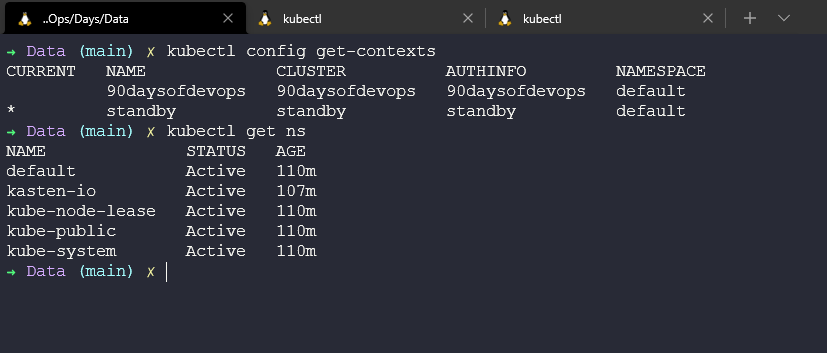
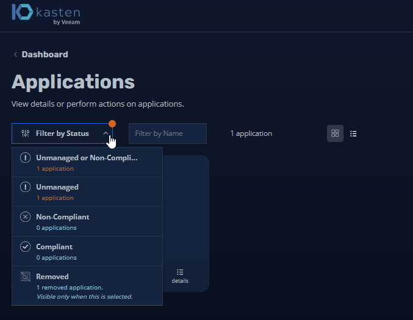
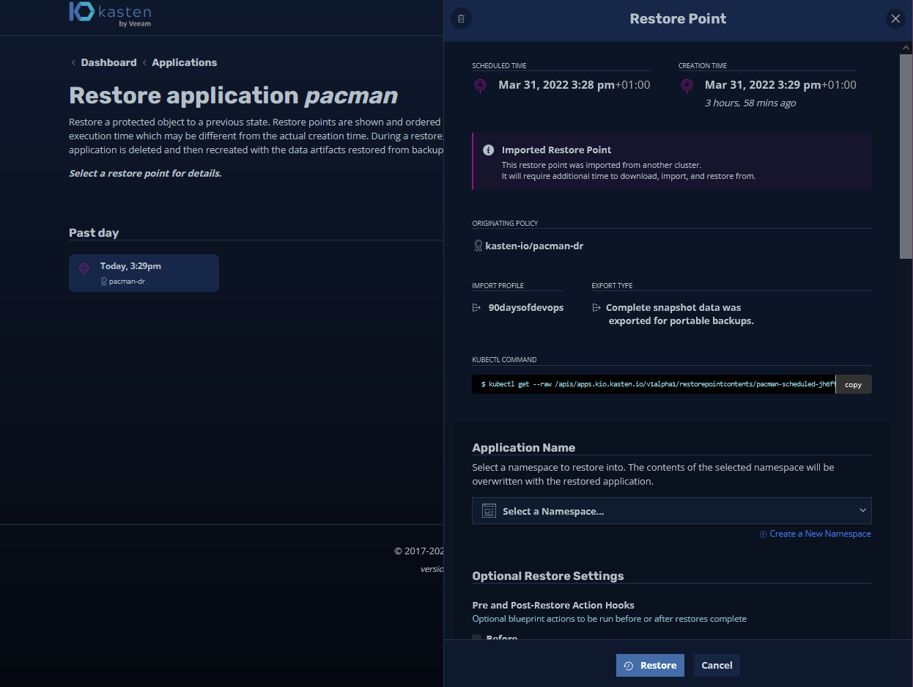
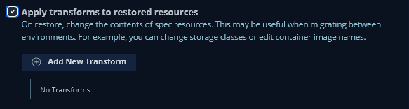
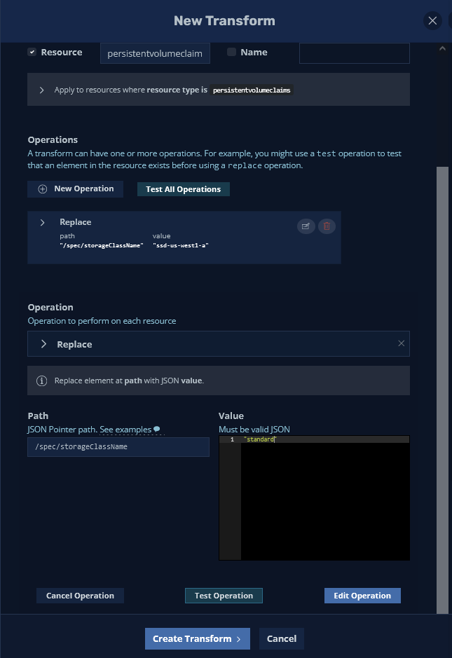
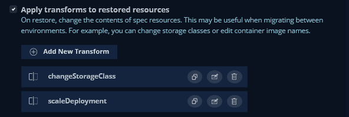
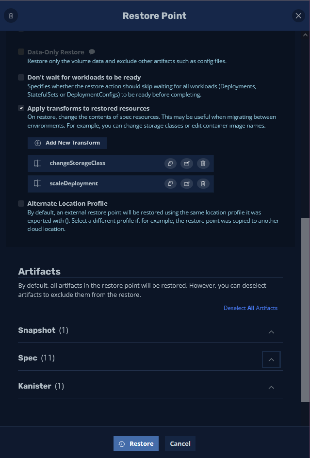
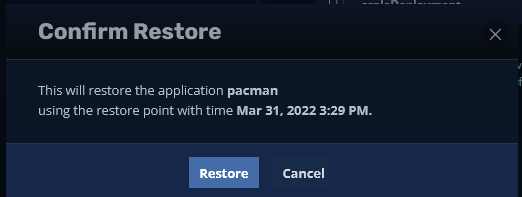
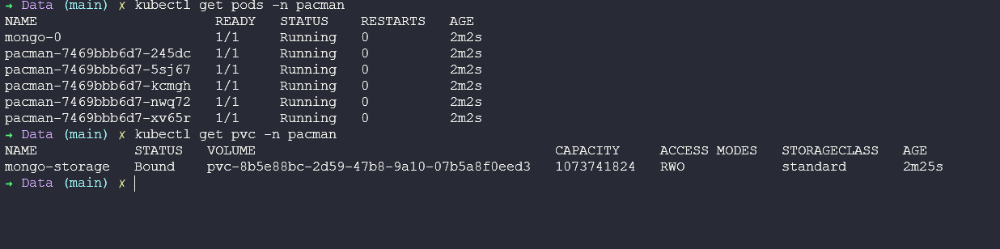

## Data & Application Mobility

Day 90 of the #90DaysOfDevOps Challenge! In this final session I am going to cover mobility of our data and applications. I am specifically going to focus on Kubernetes but the requirement across platforms and between platforms is something that is an ever-growing requirement and is seen in the field. 

The use case being "I want to move my workload, application and data from one location to another" for many different reasons, could be cost, risk or to provide the business with a better service. 

In this session we are going to take our workload and we are going to look at moving a Kubernetes workload from one cluster to another, but in doing so we are going to change how our application is on the target location. 

It in fact uses a lot of the characteristics that we went through with [Disaster Recovery](day89.md)

### **The Requirement**

Our current Kubernetes cluster cannot handle demand and our costs are rocketing through the roof, it is a business decision that we wish to move our production Kubernetes cluster to our Disaster Recovery location, located on a different public cloud which will provide the ability to expand but also at a cheaper rate. We could also take advantage of some of the native cloud services available in the target cloud. 

Our current mission critical application (Pac-Man) has a database (MongoDB) and is running on slow storage, we would like to move to a newer faster storage tier. 

The current Pac-Man (NodeJS) front-end is not scaling very well, and we would like to increase the number of available pods in the new location. 

### Getting to IT

We have our brief and in fact we have our imports already hitting the Disaster Recovery Kubernetes cluster. 

The first job we need to do is remove the restore operation we carried out on Day 89 for the Disaster Recovery testing. 

We can do this using `kubectl delete ns pacman` on the "standby" minikube cluster. 

To get started head into the Kasten K10 Dashboard, select the Applications card. From the dropdown choose "Removed"

We then get a list of the available restore points. We will select the one that is available as this contains our mission critical data. (In this example we only have a single restore point.)

When we worked on the Disaster Recovery process, we left everything as default. However these additional restore options are there if you have a Disaster Recovery process that requires the transformation of your application. In this instance we have the requirement to change our storage and number of replicas. 

Select the "Apply transforms to restored resources" option. 

It just so happens that the two built in examples for the transformation that we want to perform are what we need for our requirements. 

The first requirement is that on our primary cluster we were using a Storage Class called `csi-hostpath-sc` and in our new cluster we would like to use `standard` so we can make that change here. 

Looks good, hit the create transform button at the bottom. 

The next requirement is that we would like to scale our Pac-Man frontend deployment to "5"

If you are following along you should see both of our transforms as per below. 

You can now see from the below image that we are going to restore all of the artifacts listed below, if we wanted to we could also be granular about what we wanted to restore. Hit the "Restore" button

Again, we will be asked to confirm the actions. 

The final thing to show is now if we head back into the terminal and we take a look at our cluster, you can see we have 5 pods now for the pacman pods and our storageclass is now set to standard vs the csi-hostpath-sc 

There are many different options that can be achieved through transformation. This can span not only migration but also Disaster Recovery, test and development type scenarios and more. 

### API and Automation 

I have not spoken about the ability to leverage the API and to automate some of these tasks, but these options are present and throughout the UI there are breadcrumbs that provide the command sets to take advantage of the APIs for automation tasks. 

The important thing to note about Kasten K10 is that on deployment it is deployed inside the Kubernetes cluster and then can be called through the Kubernetes API. 

This then brings us to a close on the section around Storing and Protecting your data. 

## Resources 

- [Kubernetes Backup and Restore made easy!](https://www.youtube.com/watch?v=01qcYSck1c4&t=217s)
- [Kubernetes Backups, Upgrades, Migrations - with Velero](https://www.youtube.com/watch?v=zybLTQER0yY)
- [7 Database Paradigms](https://www.youtube.com/watch?v=W2Z7fbCLSTw&t=520s)
- [Disaster Recovery vs. Backup: What's the difference?](https://www.youtube.com/watch?v=07EHsPuKXc0)
- [Veeam Portability & Cloud Mobility](https://www.youtube.com/watch?v=hDBlTdzE6Us&t=3s)

### **Closing**

As I wrap up this challenge, I want to continue to ask for feedback to make sure that the information is always relevant. 

I also appreciate there are a lot of topics that I was not able to cover or not able to dive deeper into around the topics of DevOps. 

This means that we can always take another attempt that this challenge next year and find another 90 day's worth of content and walkthroughs to work through. 

### What is next? 

Firstly, a break from writing for a little while, I started this challenge on the 1st January 2022 and I have finished on the 31st March 2022 19:50 BST! It has been a slog. But as I say and have said for a long time, if this content helps one person, then it is always worth learning in public! 

I have some ideas on where to take this next and hopefully it has a life outside of a GitHub repository and we can look at creating an eBook and possibly even a physical book. 

I also know that we need to revisit each post and make sure everything is grammatically correct before making anything like that happen. If anyone does know about how to take markdown to print or to an eBook it would be greatly appreciated feedback. 

As always keep the issues and PRs coming. 

Thanks! 
@MichaelCade1
- [GitHub](https://github.com/MichaelCade)
- [Twitter](https://twitter.com/MichaelCade1)
