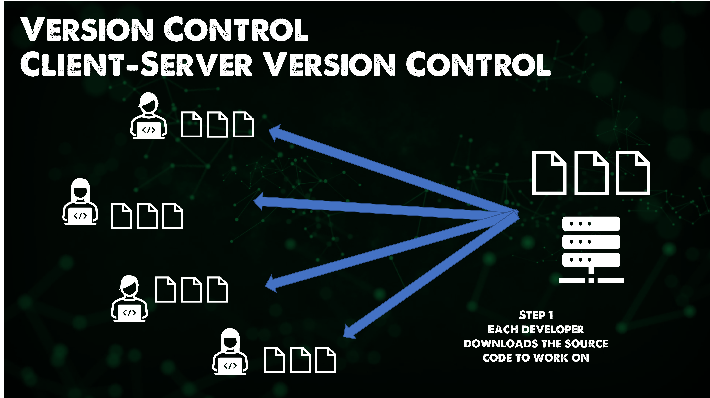
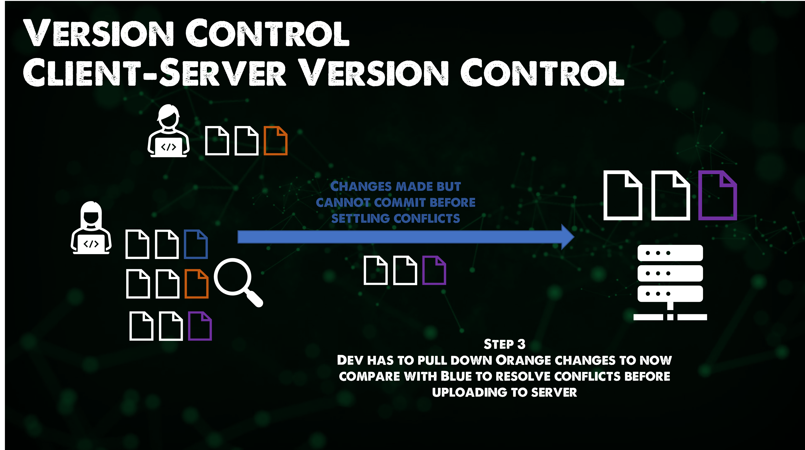
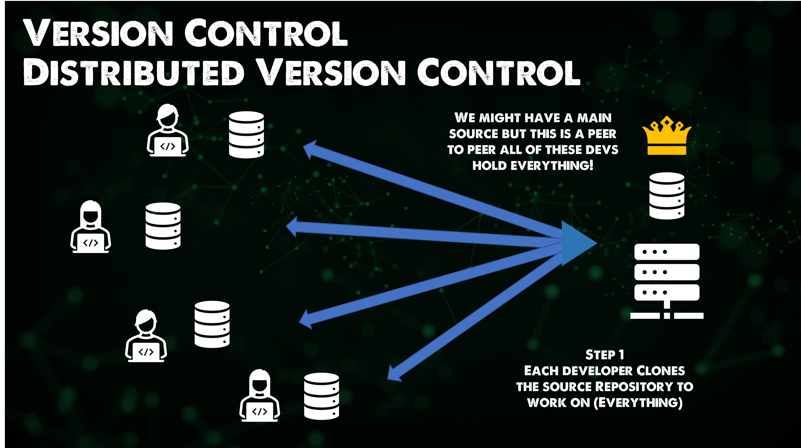

## Installing & Configuring Git

Git is an open source, cross-platform tool for version control. If you are like me, using Ubuntu or most Linux environments you might find that you already have git installed but we are going to run through the install and configuration.

Even if you already have git installed on your system it is also a good idea to make sure we are up to date.

### Installing Git

As already mentioned Git is cross-platform, we will be running through Windows and Linux but you can find macOS also listed [here](https://git-scm.com/book/en/v2/Getting-Started-Installing-Git)

For [Windows](https://git-scm.com/download/win) we can grab our installers from the official site.

You could also use `winget` on your Windows machine, think of this as your Windows Application Package Manager.

Before we install anything let's see what version we have on our Windows Machine. Open a PowerShell window and run `git --version`


We can also check our WSL Ubuntu version of Git as well.


At the time of writing the latest Windows release is `2.35.1` so we have some updating to do there which I will run through. I expect the same for Linux.

I went ahead and downloaded the latest installer and ran through the wizard and will document that here. The important thing to note is that git will uninstall previous versions before installing the latest.

Meaning that the process shown below is also the same process for the most part as if you were installing from no git.

It is a very simple installation. Once downloaded double click and get started. Read through the GNU license agreement. But remember this is free and open-source software.


Now we can choose additional components that we would like to also install but also associate with git. On Windows, I always make sure I install Git Bash as this allows us to run bash scripts on Windows.


We can then choose which SSH Executable we wish to use. IN leave this as the bundled OpenSSH that you might have seen in the Linux section.


We then have experimental features that we may wish to enable, for me I don't need them so I don't enable them, you can always come back in through the installation and enable these later on.


Installation complete, we can now choose to open Git Bash and or the latest release notes.


The final check is to take a look in our PowerShell window at what version of git we have now.


Super simple stuff and now we are on the latest version. On our Linux machine, we seemed to be a little behind so we can also walk through that update process.

I simply run the `sudo apt-get install git` command.


You could also run the following which will add the git repository for software installations.

```
sudo add-apt-repository ppa:git-core/ppa -y
sudo apt-get update
sudo apt-get install git -y
git --version
```

### Configuring Git

When we first use git we have to define some settings,

- Name
- Email
- Default Editor
- Line Ending

This can be done at three levels

- System = All users
- Global = All repositories of the current user
- Local = The current repository

Example:
`git config --global user.name "Michael Cade"`
`git config --global user.email Michael.Cade@90DaysOfDevOPs.com"`
Depending on your Operating System will determine the default text editor. In my Ubuntu machine without setting the next command is using nano. The below command will change this to visual studio code.

`git config --global core.editor "code --wait"`

now if we want to be able to see all git configurations then we can use the following command.

`git config --global -e`


On any machine this file will be named `.gitconfig` on my Windows machine you will find this in your user account directory.


### Git Theory

I mentioned in the post yesterday that there were other version control types and we can split these down into two different types. One is Client Server and the other is Distributed.

### Client-Server Version Control

Before git was around Client-Server was the defacto method for version control. An example of this would be [Apache Subversion](https://subversion.apache.org/) which is an open source version control system founded in 2000.

In this model of Client-Server version control, the first step the developer downloads the source code and the actual files from the server. This doesn't remove the conflicts but it does remove the complexity of the conflicts and how to resolve them.



Now for example let's say we have two developers working on the same files and one wins the race and commits or uploads their file back to the server first with their new changes. When the second developer goes to update they have a conflict.


So now the Dev needs to pull down the first devs code change next to their check and then commit once those conflicts have been settled.



### Distributed Version Control

Git is not the only distributed version control system. But it is very much the defacto.

Some of the major benefits of Git are:

- Fast
- Smart
- Flexible
- Safe & Secure

Unlike the Client-Server version control model, each developer downloads the source repository meaning everything. History of commits, all the branches etc.



## Resources

- [What is Version Control?](https://www.youtube.com/watch?v=Yc8sCSeMhi4)
- [Types of Version Control System](https://www.youtube.com/watch?v=kr62e_n6QuQ)
- [Git Tutorial for Beginners](https://www.youtube.com/watch?v=8JJ101D3knE&t=52s)
- [Git for Professionals Tutorial](https://www.youtube.com/watch?v=Uszj_k0DGsg)
- [Git and GitHub for Beginners - Crash Course](https://www.youtube.com/watch?v=RGOj5yH7evk&t=8s)
- [Complete Git and GitHub Tutorial](https://www.youtube.com/watch?v=apGV9Kg7ics)

See you on [Day 37](day37.md)
