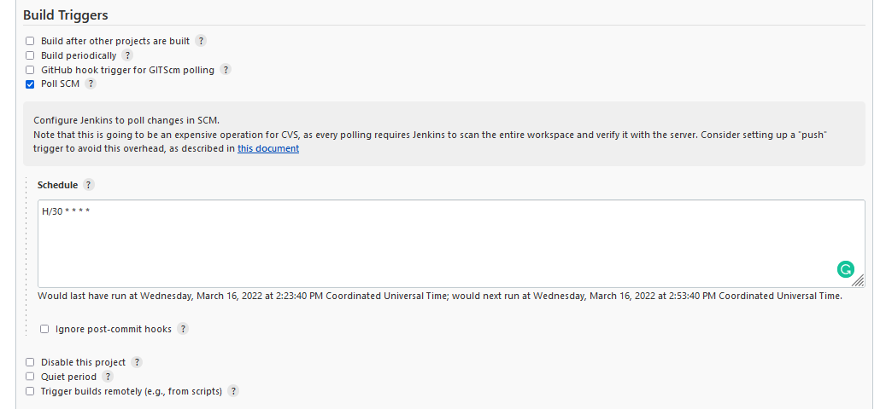
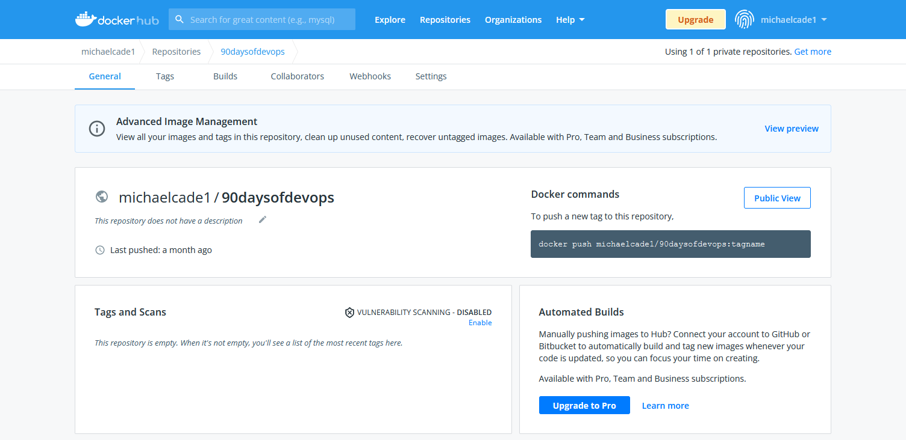
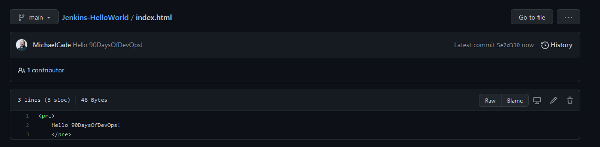

## Hello World - Jenkinsfile App Pipeline

In the last section, we built a simple Pipeline in Jenkins that would push our docker image from our dockerfile in a public GitHub repository to our private Dockerhub repository.

In this section, we want to take this one step further and we want to achieve the following with our simple application.

### Objective

- Dockerfile (Hello World)
- Jenkinsfile
- Jenkins Pipeline to trigger when GitHub Repository is updated
- Use GitHub Repository as the source.
- Run - Clone/Get Repository, Build, Test, Deploy Stages
- Deploy to DockerHub with incremental version numbers
- Stretch Goal to deploy to our Kubernetes Cluster (This will involve another job and manifest repository using GitHub credentials)

### Step One

We have our [GitHub repository](https://github.com/MichaelCade/Jenkins-HelloWorld) This currently contains our Dockerfile and our index.html

With the above this is what we were using as our source in our Pipeline, now we want to add that Jenkins Pipeline script to our GitHub repository as well.

Now back in our Jenkins dashboard, we are going to create a new pipeline but now instead of pasting our script, we are going to use "Pipeline script from SCM" We are then going to use the configuration options below.

For reference, we are going to use `https://github.com/MichaelCade/Jenkins-HelloWorld.git` as the repository URL.

We could at this point hit save and apply and we would then be able to manually run our Pipeline building our new Docker image that is uploaded to our DockerHub repository.

However, I also want to make sure that we set a schedule that whenever our repository or our source code is changed, I want to trigger a build. we could use webhooks or we could use a scheduled pull.

This is a big consideration because if you are using costly cloud resources to hold your pipeline and you have lots of changes to your code repository then you will incur a lot of costs. We know that this is a demo environment which is why I am using the "poll scm" option. (Also I believe that using minikube I am lacking the ability to use webhooks)

One thing I have changed since yesterday's session is I want to now upload my image to a public repository which in this case would be michaelcade1\90DaysOfDevOps, my Jenkinsfile has this change already. And from the previous sections, I have removed any existing demo container images.

Going backwards here, we created our Pipeline and then as previously shown we added our configuration.

At this stage, our Pipeline has never run and your stage view will look something like this.

Now let's trigger the "Build Now" button. and our stage view will display our stages.

If we then head over to our DockerHub repository, we should have 2 new Docker images. We should have a Build ID of 1 and a latest because for every build that we create based on the "Upload to DockerHub" we send a version using the Jenkins Build_ID environment variable and we also issue a latest.

Let's go and create an update to our index.html file in our GitHub repository as per below, I will let you go and find out what version 1 of the index.html was saying.

If we head back to Jenkins and select "Build Now" again. We will see if our #2 build is successful.

Then a quick look at DockerHub, we can see that we have our tagged version 2 and our latest tag.

It is worth noting here that I have added into my Kubernetes cluster a secret that enables my access and authentication to push my docker builds into DockerHub. If you are following along you should repeat this process for your account, and also make a change to the Jenkinsfile that is associated with my repository and account.

## Resources

- [Jenkins is the way to build, test, deploy](https://youtu.be/_MXtbjwsz3A)
- [Jenkins.io](https://www.jenkins.io/)
- [ArgoCD](https://argo-cd.readthedocs.io/en/stable/)
- [ArgoCD Tutorial for Beginners](https://www.youtube.com/watch?v=MeU5_k9ssrs)
- [What is Jenkins?](https://www.youtube.com/watch?v=LFDrDnKPOTg)
- [Complete Jenkins Tutorial](https://www.youtube.com/watch?v=nCKxl7Q_20I&t=3s)
- [GitHub Actions](https://www.youtube.com/watch?v=R8_veQiYBjI)
- [GitHub Actions CI/CD](https://www.youtube.com/watch?v=mFFXuXjVgkU)

See you on [Day 75](day75.md)
