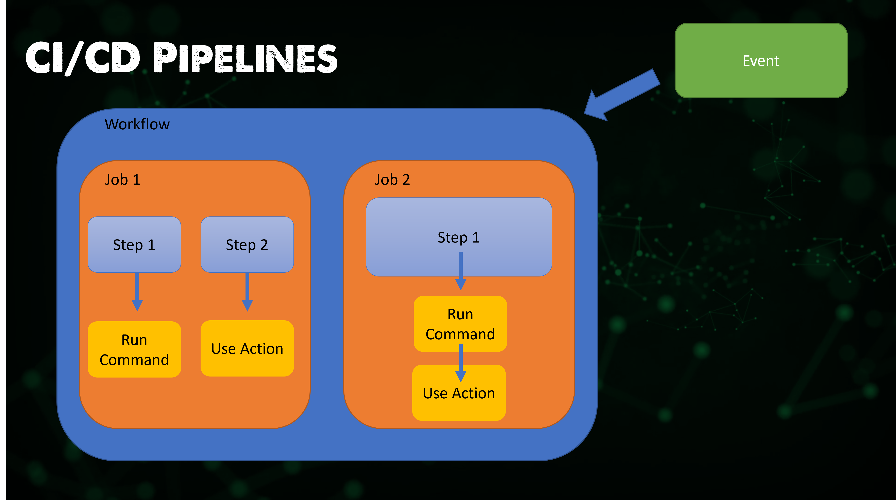
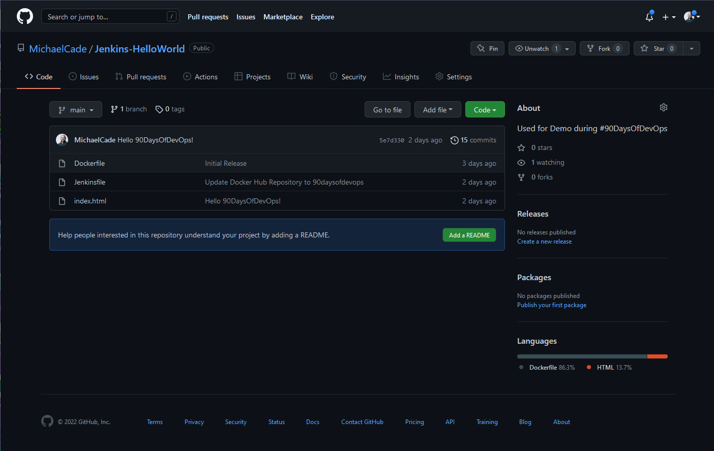
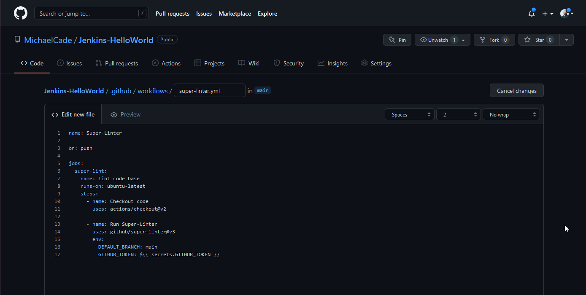
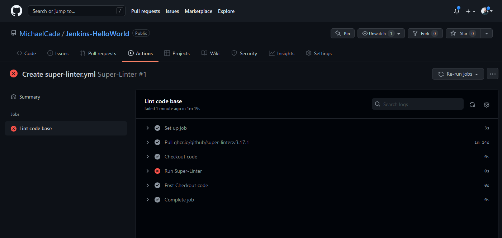
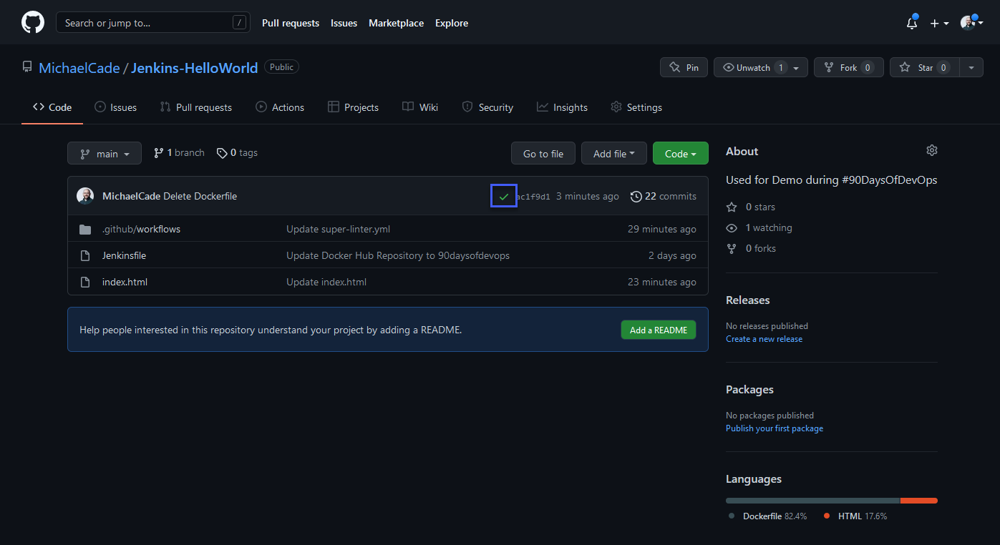

## GitHub Actions Overview

In this section, I wanted to move on and take a look at maybe a different approach to what we just spent time on. GitHub Actions is what we will focus on in this session.

GitHub Actions is a CI/CD platform that allows us to build, test and deploy amongst other tasks in our pipeline. It has the concept of workflows that build and test against a GitHub repository. You could also use GitHub Actions to drive other workflows based on events that happen within your repository.

### Workflows

Overall, in GitHub Actions, our task is called a **Workflow**.

- A **workflow** is the configurable automated process.
- Defined as YAML files.
- Contain and run one or more **jobs**
- Will run when triggered by an **event** in your repository or can be run manually
- You can multiple workflows per repository
- A **workflow** will contain a **job** and then **steps** to achieve that **job**
- Within our **workflow** we will also have a **runner** on which our **workflow** runs.

For example, you can have one **workflow** to build and test pull requests, another **workflow** to deploy your application every time a release is created, and still another **workflow** that adds a label every time someone opens a new issue.

### Events

Events are specific event in a repository that triggers the workflow to run.

### Jobs

A job is a set of steps in the workflow that execute on a runner.

### Steps

Each step within the job can be a shell script that gets executed or an action. Steps are executed in order and they are dependent on each other.

### Actions

A repeatable custom application is used for frequently repeated tasks.

### Runners

A runner is a server that runs the workflow, each runner runs a single job at a time. GitHub Actions provides the ability to run Ubuntu Linux, Microsoft Windows, and macOS runners. You can also host your own on a specific OS or hardware.

Below you can see how this looks, we have our event triggering our workflow > our workflow consists of two jobs > within our jobs we then have steps and then we have actions.



### YAML

Before we get going with a real use case let's take a quick look at the above image in the form of an example YAML file.

I have added # to the comment where we can find the components of the YAML workflow.

```Yaml
#Workflow
name: 90DaysOfDevOps
#Event
on: [push]
#Jobs
jobs:
  check-bats-version:
    #Runners
    runs-on: ubuntu-latest
    #Steps
    steps:
        #Actions
      - uses: actions/checkout@v2
      - uses: actions/setup-node@v2
        with:
          node-version: '14'
      - run: npm install -g bats
      - run: bats -v
```

### Getting Hands-On with GitHub Actions

I think there are a lot of options when it comes to GitHub Actions, yes it will satisfy your CI/CD needs when it comes to Building, Test, and Deploying your code and the continued steps thereafter.

I can see lots of options and other automated tasks that we could use GitHub Actions for.

### Using GitHub Actions for Linting your code

One option is making sure your code is clean and tidy within your repository. This will be our first example demo.

I am going to be using some example code linked in one of the resources for this section, we are going to use `GitHub/super-linter` to check against our code.

```Yaml
name: Super-Linter

on: push

jobs:
  super-lint:
    name: Lint code base
    runs-on: ubuntu-latest
    steps:
      - name: Checkout code
        uses: actions/checkout@v2

      - name: Run Super-Linter
        uses: github/super-linter@v3
        env:
          DEFAULT_BRANCH: main
          GITHUB_TOKEN: ${{ secrets.GITHUB_TOKEN }}
```

**github/super-linter**
You can see from the above that for one of our steps we have an action called GitHub/super-linter and this is referring to a step that has already been written by the community. You can find out more about this here [Super-Linter](https://github.com/github/super-linter)

"This repository is for the GitHub Action to run a Super-Linter. It is a simple combination of various linters, written in bash, to help validate your source code."

Also in the code snippet above it mentions GITHUB_TOKEN so I was interested to find out why and what this does and is needed for.

"NOTE: If you pass the Environment variable `GITHUB_TOKEN: ${{ secrets.GITHUB_TOKEN }}` in your workflow, then the GitHub Super-Linter will mark the status of each linter run in the Checks section of a pull request. Without this, you will only see the overall status of the full run. **There is no need to set the GitHub Secret as it is automatically set by GitHub, it only needs to be passed to the action.**"

The bold text is important to note at this stage. We are using it but we do not need to set any environment variable within our repository.

We will use the repository that we used in our Jenkins demo to test against.[Jenkins-HelloWorld](https://github.com/MichaelCade/Jenkins-HelloWorld)

Here is our repository as we left it in the Jenkins sessions.



For us to take advantage, we have to use the Actions tab above to choose from the marketplace which I will cover shortly or we can create our files using our super-linter code above, to create your own, you must create a new file in your repository at this exact location. `.github/workflows/workflow_name` obviously making sure the workflow_name is something useful for you to recognise, within here we can have many different workflows performing different jobs and tasks against our repository.

We are going to create `.github/workflows/super-linter.yml`



We can then paste our code and commit the code to our repository, if we then head to the Actions tab we will now see our Super-Linter workflow listed below,


We defined in our code that this workflow would run when we pushed anything to our repository, so in pushing the super-linter.yml to our repository we triggered the workflow.



As you can see from the above we have some errors most likely with my hacking ability vs my coding ability.

Although it was not my code at least not yet, in running this and getting an error I found this [issue](https://github.com/github/super-linter/issues/2255)

Take #2 I changed the version of Super-Linter from version 3 to 4 and have run the task again.


As expected my hacker coding brought up some issues and you can see them here in the [workflow](https://github.com/MichaelCade/Jenkins-HelloWorld/runs/5600278515?check_suite_focus=true)

I wanted to show the look now on our repository when something within the workflow has failed or reported back an error.


Now if we resolve the issue with my code and push the changes our workflow will run again (you can see from the image it took a while to iron out our "bugs") Deleting a file is probably not recommended but it is a very quick way to show the issue being resolved.


If you hit the new workflow button highlighted above, this is going to open the door to a huge plethora of actions. One thing you might have noticed throughout this challenge is that we don't want to reinvent the wheel we want to stand on the shoulders of giants and share our code, automation and skills far and wide to make our lives easier.


Oh, I didn't show you the green tick on the repository when our workflow was successful.



I think that covers things from a foundational point of view for GitHub Actions but if you are anything like me then you are probably seeing how else GitHub Actions can be used to automate a lot of tasks.

Next up we will cover another area of CD, we will be looking into ArgoCD to deploy our applications out into our environments.

## Resources

- [Jenkins is the way to build, test, deploy](https://youtu.be/_MXtbjwsz3A)
- [Jenkins.io](https://www.jenkins.io/)
- [ArgoCD](https://argo-cd.readthedocs.io/en/stable/)
- [ArgoCD Tutorial for Beginners](https://www.youtube.com/watch?v=MeU5_k9ssrs)
- [What is Jenkins?](https://www.youtube.com/watch?v=LFDrDnKPOTg)
- [Complete Jenkins Tutorial](https://www.youtube.com/watch?v=nCKxl7Q_20I&t=3s)
- [GitHub Actions](https://www.youtube.com/watch?v=R8_veQiYBjI)
- [GitHub Actions CI/CD](https://www.youtube.com/watch?v=mFFXuXjVgkU)

See you on [Day 76](day76.md)
