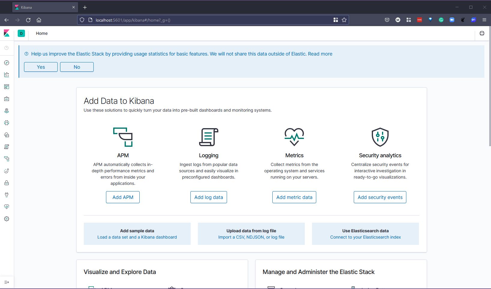
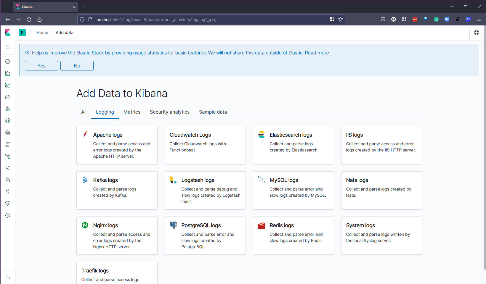

### EFK Stack

In the previous section, we spoke about ELK Stack, which uses Logstash as the log collector in the stack, in the EFK Stack we are swapping that out for FluentD or FluentBit.

Our mission in this section is to monitor our Kubernetes logs using EFK.

### Overview of EFK

We will be deploying the following into our Kubernetes cluster.

The EFK stack is a collection of 3 software bundled together, including:

- Elasticsearch: NoSQL database is used to store data and provides an interface for searching and query logs.

- Fluentd: Fluentd is an open source data collector for a unified logging layer. Fluentd allows you to unify data collection and consumption for better use and understanding of data.

- Kibana: Interface for managing and statistics logs. Responsible for reading information from elasticsearch.

### Deploying EFK on Minikube

We will be using our trusty minikube cluster to deploy our EFK stack. Let's start a cluster using `minikube start` on our system. I am using a Windows OS with WSL2 enabled.

I have created [efk-stack.yaml](Days/Monitoring/../../Monitoring/EFK%20Stack/efk-stack.yaml) which contains everything we need to deploy the EFK stack into our cluster, using the `kubectl create -f efk-stack.yaml` command we can see everything being deployed.

Depending on your system and if you have run this already and have images pulled you should now watch the pods into a ready state before we can move on, you can check the progress with the following command. `kubectl get pods -n kube-logging -w` This can take a few minutes.

The above command lets us keep an eye on things but I like to clarify that things are all good by just running the following `kubectl get pods -n kube-logging` command to ensure all pods are now up and running.

Once we have all our pods up and running and at this stage, we should see

- 3 pods associated with ElasticSearch
- 1 pod associated with Fluentd
- 1 pod associated with Kibana

We can also use `kubectl get all -n kube-logging` to show all in our namespace, fluentd as explained previously is deployed as a daemonset, kibana as deployment and Elasticsearch as a statefulset.

Now all of our pods are up and running we can now issue in a new terminal the port-forward command so that we can access our kibana dashboard. Note that your pod name will be different to the command we see here. `kubectl port-forward kibana-84cf7f59c-v2l8v 5601:5601 -n kube-logging`

We can now open up a browser and navigate to this address, `http://localhost:5601` you will be greeted with either the screen you see below or you might indeed see a sample data screen or continue and configure yourself. Either way and by all means look at that test data, it is what we covered when we looked at the ELK stack in a previous session.

Next, we need to hit the "discover" tab on the left menu and add "\*" to our index pattern. Continue to the next step by hitting "Next step".

In Step 2 of 2, we are going to use the @timestamp option from the dropdown as this will filter our data by time. When you hit create pattern it might take a few seconds to complete.

If we now head back to our "discover" tab after a few seconds you should start to see data coming in from your Kubernetes cluster.

Now that we have the EFK stack up and running and we are gathering logs from our Kubernetes cluster via Fluentd we can also take a look at other sources we can choose from if you navigate to the home screen by hitting the Kibana logo on the top left you will be greeted with the same page we saw when we first logged in.

We can add APM, Log data, metric data and security events from other plugins or sources.

If we select "Add log data" then we can see below that we have a lot of choices on where we want to get our logs from, you can see that Logstash is mentioned there which is part of the ELK stack.

Under the metrics data, you will find that you can add sources for Prometheus and lots of other services.

### APM (Application Performance Monitoring)

There is also the option to gather APM (Application Performance Monitoring) which collects in-depth performance metrics and errors from inside your application. It allows you to monitor the performance of thousands of applications in real time.

I am not going to get into APM here but you can find out more on the [Elastic site](https://www.elastic.co/observability/application-performance-monitoring)

## Resources

- [Understanding Logging: Containers & Microservices](https://www.youtube.com/watch?v=MMVdkzeQ848)
- [The Importance of Monitoring in DevOps](https://www.devopsonline.co.uk/the-importance-of-monitoring-in-devops/)
- [Understanding Continuous Monitoring in DevOps?](https://medium.com/devopscurry/understanding-continuous-monitoring-in-devops-f6695b004e3b)
- [DevOps Monitoring Tools](https://www.youtube.com/watch?v=Zu53QQuYqJ0)
- [Top 5 - DevOps Monitoring Tools](https://www.youtube.com/watch?v=4t71iv_9t_4)
- [How Prometheus Monitoring works](https://www.youtube.com/watch?v=h4Sl21AKiDg)
- [Introduction to Prometheus monitoring](https://www.youtube.com/watch?v=5o37CGlNLr8)
- [Promql cheat sheet with examples](https://www.containiq.com/post/promql-cheat-sheet-with-examples)
- [Log Management for DevOps | Manage application, server, and cloud logs with Site24x7](https://www.youtube.com/watch?v=J0csO_Shsj0)
- [Log Management what DevOps need to know](https://devops.com/log-management-what-devops-teams-need-to-know/)
- [What is ELK Stack?](https://www.youtube.com/watch?v=4X0WLg05ASw)
- [Fluentd simply explained](https://www.youtube.com/watch?v=5ofsNyHZwWE&t=14s)

See you on [Day 83](day83.md)
