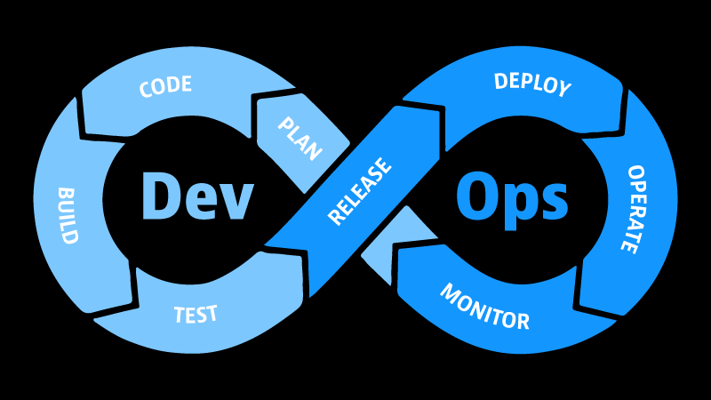

## 計画 > コーディング > ビルド > テスト > リリース > デプロイ > オペレート > 監視

今日は、DevOpsの世界におけるアプリケーションのスタートからゴールまでの個々のステップと継続的なサイクルに焦点を当てます。

### 計画:

これは、開発チームが集まって、次のスプリントでどのような種類の機能やバグフィックスを展開するかを考える、計画プロセスから始まるものです。これはDevOpsエンジニアとして、このプロセスに参加し、どのような種類のものが自分のところにやってくるのかを知り、自分が関与する必要があります。また、彼らの決定や進路に影響を与え、あなたが構築したインフラで彼らが作業できるようにしたり、彼らがその進路にいない場合にもっとうまくいくものに舵を切ることができます。ここで一つ重要なことは、開発者またはソフトウェアエンジニアリングチームはDevOpsエンジニアとしてあなたのお客様であり、これは彼らが悪い方向に行く前にお客様と作業する機会です。

### コーディング:

計画セッションが終わると、彼らはコードを書き始めます。あなたがこの作業に関わることが多いか少ないかは別として、彼らがコードを書いているときに、インフラについてよりよく理解する手助けをすることができます。

### ビルド:

ここで、自動化プロセスの第一段階を開始します。彼らのコードを受け取り、彼らが使っている言語に応じて、トランスパイルやコンパイル、あるいはそのコードからDockerイメージを作成するなど、CI/CDパイプラインを使ってそのプロセスを進めていくのです。

## テスト:

開発チームがテストを書くのが普通ですが、どのようなテストを書くかについて、あなたが何らかの意見を述べることもあるでしょう。しかし、私たちはテストを実行する必要があります。テストは、本番環境に問題を持ち込むのを最小限に抑えようとする方法であり、保証するものではありませんが、できる限り保証に近い形で、新しいバグを出さない、以前動いていたものを壊さないようにしたいのです。

## リリース:

テストに合格したら、リリース処理を行うことになりますが、どのようなアプリケーションに取り組んでいるかによって、これは非段階的なものになるかもしれません。コードは GitHub リポジトリや git リポジトリなど、どこにでも置いておけますが、コンパイルしたコードや docker イメージをレジストリやリポジトリに置いて、本番サーバーからアクセスできるようにし、デプロイ処理を行うことがあります。

## デプロイ:

デプロイはコードを本番稼動させるときの最終ゲームのようなもので、デプロイを行うまでは、あなたとソフトウェアエンジニアリングチームがこの時点までに製品に費やしたすべての時間と努力の価値を、私たちのビジネスは実際に実感することができないからです。

## オペレート:

デプロイされた後、私たちはそれを運用することになります。運用には、例えば顧客からサイトの動作が遅い、アプリケーションの動作が遅いと いった問い合わせを受けるようになり、その原因を突き止め、ピーク時にはサーバーの数を増やし、オフピーク時にはサーバー の数を減らすといった自動スケーリングを組み込む必要があるかもしれません。もう一つの運用上の工夫として、運用チームから運用チームへのフィードバック・ループを設け、運用中に発生した重要なイベント、例えばデプロイメントを一段階前に戻すといったことを知らせます。これは環境に応じて自動化することもしないこともできますが、可能であれば常に自動化することが目標です。しかし、理想的には、自動化プロセスの一環として自動的にデプロイしたいものです。その場合、運用ステップに何らかの通知を含めて、デプロイが行われたことを運用チームに知らせるのがよいでしょう。

## 監視:

特に運用上の問題やオートスケーリング・トラブルシューティングなどでは、モニタリングが必要です。
例えば、メモリ使用量、CPU使用量、ディスク容量、APIエンドポイント、応答時間、エンドポイントの応答速度、そしてログがその大きな要素です。ログがあれば、開発者は本番システムにアクセスすることなく、何が起きているのかを確認することができます。

## リンス・アンド・リピート:

それができたら、また最初に戻って企画を練り直し、全部をやり直します。

## 継続的に

多くのツールが、上記のような継続的なプロセス、これらすべてのコード、そして完全に自動化された最終的な目標、クラウドインフラやあらゆる環境を実現するために、しばしば継続的インテグレーション/継続的デリバリー/継続的デプロイメント、略して「CI/CD」と表現されます。CI/CDについては、90日の後半で1週間かけて、いくつかの例とウォークスルーで基本を把握する予定です。

### 継続的デリバリー:

継続的デリバリー = 計画 > コーディング > ビルド > テスト

### 継続的インテグレーション:

これは事実上、上記の継続的デリバリーフェーズの結果に、リリースフェーズの結果を加えたものです。これは失敗の場合も成功の場合も同じですが、これを継続的デリバリーにフィードバックしたり、継続的デプロイメントに移行したりします。

継続的インテグレーション＝計画＞コード＞ビルド＞テスト＞リリース

### 継続的デプロイメント:

継続的インテグレーションからのリリースが成功したら、継続的デプロイメントに移行し、次のフェーズに進みます。

CIリリースが成功した場合 = 継続的デプロイメント = デプロイ > 運用 > 監視

上記の3つの継続的概念は、DevOpsライフサイクルのフェーズの単純な集合体であることがお分かりいただけると思います。

この最後の部分は、3日目の復習のようなものでしたが、これで実際に物事が明確になったと思っています。

### リソース:

- [DevOps for Developers – Software or DevOps Engineer?](https://www.youtube.com/watch?v=a0-uE3rOyeU)
- [Techworld with Nana -DevOps Roadmap 2022 - How to become a DevOps Engineer? What is DevOps?](https://www.youtube.com/watch?v=9pZ2xmsSDdo&t=125s)
- [How to become a DevOps Engineer in 2021 - DevOps Roadmap](https://www.youtube.com/watch?v=5pxbp6FyTfk)

ここまで来れば、ここが自分の居場所かどうかが分かるはずです。

では、[6日目](day06.md)でお会いしましょう。
