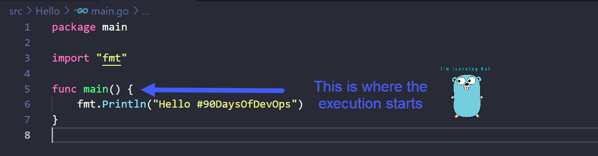

## Hello Worldのコードを説明しましょう

### Go の仕組み

[Day 8](day08.md) では、ワークステーションに Go をインストールする方法を説明し、その後最初の Go アプリケーションを作成しました。

このセクションでは、コードをより深く見て、Go 言語についてもう少し理解します。

### コンパイルとは？
Hello Worldの6行のコード](Go/hello.go)に入る前に、コンパイルについて少し理解しておく必要があります。

Python、Java、Go、C++など、私たちが普段使っているプログラミング言語は、高水準言語です。つまり、人間が読むことはできても、機械がプログラムを実行するときには、機械が理解できる形である必要があるのです。そのため、人間が読めるコードを機械語に変換する必要があります。これをコンパイルといいます。

上記から、私たちが [Day 8](day08.md) で何をしたかがわかります。ここでは、単純な Hello World main.go を作成し、 `go build main.go` コマンドを使って実行ファイルをコンパイルしています。

### パッケージとは何ですか？
パッケージとは、同じディレクトリにあるソースファイルの集まりで、一緒にコンパイルされたものです。さらに単純化すると、パッケージは同じディレクトリにあるたくさんの .go ファイルです。8日目のHelloフォルダーを覚えていますか？より複雑な Go プログラムに参加する場合、folder1 folder2 folder3 に異なる .go ファイルがあり、複数のパッケージでプログラムを構成していることに気づくかもしれません。

パッケージを使うのは、他の人のコードを再利用するためで、すべてを一から書く必要はありません。例えば、プログラムの一部として電卓を使いたい場合、数学関数を含む既存の Go パッケージを見つけることができ、それをコードにインポートすれば、長い目で見れば多くの時間と労力を節約することができます。

Go では、ソース コードの再利用と保守を容易にするために、コードをパッケージで整理することを推奨しています。

### Hello #90DaysOfDevOps 行を追う
それでは、Hello #90DaysOfDevOps の main.go ファイルを見て、行を追って見ていきましょう。

最初の行に `package main` とありますが、これはこのファイルが main というパッケージに属していることを意味します。すべての .go ファイルはパッケージに属する必要があり、冒頭の行に `package something` と書かれている必要があります。

パッケージは好きな名前をつけることができます。このパッケージの中に入るプログラムのスタート地点なので、 `main` と呼ばなければなりません。これは規則です。(このルールについてもっと理解する必要がある？)

コードをコンパイルして実行するときはいつでも、実行を開始する場所をマシンに伝えなければなりません。これはmainと呼ばれる関数を書くことによって行います。マシンはプログラムのエントリポイントを見つけるためにmainと呼ばれる関数を探します。

関数とは、ある特定のタスクを実行するコードのブロックのことで、プログラム全体で使用することができます。

関数は `func` を使って任意の名前で宣言することができますが、今回はコードが始まる場所なので `main` という名前をつける必要があります。

次にコードの3行目を見てみましょう。これは基本的に、メインプログラムに別のパッケージを取り込むことを意味します。
fmtはGoが提供する標準パッケージで、このパッケージには `Println()` 関数が含まれており、これをインポートしたことで6行目でこれを使うことができるようになりました。 標準的なパッケージが多数用意されており、それらをプログラムに組み込んで活用したり、再利用することで、ゼロから書く手間を省くことができます。[Go標準ライブラリ](https://pkg.go.dev/std)

ここにある `Println()` は、実行ファイルが正常に実行されたときに、その端末の標準出力に書き出す方法です。()の間のメッセージは自由に変更してください。

### TLDR

- 1行目** = このファイルは `main` というパッケージの中にあり、プログラムのエントリポイントを含むので `main` という名前にする必要があります。
- 3行目** = `Println()` を使用するために、6行目で fmt パッケージをインポートする必要があります。
- 5行目** = 実際のスタート地点、`main`関数です。
- 6行目** = "Hello #90DaysOfDevOps" と表示させることができます。

## リソース

- [StackOverflow 2021 Developer Survey](https://insights.stackoverflow.com/survey/2021)
- [Why we are choosing Golang to learn](https://www.youtube.com/watch?v=7pLqIIAqZD4&t=9s)
- [Jake Wright - Learn Go in 12 minutes](https://www.youtube.com/watch?v=C8LgvuEBraI&t=312s) 
- [Techworld with Nana - Golang full course - 3 hours 24 mins](https://www.youtube.com/watch?v=yyUHQIec83I) 
- [**NOT FREE** Nigel Poulton Pluralsight - Go Fundamentals - 3 hours 26 mins](https://www.pluralsight.com/courses/go-fundamentals) 
- [FreeCodeCamp -  Learn Go Programming - Golang Tutorial for Beginners](https://www.youtube.com/watch?v=YS4e4q9oBaU&t=1025s) 
- [Hitesh Choudhary - Complete playlist](https://www.youtube.com/playlist?list=PLRAV69dS1uWSR89FRQGZ6q9BR2b44Tr9N) 

[10日目](day10.md)にお会いしましょう。
