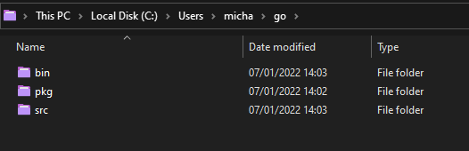
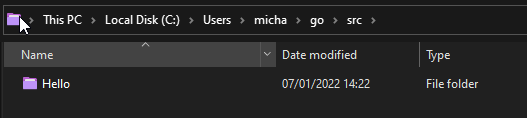
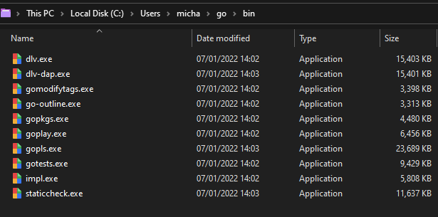
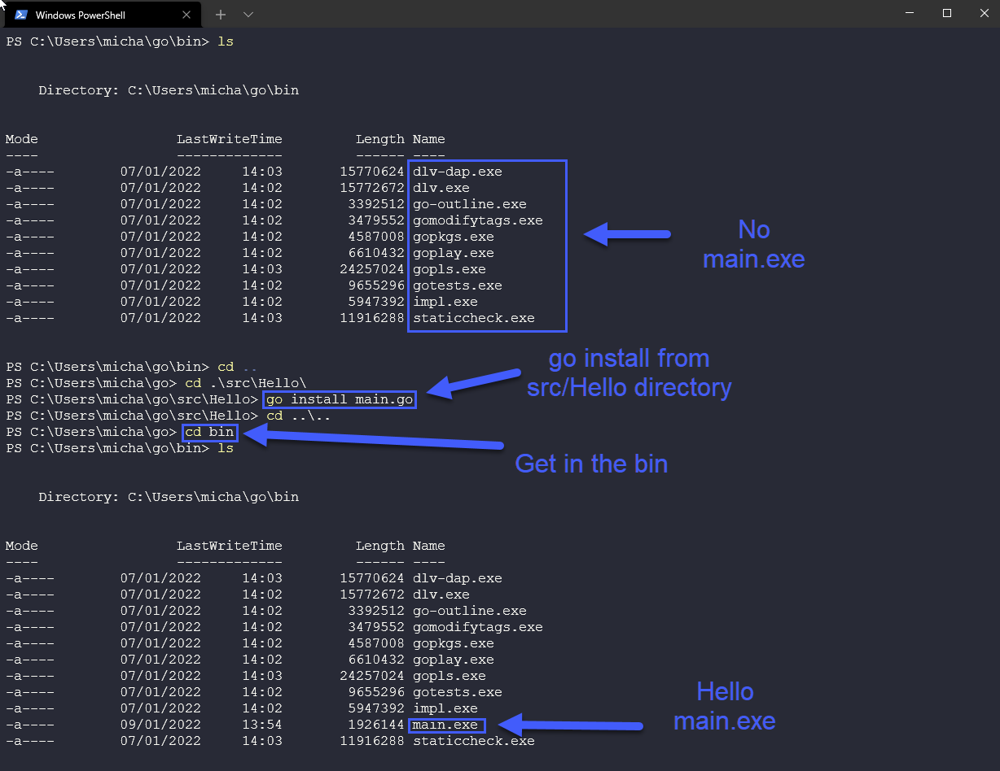

### Goワークスペースとコードのコンパイルと実行 
[Day 8](day08.md) では、`Hello #90DaysOfDevOps` のデモを行うためにGoを起動するためのGoワークスペースを簡単に説明しましたが、Goワークスペースについてもう少し説明する必要があると思います。

私たちはデフォルトを選択し、すでに定義されているGOPATHにGoフォルダを作成したことを思い出してください。

```
echo $GOPATH
```

を実行すると 出力は私のものと似ているはずです（ユーザー名は違うかもしれませんが）。

```
/home/michael/projects/go
```

そして、この中に、3つのディレクトリを作成しました。**src**, **pkg**, **bin** の3つのディレクトリを作成しました。



**src** は、すべての Go プログラムとプロジェクトが保存される場所です。これは、すべてのGoリポジトリの名前空間パッケージ管理を処理します。ここでは、ワークステーションにHello #90DaysOfDevOpsプロジェクト用のHelloフォルダがあることがわかります。



**pkg** は、プログラムにインストールされている、またはインストールされていたパッケージの アーカイブファイルです。これは、使用されているパッケージが変更されたかどうかに基づいて、コンパイル処理を高速化するのに役立ちます。


**bin** は、コンパイルされたすべてのバイナリが格納される場所です。



Hello #90DaysOfDevOps は複雑なプログラムではないので、別の素晴らしいリソース [GoChronicles](https://gochronicles.com/) から引用した、より複雑な Go プログラムの例を紹介します。


このページでは、なぜこのようなレイアウトになっているのか、また、私たちが言及していない他のフォルダーについても少し詳しく説明しています [GoChronicles](https://gochronicles.com/project-structure/)

### コードのコンパイル＆実行

Day 9](day09.md) では、コードのコンパイルについて簡単に紹介しましたが、ここではもう少し深く掘り下げます。

コードを実行するには、まず **コンパイル** しなければなりません。Goの中でこれを行うには、3つの方法があります。

- go ビルド
- インストールする
- go run 

上記のコンパイル段階に入る前に、Goのインストールで得られるものを見ておく必要があります。

8日目にGoをインストールしたとき、Goツールというものがインストールされました。これはGoのソースファイルをビルドしたり処理したりするためのいくつかのプログラムで構成されています。ツールの1つが `Go` です。

特筆すべきは、標準的なGoのインストールには含まれていない、追加のツールをインストールすることができることです。

コマンドプロンプトを開いて `go` と入力すると、下の画像のようなものが表示され、その下に "Additional Help Topics" と表示されますが、今のところ気にする必要はありません。


また、これらのツールのうち少なくとも2つは、8日目までにすでに使っていることを思い出してください。


もっと詳しく知りたいのは、ビルド、インストール、ランです。


- `go run` - このコマンドは、コマンドラインで指定された .go ファイルで構成されるメインパッケージをコンパイルして実行します。このコマンドは、一時フォルダにコンパイルされます。
- `go build` - パッケージと依存関係をコンパイルするために、カレントディレクトリにあるパッケージをコンパイルします。main` パッケージであれば、カレントディレクトリに実行ファイルを配置します。そうでなければ、`pkg` フォルダに実行ファイルを配置します。また、`go build` を使うと、Go がサポートする OS プラットフォーム用の実行ファイルをビルドすることができます。
- go install` - go build と同じですが、実行ファイルを `bin` フォルダに配置します。

go build と go run を実行しましたが、必要であればここでもう一度実行しても構いません。



もしあなたがフォローしているなら、以下のプレイリストやビデオのいずれかを見ていることを希望的観測として、私はこれら全ての断片を取り、Golang言語の基礎知識を理解できるようにこれらを私のメモに翻訳しています。以下のリソースは、あなたが全体的に必要とする多くの分野について、より良い理解を与えてくれそうですが、私は7日間または7時間分の旅の記録として、私が見つけた面白いことを記録しようとしています。

## リソース

- [StackOverflow 2021 Developer Survey](https://insights.stackoverflow.com/survey/2021)
- [Why we are choosing Golang to learn](https://www.youtube.com/watch?v=7pLqIIAqZD4&t=9s)
- [Jake Wright - Learn Go in 12 minutes](https://www.youtube.com/watch?v=C8LgvuEBraI&t=312s) 
- [Techworld with Nana - Golang full course - 3 hours 24 mins](https://www.youtube.com/watch?v=yyUHQIec83I) 
- [**NOT FREE** Nigel Poulton Pluralsight - Go Fundamentals - 3 hours 26 mins](https://www.pluralsight.com/courses/go-fundamentals) 
- [FreeCodeCamp -  Learn Go Programming - Golang Tutorial for Beginners](https://www.youtube.com/watch?v=YS4e4q9oBaU&t=1025s) 
- [Hitesh Choudhary - Complete playlist](https://www.youtube.com/playlist?list=PLRAV69dS1uWSR89FRQGZ6q9BR2b44Tr9N) 

[11日目](day11.md)にお会いしましょう。
