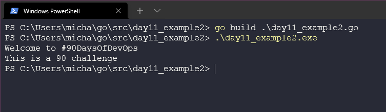

今日のトピックに入る前に、[Techworld with Nana](https://www.youtube.com/watch?v=yyUHQIec83I) とGoの基礎についての素晴らしい簡潔な旅に大きな賛辞を送りたいと思います。

[Day8](day08.md)では環境を設定し、[Day9](day09.md)ではHello #90DaysOfDevOpsコードを歩き、[Day10](day10.md)ではGoワークスペースをみて、コードのコンパイルと実行について少し深く掘り下げて説明しました。

今日は、新しいプログラムを書きながら、変数、定数、データ型について見ていきます。

## 変数、定数、データ型

まず、アプリケーションの企画から始めましょう。#90DaysOfDevOpsチャレンジの残り日数を教えてくれるプログラムに取り組むのは良い考えだと思います。

ここで最初に考えるべきことは、私たちがアプリを作り、参加者を迎え入れ、完了した日数についてユーザーにフィードバックしているときに、プログラムを通して何度も#90DaysOfDevOpsという言葉を使うかもしれない、ということです。これは、#90DaysOfDevOpsをプログラム内の変数にするのに最適なユースケースです。

- 変数は、値を保存するために使用されます。
- 保存した情報や値を入れた小さな箱のようなものです。
- この変数は、プログラム全体で使用することができ、この課題や変数が変更された場合、1か所だけ変更すればよいという利点もあります。つまり、この変数の値を1つ変えるだけで、コミュニティ内の他の課題にも転用できるのです。

Goプログラムでこれを宣言するには、変数のための**キーワード**を使用して値を定義します。これは後ほど紹介する `func main` というコードのブロックの中で使われます。[キーワード](https://go.dev/ref/spec#Keywords)については、こちらで詳しく説明しています。

変数名は説明的であることを忘れないようにしましょう。これはデッドコード(使われないコード)の可能性を避けるためです。これはデッドコード、つまり使われないコードを避けるためです。

```
var challenge = "#90DaysOfDevOps"
```

上記のように設定し、次のコードスニペットで見るように使用すると、以下の出力から、変数を使用したことがわかります。

```
package main

import "fmt"

func main() {
    var challenge = "#90DaysOfDevOps"
    fmt.Println("Welcome to", challenge "")
}
```

上記のコードスニペットは [day11_example1.go](Go/day11_example1.go) で見ることができます。
上記の例でコードをビルドすると、以下のような出力が得られることがわかります。


また、今回のチャレンジは少なくとも90日ですが、次は100日かもしれませんので、ここでも変数を定義しておきたいと思います。しかし、このプログラムでは、これを定数として定義したいと思います。定数は変数のようなものですが、その値はコードの中では変更できません（このコードで後で新しいアプリケーションを作り、この定数を変更することはできますが、アプリケーションを実行している間はこの90は変更されません）。

コードに `const` を追加し、これを表示するコードをもう一行追加してください。

```
package main

import "fmt"

func main() {
    var challenge = "#90DaysOfDevOps"
    const daystotal = 90

    fmt.Println("Welcome to", challenge)
    fmt.Println("This is a", daystotal, "challenge")
}
```
上記のコードは [day11_example2.go] (Go/day11_example2.go) で見ることができます。

この `go build` プロセスをもう一度実行してみると、以下のような結果になります。



最後に、これでプログラムが終わるわけではありませんが、[Day12](day12.md)でさらに機能を追加するために、またこの話に戻ります。ここで、チャレンジを完了した日数を表す別の変数を追加したいと思います。

以下では、完了した日数を表す `dayscomplete` 変数を追加しています。

```
package main

import "fmt"

func main() {
    var challenge = "#90DaysOfDevOps"
    const daystotal = 90
    var dayscomplete = 11

    fmt.Println("Welcome to", challenge, "")
    fmt.Println("This is a", daystotal, "challenge and you have completed", dayscomplete, "days")
    fmt.Println("Great work")
}
```
上記のコードは [day11_example3.go] (Go/day11_example3.go) で見ることができます。

もう一度 `go build` プロセスを実行してみましょう。あるいは `go run` でもかまいません。


以下は、コードを読みやすく、編集しやすくするために私が使った他の例です。今までは `Println` を使っていましたが、 `%v` を使って `Printf` を使うことで、よりシンプルにすることができます。

ここでは、`%v`をデフォルト値として使用していますが、他にもオプションがあり、[fmt package documentation](https://pkg.go.dev/fmt) に記載されています。また、コード例として [day11_example4.go](Go/day11_example4.go) を参照してください。

変数もまた、より単純な形式で定義することができます。変数であることと、その型を定義する代わりに、次のようなコードを書くと、同じ機能を持ちながら、よりきれいでシンプルなコードになります。ただし、これは変数に対してのみ有効であり、定数に対しては有効ではありません。

```
func main() {
    challenge := "#90DaysOfDevOps"
    const daystotal = 90
```

## データ型

上記の例では、変数の型を定義していません。これは、変数に値を与えることができ、Goは十分に賢いので、その型が何であるかを知っているか、少なくとも保存した値に基づいてそれが何であるかを推論することができるからです。しかし、ユーザーが入力する場合は、特定の型が必要です。

これまでのコードでは、文字列と整数を使用してきました。日数にはInteger、課題の名前にはStringを使用しました。

また、それぞれのデータ型は異なることができ、異なる挙動をすることに注意することが重要です。例えば、整数は掛け算ができるのに、文字列はできない。

4つのカテゴリーがあります。

- **基本型**。数値、文字列、ブーリアンなどがこれに該当する。
- **集合型**。配列や構造体がこれに該当する。
- **参照型**。ポインタ、スライス、マップ、関数、チャネルがこれに該当する。
- インターフェース型

データ型は、プログラミングにおいて重要な概念である。データ型は、変数値のサイズと型を指定します。

Goは静的型付けされており、一度変数の型が定義されると、その型のデータしか保存できないことを意味します。

Goには3つの基本的なデータ型があります。

- ブール**：ブール値を表し、trueまたはfalseのどちらかである。
- Numeric**: 整数型、浮動小数点数型、複素数型を表す。
- 文字列**：文字列の値を表します。

データ型については、[Golang by example](https://golangbyexample.com/all-data-types-in-golang-with-examples/)という資料が超詳しいです。

また、[Techworld with Nana](https://www.youtube.com/watch?v=yyUHQIec83I&t=2023s) は、Goのデータ型について詳しく説明しています。

もし、変数に型を定義する必要があれば、次のようにします。

```
var TwitterHandle string 
var DaysCompleted uint
```

Goは値が与えられると変数を意味するので、次のようにすればそれらの値をプリントアウトすることができます。

```
fmt.Printf("challenge is %T, daystotal is %T, dayscomplete is %T\n", conference, daystotal, dayscomplete)
```
整数型と浮動小数点型には多くの種類がありますが、上記のリンクで詳しく説明します。

- **int** = 整数
- **unint** = 正の整数
- **浮動小数点型** = 小数の要素を含む数

## リソース

- [StackOverflow 2021 Developer Survey](https://insights.stackoverflow.com/survey/2021)
- [Why we are choosing Golang to learn](https://www.youtube.com/watch?v=7pLqIIAqZD4&t=9s)
- [Jake Wright - Learn Go in 12 minutes](https://www.youtube.com/watch?v=C8LgvuEBraI&t=312s) 
- [Techworld with Nana - Golang full course - 3 hours 24 mins](https://www.youtube.com/watch?v=yyUHQIec83I) 
- [**NOT FREE** Nigel Poulton Pluralsight - Go Fundamentals - 3 hours 26 mins](https://www.pluralsight.com/courses/go-fundamentals) 
- [FreeCodeCamp -  Learn Go Programming - Golang Tutorial for Beginners](https://www.youtube.com/watch?v=YS4e4q9oBaU&t=1025s) 
- [Hitesh Choudhary - Complete playlist](https://www.youtube.com/playlist?list=PLRAV69dS1uWSR89FRQGZ6q9BR2b44Tr9N) 

次は、このプログラムにユーザー入力機能を追加して、何日目が終了したかを尋ねるようにします。

それでは、[12日目](day12.md)でお会いしましょう。
