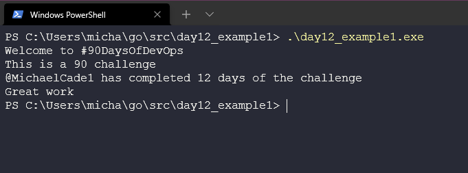
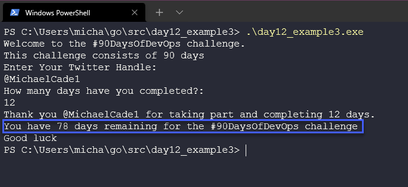

## ポインタを使ったユーザー入力の取得と完成したプログラム

昨日([Day 11](day11.md)) 、私たちは自己完結した最初のGoプログラムを作成しました。ユーザーの入力を得たい部分はコード内で変数として作成し、値を与えました。今度は、変数に終了メッセージの値を与えるために、ユーザーに入力を求めたいと思います。

## ユーザー入力の取得

その前に、もう一度アプリケーションを見て、ユーザーの入力を得る前にテストとして必要な変数を調べてみましょう。

昨日、私たちは次のようなコードを書き上げました [day11_example4.go](Go/day11_example4.go) 私たちは手動で `challenge, daystotal, dayscomplete` 変数と定数をコードで定義しています。

次に、`TwitterName` という新しい変数を追加しましょう。この新しいコードは [day12_example1.go](Go/day12_example1.go) にあります。このコードを実行すると、次のような結果が得られます。



現在12日目ですが、毎日 `dayscomplete` を変更して、毎日コードをコンパイルする必要があります。

ユーザーの入力を得て、名前と完了した日数の値を取得したいと思います。これを行うには、`fmt`パッケージの別の関数を使用します。

fmt` パッケージについて復習すると、以下のような様々な関数があります。

- メッセージの印刷
- ユーザーの入力を収集する
- ファイルへの書き込み

これは、変数の値を代入する代わりに、ユーザーに入力を求めるものです。

```
fmt.Scan(&TwitterName)
```

変数の前に `&` を使っていることに注意してください。これはポインタと呼ばれるもので、次のセクションで説明します。

コード [day12_example2.go](Go/day12_example2.go) では、ユーザーに二つの変数、 `TwitterName` と `DaysCompleted` の入力を求めていることがわかります。

プログラムを実行してみると、上記の2つの変数が入力されていることがわかります。


さて、ユーザーからの入力を得てメッセージを表示したのはいいのですが、挑戦があと何日残っているかをプログラムに表示させるのはどうでしょう。

そのために `remainingDays` という変数を作成し、コード内で `90` というハードバリューを設定しました。この値を変更して、ユーザから `DaysCompleted` という入力を得たときに残りの日数を表示する必要があります。このためには、この単純な変数の変更を行います。

```
remainingDays = remainingDays - DaysCompleted
```

完成したプログラムはこちら [day12_example2.go](Go/day12_example3.go) で見ることができます。

このプログラムを実行すると、ユーザー入力と `remainingDays` の値に基づいて簡単な計算が行われていることがわかります。



## ポインターとは（特殊変数）

ポインタとは、他の変数のメモリアドレスを指し示す（特殊な）変数のことです。

これについては、[geeksforgeeks](https://www.geeksforgeeks.org/pointers-in-golang/)にすばらしい説明があります。

ここではコードを単純化して、printコマンドの前に`&`をつけるかつけないかで、ポインタのメモリアドレスを表示してみましょう。このコード例をここに追加しました。[day12_example4.go](Go/day12_example4.go)です。

以下は、このコードを実行しているところです。


## リソース

- [StackOverflow 2021 Developer Survey](https://insights.stackoverflow.com/survey/2021)
- [Why we are choosing Golang to learn](https://www.youtube.com/watch?v=7pLqIIAqZD4&t=9s)
- [Jake Wright - Learn Go in 12 minutes](https://www.youtube.com/watch?v=C8LgvuEBraI&t=312s) 
- [Techworld with Nana - Golang full course - 3 hours 24 mins](https://www.youtube.com/watch?v=yyUHQIec83I) 
- [**NOT FREE** Nigel Poulton Pluralsight - Go Fundamentals - 3 hours 26 mins](https://www.pluralsight.com/courses/go-fundamentals) 
- [FreeCodeCamp -  Learn Go Programming - Golang Tutorial for Beginners](https://www.youtube.com/watch?v=YS4e4q9oBaU&t=1025s) 
- [Hitesh Choudhary - Complete playlist](https://www.youtube.com/playlist?list=PLRAV69dS1uWSR89FRQGZ6q9BR2b44Tr9N) 

13日目](day13.md)でお会いしましょう。

