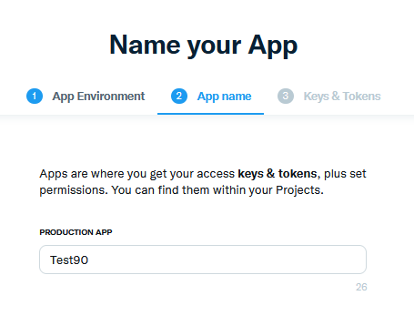
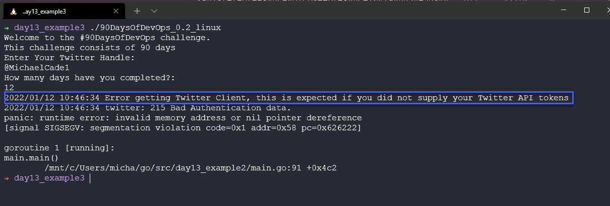

## 新しいアプリで進捗をツイート

このプログラミング言語について調べる最終日、私たちはまだこの言語の表面に触れただけですが、このようなスタートだからこそ、私たちは興味を持ち、興奮し、もっと潜り込みたいと思うのだと思います。

このセッションでは、私たちが紹介したパッケージを利用して、画面上で進捗状況を確認できるだけでなく、チャレンジの詳細や状況をツイートする機能を作りたいと思います。

## 進捗をツイートする機能を追加する

まず最初に、Twitterで開発者用のAPIアクセスを設定する必要があります。

Twitter Developer Platform](https://developer.twitter.com)にアクセスし、自分のTwitterハンドル名と詳細情報を入力してサインインします。ログインすると、以下のような画面が表示されますが、すでに作成したアプリは表示されません。


ここから、昇格アクセスを要求することもできます。これは少し時間がかかるかもしれませんが、私の場合はとても早かったです。

次に、プロジェクトとアプリを選択し、アプリを作成する必要があります。アカウントアクセスによって制限があり、essentialでは1つのアプリと1つのプロジェクトしか持てず、elevatedでは3つのアプリを持つことができます。


アプリケーションに名前を付ける。



このAPIトークンを安全な場所に保存しておくことが重要です。(私はこのアプリを削除しました) これらは後でGoアプリケーションで必要になります。


これでアプリの作成は完了です。（上のスクリーンショットの名前はすでに使われていたので、アプリ名を変更する必要がありました。） 


先ほど集めた鍵はコンシューマーキーと呼ばれ、アクセストークンとシークレットも必要です。これらの情報は、"Keys & Tokens "タブで収集することができます。


さて、Twitter開発者ポータルでの作業は一旦終了です。キーは後で必要になるので、必ず保管しておいてください。

## Go ツイッターボット

アプリケーション内で開始するコードも覚えておいてください [day13_example1](Go/day13_example1.go) しかし、まず、何かをツイートするための正しいコードがあることを確認する必要があります。

Twitter にツイートするためのコードを考えましょう。ここでは [go-twitter](https://github.com/dghubble/go-twitter) を使用します。これはTwitter API用のGoクライアントライブラリです。

メインアプリケーションに組み込む前にテストするために、`src` フォルダに go-twitter-bot という新しいディレクトリを作成し、そのフォルダに対して `go mod init github.com/michaelcade/go-twitter-bot` を実行すると `go.mod` ファイルが作成され、新しい main.go を書いてこれをテストできるようになりました。

次に、Twitter開発者ポータルから集めたキー、トークン、シークレットが必要です。これらを環境変数に設定するつもりです。これは実行しているOSに依存します。

Windows
```
set CONSUMER_KEY
set CONSUMER_SECRET
set ACCESS_TOKEN
set ACCESS_TOKEN_SECRET
```

Linux / macOS
```
export CONSUMER_KEY
export CONSUMER_SECRET
export ACCESS_TOKEN
export ACCESS_TOKEN_SECRET
```

この段階のコードは [day13_example2](Go/day13_example2.go) を見ていただくとして、ここでは構造体を使用してキー、秘密情報、トークンを定義していることがお分かりいただけると思います。

次に、これらの認証情報をパースして Twitter API に接続するための `func` を用意しています。

そして成功したら、ツイートを送信します。

```
package main

import (
    // other imports
    "fmt"
    "log"
    "os"

    "github.com/dghubble/go-twitter/twitter"
    "github.com/dghubble/oauth1"
)

// Credentials stores all of our access/consumer tokens
// and secret keys needed for authentication against
// the twitter REST API.
type Credentials struct {
    ConsumerKey       string
    ConsumerSecret    string
    AccessToken       string
    AccessTokenSecret string
}

// getClient is a helper function that will return a twitter client
// that we can subsequently use to send tweets, or to stream new tweets
// this will take in a pointer to a Credential struct which will contain
// everything needed to authenticate and return a pointer to a twitter Client
// or an error
func getClient(creds *Credentials) (*twitter.Client, error) {
    // Pass in your consumer key (API Key) and your Consumer Secret (API Secret)
    config := oauth1.NewConfig(creds.ConsumerKey, creds.ConsumerSecret)
    // Pass in your Access Token and your Access Token Secret
    token := oauth1.NewToken(creds.AccessToken, creds.AccessTokenSecret)

    httpClient := config.Client(oauth1.NoContext, token)
    client := twitter.NewClient(httpClient)

    // Verify Credentials
    verifyParams := &twitter.AccountVerifyParams{
        SkipStatus:   twitter.Bool(true),
        IncludeEmail: twitter.Bool(true),
    }

    // we can retrieve the user and verify if the credentials
    // we have used successfully allow us to log in!
    user, _, err := client.Accounts.VerifyCredentials(verifyParams)
    if err != nil {
        return nil, err
    }

    log.Printf("User's ACCOUNT:\n%+v\n", user)
    return client, nil
}
func main() {
    fmt.Println("Go-Twitter Bot v0.01")
    creds := Credentials{
        AccessToken:       os.Getenv("ACCESS_TOKEN"),
        AccessTokenSecret: os.Getenv("ACCESS_TOKEN_SECRET"),
        ConsumerKey:       os.Getenv("CONSUMER_KEY"),
        ConsumerSecret:    os.Getenv("CONSUMER_SECRET"),
    }

    client, err := getClient(&creds)
    if err != nil {
        log.Println("Error getting Twitter Client")
        log.Println(err)
    }

    tweet, resp, err := client.Statuses.Update("A Test Tweet from the future, testing a #90DaysOfDevOps Program that tweets, tweet tweet", nil)
    if err != nil {
        log.Println(err)
    }
    log.Printf("%+v\n", resp)
    log.Printf("%+v\n", tweet)
}

```
上記は、起こっていることに基づいてエラーを出すか、成功し、コードに記載されているメッセージを含むツイートが送信されます。

## 2つを組み合わせる - Go-Twitter-Bot＋当社アプリ

この2つを `main.go` の中でマージする必要があります。きっと誰かがもっと良い方法があると叫んでいると思います。

マージされたコードベースは [day13_example3](Go/day13_example3.go) で見ることができますが、以下でも紹介しておきます。

```
package main

import (
    // other imports
    "fmt"
    "log"
    "os"

    "github.com/dghubble/go-twitter/twitter"
    "github.com/dghubble/oauth1"
)

// Credentials stores all of our access/consumer tokens
// and secret keys needed for authentication against
// the twitter REST API.
type Credentials struct {
    ConsumerKey       string
    ConsumerSecret    string
    AccessToken       string
    AccessTokenSecret string
}

// getClient is a helper function that will return a twitter client
// that we can subsequently use to send tweets, or to stream new tweets
// this will take in a pointer to a Credential struct which will contain
// everything needed to authenticate and return a pointer to a twitter Client
// or an error
func getClient(creds *Credentials) (*twitter.Client, error) {
    // Pass in your consumer key (API Key) and your Consumer Secret (API Secret)
    config := oauth1.NewConfig(creds.ConsumerKey, creds.ConsumerSecret)
    // Pass in your Access Token and your Access Token Secret
    token := oauth1.NewToken(creds.AccessToken, creds.AccessTokenSecret)

    httpClient := config.Client(oauth1.NoContext, token)
    client := twitter.NewClient(httpClient)

    // Verify Credentials
    verifyParams := &twitter.AccountVerifyParams{
        SkipStatus:   twitter.Bool(true),
        IncludeEmail: twitter.Bool(true),
    }

    // we can retrieve the user and verify if the credentials
    // we have used successfully allow us to log in!
    user, _, err := client.Accounts.VerifyCredentials(verifyParams)
    if err != nil {
        return nil, err
    }

    log.Printf("User's ACCOUNT:\n%+v\n", user)
    return client, nil
}
func main() {
    creds := Credentials{
        AccessToken:       os.Getenv("ACCESS_TOKEN"),
        AccessTokenSecret: os.Getenv("ACCESS_TOKEN_SECRET"),
        ConsumerKey:       os.Getenv("CONSUMER_KEY"),
        ConsumerSecret:    os.Getenv("CONSUMER_SECRET"),
    }
    {
        const DaysTotal int = 90
        var remainingDays uint = 90
        challenge := "#90DaysOfDevOps"

        fmt.Printf("Welcome to the %v challenge.\nThis challenge consists of %v days\n", challenge, DaysTotal)

        var TwitterName string
        var DaysCompleted uint

        // asking for user input
        fmt.Println("Enter Your Twitter Handle: ")
        fmt.Scanln(&TwitterName)

        fmt.Println("How many days have you completed?: ")
        fmt.Scanln(&DaysCompleted)

        // calculate remaining days
        remainingDays = remainingDays - DaysCompleted

        //fmt.Printf("Thank you %v for taking part and completing %v days.\n", TwitterName, DaysCompleted)
        //fmt.Printf("You have %v days remaining for the %v challenge\n", remainingDays, challenge)
        // fmt.Println("Good luck")

        client, err := getClient(&creds)
        if err != nil {
            log.Println("Error getting Twitter Client, this is expected if you did not supply your Twitter API tokens")
            log.Println(err)
        }

        message := fmt.Sprintf("Hey I am %v I have been doing the %v for %v days and I have %v Days left", TwitterName, challenge, DaysCompleted, remainingDays)
        tweet, resp, err := client.Statuses.Update(message, nil)
        if err != nil {
            log.Println(err)
        }
        log.Printf("%+v\n", resp)
        log.Printf("%+v\n", tweet)
    }

}
```
この結果、ツイートが表示されるはずですが、環境変数が指定されていない場合は、以下のようなエラーが表示されるはずです。



この問題を解決したら、あるいはTwitterで認証しないのであれば、昨日終了したコードを使用できます。成功したときの端末の出力は、以下のような感じになります。 


出来上がったツイートはこのような感じになるはずです。


## How to compile for multiple OSs

次に、"複数のオペレーティングシステム用にどのようにコンパイルするのか？"という質問を取り上げたいと思います。Goの素晴らしいところは、多くの異なるオペレーティングシステム用に簡単にコンパイルできることです。以下のコマンドを実行すれば、全リストが得られます。

```
go tool dist list
```
これまでの `go build` コマンドの使用は素晴らしく、環境変数 `GOOS` と `GOARCH` を使ってホストマシンとビルドの対象を決定してくれます。しかし、以下のコードを例として、他のバイナリを作成することもできます。

```
GOARCH=amd64 GOOS=darwin go build -o ${BINARY_NAME}_0.1_darwin main.go
GOARCH=amd64 GOOS=linux go build -o ${BINARY_NAME}_0.1_linux main.go
GOARCH=amd64 GOOS=windows go build -o ${BINARY_NAME}_0.1_windows main.go
GOARCH=arm64 GOOS=linux go build -o ${BINARY_NAME}_0.1_linux_arm64 main.go
GOARCH=arm64 GOOS=darwin go build -o ${BINARY_NAME}_0.1_darwin_arm64 main.go
```

これで、上記のすべてのプラットフォーム用のバイナリがディレクトリに作成されます。これを元に makefile を作成し、コードに新しい機能を追加するたびにこのバイナリをビルドするようにすればよいのです。私は、[makefile](Go/makefile)を含めています。

これは、あなたが現在 [リポジトリ](https://github.com/MichaelCade/90DaysOfDevOps/releases)で見ることができるリリースを作成するために使用したものです。

## リソース

- [StackOverflow 2021 Developer Survey](https://insights.stackoverflow.com/survey/2021)
- [Why we are choosing Golang to learn](https://www.youtube.com/watch?v=7pLqIIAqZD4&t=9s)
- [Jake Wright - Learn Go in 12 minutes](https://www.youtube.com/watch?v=C8LgvuEBraI&t=312s) 
- [Techworld with Nana - Golang full course - 3 hours 24 mins](https://www.youtube.com/watch?v=yyUHQIec83I) 
- [**NOT FREE** Nigel Poulton Pluralsight - Go Fundamentals - 3 hours 26 mins](https://www.pluralsight.com/courses/go-fundamentals) 
- [FreeCodeCamp -  Learn Go Programming - Golang Tutorial for Beginners](https://www.youtube.com/watch?v=YS4e4q9oBaU&t=1025s) 
- [Hitesh Choudhary - Complete playlist](https://www.youtube.com/playlist?list=PLRAV69dS1uWSR89FRQGZ6q9BR2b44Tr9N) 
- [A great repo full of all things DevOps & exercises](https://github.com/bregman-arie/devops-exercises)
- [GoByExample - Example based learning](https://gobyexample.com/)
- [go.dev/tour/list](https://go.dev/tour/list)
- [go.dev/learn](https://go.dev/learn/)

これで7日間のプログラミング言語の学習は終了です。上記の内容を続けて、プログラミング言語Goの他の側面を理解することができれば幸いです。

次は、Linuxとそこで知っておくべき基本的なことに焦点を当てます。

それでは、[Day14](day14.md)でお会いしましょう。
