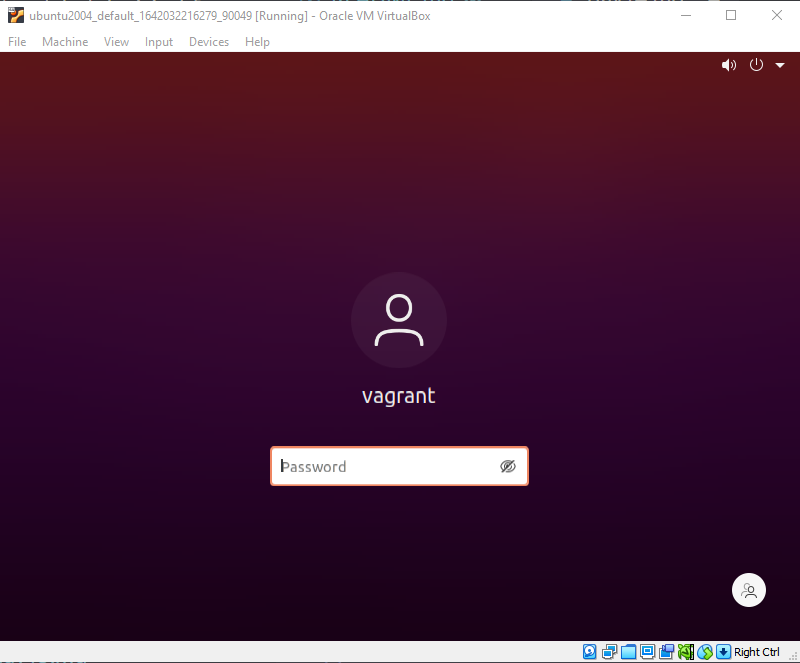

## 全体像の把握 DevOpsとLinux

LinuxとDevOpsは、非常によく似た文化と観点を共有しており、どちらもカスタマイズとスケーラビリティに重点を置いています。Linuxのこの2つの側面は、DevOpsにとって特に重要です。

特にソフトウェア開発やインフラストラクチャの管理に関連する場合、多くのテクノロジーがLinuxから始まっています。

また、多くのオープン・ソース・プロジェクト、特にDevOpsツールは、最初からLinux上で動作するように設計されています。

DevOpsの観点から、あるいは実際、運用の役割の観点から、あなたはLinuxに遭遇することになるでしょう。WinOpsもありますが、ほとんどの場合、Linuxサーバを管理、デプロイすることになります。

私は何年も前からLinuxを日常的に使っていますが、デスクトップ・マシンはいつもmacOSかWindowsでした。しかし、現在のクラウド・ネイティブの職務に就いたとき、私は思い切って自分のラップトップを完全にLinuxベースにして日常的に使うようにした。仕事用のアプリケーションにはまだWindowsが必要だし、私のオーディオやビデオ機器の多くはLinuxでは動かないが、これから7日間にわたって触れる多くのことをよりよく理解するために、Linuxデスクトップをフルタイムで動かすことを自分に強いていた。

## はじめに

もっと簡単で破壊的でない選択肢もあるので、決して私と同じことをしろと言っているわけではありませんが、フルタイムのステップを踏むことで、Linuxで物事を動かす方法をより早く学ぶことができるということは言えると思います。

この7日間の大半は、Windowsマシン上のVirtual BoxでVirtual Machineをデプロイするつもりです。一方、あなたが管理するLinuxサーバーの多くは、GUIがなく、すべてがシェルベースのサーバーでしょう。しかし、冒頭で言ったように、この90日間を通して取り上げたツールの多くはLinuxから始まっている。

この記事では、Virtual Box環境でUbuntuデスクトップの仮想マシンを立ち上げて実行することに集中します。Virtual Box](https://www.virtualbox.org/) をダウンロードし、リンク先のサイトから最新の [Ubuntu ISO](https://ubuntu.com/download) を入手して、デスクトップ環境を構築することもできますが、それではDevOpsらしくありませんよね？

ほとんどのLinuxディストリビューションを使うもう一つの理由は、それらがフリーでオープンソースであることです。また、モバイルデバイスや企業のRedHat Enterpriseサーバーのことを考えず、おそらく最も広く使われているディストリビューションであるUbuntuを選んでいます。間違っているかもしれませんが、CentOSとその歴史から、Ubuntuが上位に来るのは間違いないと思いますし、超シンプルです。

## HashiCorp Vagrantのご紹介

Vagrant は、仮想マシンのライフサイクルを管理する CLI ユーティリティです。vagrant を使って vSphere、Hyper-v、Virtual Box、Docker など様々なプラットフォームで仮想マシンをスピンアップ、ダウンすることができます。他のプロバイダもありますが、ここではVirtual Boxを使用するので、これにこだわることにします。

まず、Vagrantをインストールします。ダウンロードページに行くと、すべてのOSがリストアップされています。[HashiCorp Vagrant](https://www.vagrantup.com/downloads) 私はWindowsを使用しているので、自分のシステム用のバイナリを取得し、システムにインストールしました。

次に、[Virtual Box](https://www.virtualbox.org/wiki/Downloads)をインストールする必要があります。これもまた、様々なOSにインストールすることができます。Vagrantを選ぶ良い理由は、Windows、macOS、Linuxを使用しているのであれば、Vagrantでカバーできるということです。

どちらもインストールはとても簡単です。もし問題があれば、どちらも素晴らしいコミュニティがあるので、気軽に声をかけてください。

## 初のVAGRANTFILE

VAGRANTFILEは、配備したいマシンの種類を記述します。また、このマシンの設定とプロビジョニングがどのように見えるようにしたいかを定義します。

VAGRANTFILEを保存し、整理する場合、私はワークスペース内の独自のフォルダに入れることが多いです。私のシステムでは、以下のように表示されます。この後、Vagrant を使ってみて、様々なシステムを簡単に立ち上げることができることを期待しています。


それでは、VAGRANTFILE を見て、何を構築しているのか見てみましょう。


```
Vagrant.configure("2") do |config|

  config.vm.box = "chenhan/ubuntu-desktop-20.04"

  config.vm.provider :virtualbox do |v|

   v.memory  = 8096

   v.cpus    = 4

   v.customize ["modifyvm", :id, "--vram", "128mb"]

   end

end

```

これは非常にシンプルなVAGRANTFILEで、特定の「ボックス」が欲しいと言っています。ボックスとは、あなたが探しているシステムのパブリックイメージかプライベートビルドのどちらかです。Vagrant boxes の[公開カタログ](https://app.vagrantup.com/boxes/search) に、公開されている "box" の一覧があります。

次の行では、特定のプロバイダ（この場合は `VirtualBox` ）を使い、マシンのメモリを `8GB` に、CPU数を `4` に定義することを述べています。また、私の経験では、表示に問題がある場合は、次の行を追加するとよいでしょう。これはビデオメモリを設定するもので、私なら128MBまで増設しますが、システムによります。

```
v.customize ["modifyvm", :id, "--vram", ""]
```

また、この特定のvagrantファイルのコピーを[Linux Folder](Linux/VAGRANTFILE)に置きました。

## Linuxデスクトップのプロビジョニング

ワークステーションのターミナルで、最初のマシンを立ち上げる準備ができました。私の場合、WindowsマシンでPowerShellを使用しています。プロジェクトフォルダに移動して、VAGRANTFILEを見つけます。そこで、`vagrant up`コマンドを入力し、すべてが正しく行われていれば、以下のような画面が表示されます。


もう一つ、仮想マシンのネットワークは`NAT`に設定されます。この段階では、NATについて知る必要はありませんし、次のネットワークについてのセッションで説明する予定です。NATはVirtual Boxのデフォルトのネットワークモードでもあり、ホームネットワークにマシンを接続するための簡単なボタンです。詳しくは[Virtual Box documentation](https://www.virtualbox.org/manual/ch06.html#network_nat)で確認できます。

`vagrant up`が完了したら、今度は `vagrant ssh`を使って新しいVMの端末に直接アクセスできるようにします。


これから数日間、私たちはほとんどここを探索することになりますが、私が行った開発者用ワークステーションのカスタマイズについても紹介したいと思いますし、これを毎日のドライバとして実行すると生活がずっとシンプルになります。

ただし、Virtual Boxでは、VMを選択するとログインプロンプトが表示されるはずですので、ご確認ください。



ここまで来て、「USERNAMEとPASSWORD」は何ですか？

- Username = vagrant

- Password = vagrant


明日は、いくつかのコマンドとその機能について説明しますが、ターミナルはすべてを実現する場所となります。

## リソース

- [Learn the Linux Fundamentals - Part 1](https://www.youtube.com/watch?v=kPylihJRG70)
- [Linux for hackers (don't worry you don't need be a hacker!)](https://www.youtube.com/watch?v=VbEx7B_PTOE)

Goのリソースと同じように、私たちがここで参加し学ぶことができるように、私は一般的にそれらを無料のコンテンツに保つつもりです。

次はLinux環境で毎日使うようなコマンドを見ていこうと思います。

[15日目](day15.md)でお会いしましょう。

