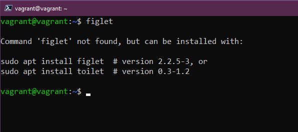
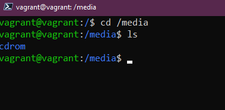
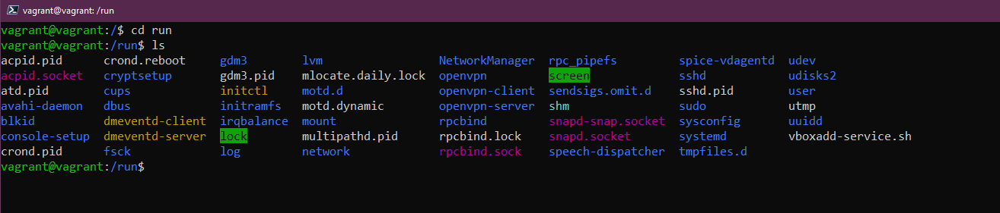
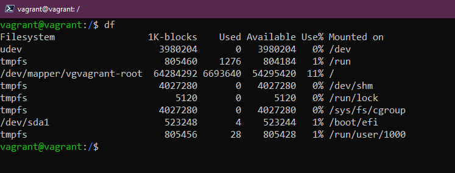

## Linuxシステム、ファイルシステム、ストレージの管理

これまで、Linux と DevOps の簡単な概要を説明し、vagrant を使ってラボ環境をセットアップしました [Day 14](day14.md) 。そして、ターミナルで物事を成し遂げるときに毎日使うツールキットのコマンドのごく一部に触れました [Day 15](day15.md) 。

ここでは、Linux システムのアップデート、ソフトウェアのインストール、システムフォルダの用途の理解、そしてストレージの3つの重要な領域について見ていきたいと思います。

## Ubuntuとソフトウェアの管理

まず最初に、オペレーティング・システムのアップデート方法について説明します。Windows OS や macOS では、このプロセスはよく知られていますが、Linux デスクトップやサーバでは少し違ってきます。

ここでは、aptパッケージマネージャについて見ていきます。これは、Ubuntu VMでアップデートとソフトウェアのインストールに使用するものです。

一般的に、少なくとも開発用ワークステーションでは、ソフトウェアをインストールする前に、中央リポジトリから最新の利用可能なアップデートがあることを確認するために、このコマンドを実行することにしています。

`sudo apt-get update`

これで、最新のOSアップデートがインストールされたUbuntuのVMができました。ここで、いくつかのソフトウェアをインストールしたいと思います。

ここでは、テキストバナーを生成するプログラムである `figlet` を選択しましょう。

ターミナルで`figlet`と入力すると、システムにインストールされていないことがわかります。

しかし、上記のように `apt` のインストールオプションが表示されるので、それを試してみることができます。これは、デフォルトのレポジトリに figlet というプログラムがあるからです。 それでは、`sudo apt install figlet`を試してみましょう。

これで、以下のように `figlet` アプリを使用することができます。

もし、インストールしたソフトウェアを削除したい場合は、`apt`パッケージマネージャを使用して削除することもできます。

`sudo apt remove figlet`

サードパーティのリポジトリもありますが、Ubuntuのデフォルトのリポジトリにアクセスすることができます。

例えば、UbuntuのVMにvagrantをインストールしたい場合、今はできません。次に、HashiCorpのリポジトリを信頼するためのキーを追加し、リポジトリをシステムに追加します。

HashiCorpのリポジトリを追加したら、`sudo apt install vagrant`を実行して、システムにvagrantをインストールします。

ソフトウェアのインストールには多くの選択肢があり、Ubuntuに組み込まれているパッケージマネージャやスナップを使ってインストールすることもできます。

LinuxでOSやソフトウェアのインストールを管理する方法について感じていただければ幸いです。

## ファイルシステムの説明

Linuxは設定ファイルで構成されており、何かを変更したい場合は、この設定ファイルを変更することになります。

Windowsでは、C:ドライブがあり、これがルートとみなされます。Linuxでは、`/`があり、ここにLinuxシステム上の重要なフォルダがあります。

- `/bin` - バイナリーの略で、システムが必要とするバイナリー、実行ファイル、ツールはほとんどここにあります。

- `/boot` - システムが起動するために必要なすべてのファイル。起動の仕方、起動するドライブ。

- `/dev` - デバイスの情報はここにあります。ここにはディスクドライブのポインタがあり、`sda`はOSのメインディスクになります。

- `/etc` - Linuxシステムで最も重要なフォルダであり、設定ファイルの大部分がここにあります。

- `/home` - この中にユーザーフォルダとファイルがあります。私たちのvagrantユーザーフォルダがあります。ここには、コマンドのセクションで作業した `Documents` と `Desktop` フォルダがあります。

- `/lib` - バイナリや実行ファイルがあるのが `/bin` で、それらの共有ライブラリがあるのが `/lib` であると述べました。

- `/media` - ここで、リムーバブルデバイスを見つけることができます。

- `/mnt` - これは一時的なマウントポイントです。ここについては、次のストレージのセクションで詳しく説明します。

- `/opt` - オプションのソフトウェアパッケージです。ここに、vagrantやvirtual boxのソフトウェアが格納されていることに気づきます。

- `/proc` - カーネルとプロセスの情報、`/dev`に似ている。

- `/root` - アクセスするには、このフォルダにsudoする必要があります。rootのホームフォルダです。

- `/run` - アプリケーションの状態を表すプレースホルダーです。

- `/sbin` - Sudo binは、binフォルダと似ていますが、これらのツールは、システム上で昇格したスーパーユーザー特権を対象としています。

- `/tmp` - 一時ファイル

- `/usr` - 私たち標準的なユーザーがソフトウェアパッケージをインストールした場合、一般的には `/usr/bin` の場所にインストールされます。

- `/var` - 私たちのアプリケーションは `bin` フォルダにインストールされます。すべてのログファイルを保存する場所が必要で、これは `/var` です。

## ストレージ

Linux システムやその他のシステムで、利用可能なディスクとそのディスクにある空き容量を知りた い場合があります。次のいくつかのコマンドは、ストレージを識別し、使用し、管理するのに役立ちます。

- `lsblk` - ブロックデバイスをリストアップします。`sda` は物理ディスク、そして `sda1、sda2、sda3` はそのディスク上のパーティションです。

- `df` - パーティション、合計、使用、使用可能について、もう少し詳しく教えてくれます。他のフラグを指定することもできますが、一般的には `df -h` を使ってデータを人間的に出力しています。

Linuxのターミナルでは、`sudo mkfs -t ext4 /dev/sdb` を使って、sdbを新しく追加したディスクに関連付けながらフォーマットすることができます。

次に、新しくフォーマットしたディスクを使用できるようにマウントする必要があります。これを前述の `/mnt` フォルダに行い、そこに `sudo mkdir NewDisk` でディレクトリを作成し、 `sudo mount /dev/sdb newdisk` でその場所にディスクをマウントします。

また、システムからストレージを安全にアンマウントする必要がある場合もあります。これを行うには、`sudo umount /dev/sdb` とします。

ディスクをアンマウントせず、このディスクをデータベースやその他の永続的な用途に使用する場合、システムを再起動したときにディスクが存在するようにしたいものです。そのためには、このディスクを `/etc/fstab` 設定ファイルに追加して持続させる必要があります。そうしないと、マシンを再起動したときに使用できなくなり、手動で上記のプロセスを実行しなければならなくなります。データはディスク上に残りますが、このファイルに設定を追加しない限り、オートマウン トは行われません。

`fstab` 設定ファイルを編集したら、`sudo mount -a` で動作を確認できます。もしエラーがなければ、変更した内容は再起動しても持続します。

テキストエディタを使ってファイルを編集する方法については、次回のセッションで説明します。

## リソース

- [Learn the Linux Fundamentals - Part 1](https://www.youtube.com/watch?v=kPylihJRG70)
- [Linux for hackers (don't worry you don't need to be a hacker!)](https://www.youtube.com/watch?v=VbEx7B_PTOE)

[Day17](day17.md)でお会いしましょう。
