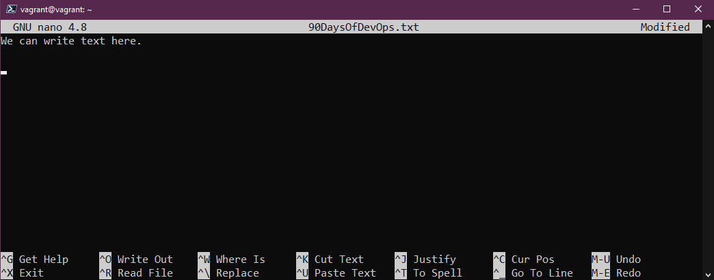
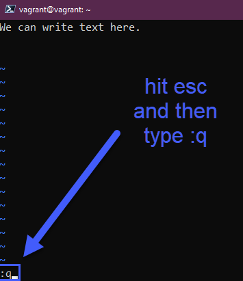

## テキストエディター - nano vs vim

Linuxシステムの大半はサーバーであり、GUIを持たないでしょう。前回のセッションで、Linuxはほとんど設定ファイルで構成されており、システム上の何かを変更するためには、設定ファイルを編集できる必要があることを述べました。

たくさんのオプションがありますが、おそらく最も一般的な2つのターミナル・テキストエディタをカバーする必要があると思います。私はこの2つのエディタを使ったことがありますが、素早い変更には `nano` が簡単で、`vim` は非常に幅広い機能を持っています。

### nano 

- すべてのシステムで利用できるわけではありません。
- 使い始めに最適です。

`nano 90DaysOfDevOps.txt` を実行すると、何も入っていない新しいファイルが作成されます。ここからテキストを追加して、そのファイルに対して何をしたいかを以下に説明します。

次に、`control x + enter`を使用して、`ls`を実行すると、新しいテキストファイルが表示されます。

これで、そのファイルに対して `cat` を実行し、ファイルを読み込むことができます。それから同じように `nano 90DaysOfDevOps.txt` を使って、テキストを追加したりファイルを修正したりすることができます。

私にとっては、設定ファイルにちょっとした変更を加えるのに、nanoはとても簡単です。

### vim

最も一般的なテキストエディタと言えるかもしれません。1976年に発売されたUNIXのテキストエディタviの兄弟で、vimで多くの機能を手に入れることができます。

- すべてのLinuxディストリビューションでサポートされています。
- 信じられないほど強力です。7時間コースでvimを学ぶことができます。

`vim` コマンドで vim に飛び込んだり、新しい txt ファイルを編集したい場合は `vim 90DaysOfDevOps.txt` を実行しますが、まず最初に下の方にあるヘルプメニューがないことに気がつくと思います。

最初の質問は "How do I exit vim?" で、これは `escape` で、もし何も変更していなければ `:q` となります。

テキストを追加したい場合は、`normal`から`insert`に切り替える必要があります。テキストを追加して、その変更を保存したい場合は、escapeキーを押して、次に `:wq` を押します。

この確認は `cat` コマンドで変更内容が保存されているかどうかを確認します。

vim にはクールな高速機能があり、ショートカットを知っていれば、ちょっとした作業を非常に素早く行うことができます。例えば、繰り返される単語のリストを追加して、それを変更する必要があるとします。例えば、設定ファイルで、ネットワーク名を繰り返していますが、これが変更されたので、すぐにこれを変更したいとします。この例では、dayという単語を使っています。

この単語を 90DaysOfDevOps に置き換えるには、`esc` を押して `:%s/Day/90DaysOfDevOps` と入力してください。

エンターキーを押すと、dayという単語が90DaysOfDevOpsに置き換わります。

コピー＆ペーストは、私にとって大きな目から鱗でした。キーボードの「yy」を使ってコピーすることができます。同じ行に`p`ペースト、新しい行に`p`ペースト。

また、削除したい行数を選んでから`dd`を押すと、その行を削除することができます。

以前のセッションで紹介したように `grep` を使うこともできますが、vim を使うこともできます。

vimの場合、これは表面的なことにさえ触れていません。私ができる最大のアドバイスは、可能な限り手を動かしてvimを使用することです。

よくある面接の質問で、Linuxで好きなテキストエディタは何かというのがありますが、私は少なくともこの2つの知識があることを確認し、答えられるようにします。少なくとも、テキストエディタが何であるかを理解する能力があることを示すことができます。しかし、より熟練するために、それらと手をつないでください。

もう一つのポインターは、vim では矢印キーの他に `H,J,K,L` を使って移動することができます。

## リソース

- [Vim in 100 Seconds](https://www.youtube.com/watch?v=-txKSRn0qeA)
- [Vim tutorial](https://www.youtube.com/watch?v=IiwGbcd8S7I)
- [Learn the Linux Fundamentals - Part 1](https://www.youtube.com/watch?v=kPylihJRG70)
- [Linux for hackers (don't worry you don't need to be a hacker!)](https://www.youtube.com/watch?v=VbEx7B_PTOE)

[Day18](day18.md)でお会いしましょう。
