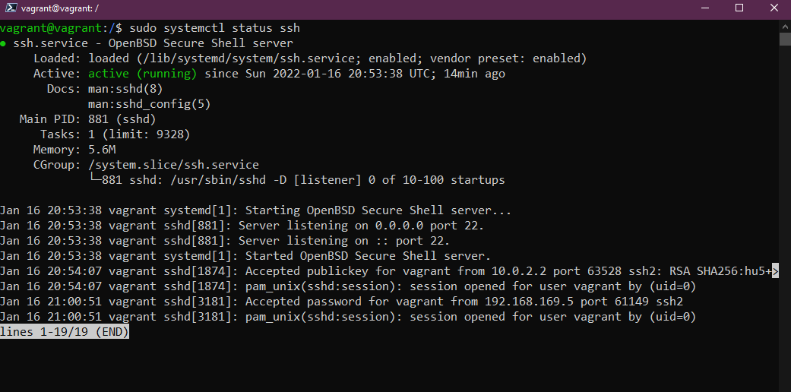
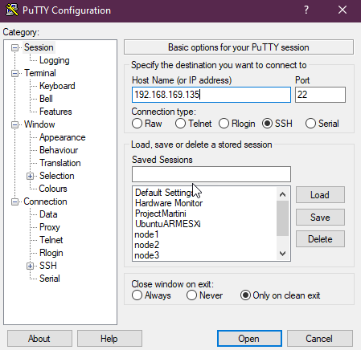
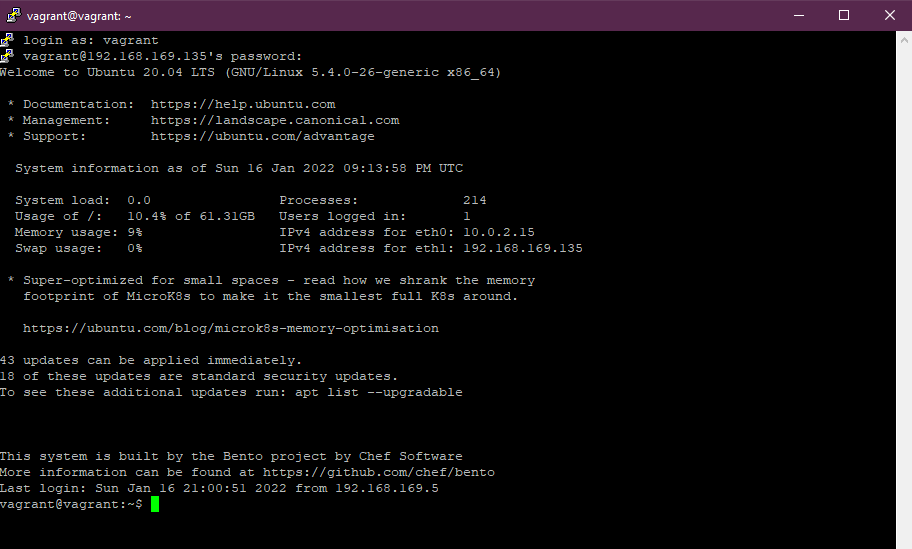
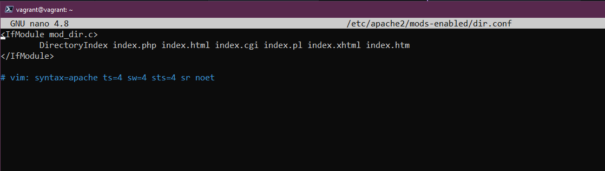
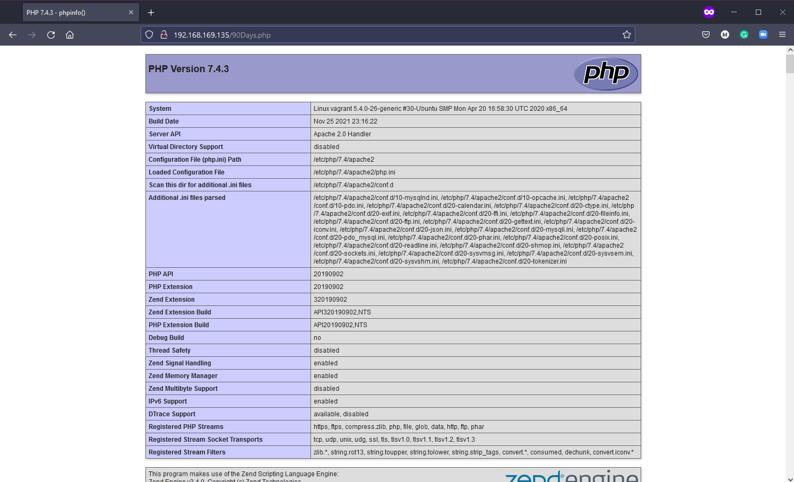

## SSH＆Webサーバー

これまで述べてきたように、多くのリモート Linux サーバーを管理することになるので、リモートサーバーへの接続が安全であることを確認する必要があります。このセクションでは、リモートシステムとの安全な接続に役立つ、誰もが知っておくべき SSH の基本をいくつか取り上げます。

- SSH による接続のセットアップ
- ファイルの転送
- 秘密鍵の作成

### SSH の紹介

- セキュアシェル
- ネットワークプロトコル
- 安全な通信を可能にする
- あらゆるネットワークサービスを保護することができる
- 一般的にリモートコマンドラインアクセスに使用される

私たちの環境では、すでに SSH を使っていますが、これはすべて vagrant の設定によって自動化されているので、`vagrant ssh` を実行するだけで、リモート仮想マシンにアクセスできるようになります。

もしリモートマシンがワークステーションと同じシステム上になく、遠隔地にある場合、例えばクラウドベースのシステムであったり、インターネット経由でしかアクセスできないデータセンターで動いている場合、システムを管理するために安全にアクセスする方法が必要です。

SSHはクライアントとサーバーの間に安全なトンネルを提供し、悪意ある者に傍受されることがないようにします。


サーバーにはサーバーサイドのSSHサービスが常に稼働しており、特定のTCPポート(22)でリッスンしています。

クライアントを使って正しい認証情報またはSSHキーで接続すれば、そのサーバーにアクセスすることができます。

### ブリッジネットワークアダプターをシステムに追加する

現在の仮想マシンでこの機能を使用するには、ブリッジドネットワークアダプターをマシンに追加する必要があります。

仮想マシンをパワーダウンし、Virtual Box内でマシンを右クリックし、[設定]を選択します。新しいウィンドウが表示されたら、[ネットワーク]を選択します。


マシンの電源を入れ直すと、ローカルマシンにIPアドレスが設定されているはずです。ip addr`コマンドで確認することができます。

### SSHサーバーが起動していることを確認する

SSHはvagrantで使っているのですでに設定されているはずですが、次のコマンドで確認できます。

sudo systemctl status ssh` を実行して確認します。



SSH サーバーがない場合は、`sudo apt install openssh-server` というコマンドでインストールすることができます。

次に、ファイアウォールが動作している場合に、SSHが許可されることを確認します。これは `sudo ufw allow ssh` で行えますが、Vagrant のプロビジョニングで自動化されているので、この設定には必要ありません。

### リモートアクセス - SSHパスワード 

SSHサーバーがポート22をリッスンし、ブリッジネットワークが追加されたので、ローカルマシンでputtyまたはSSHクライアントを使用してSSHを使用してシステムに接続することができるようになりました。



もし、このIPアドレスでこのシステムに接続するのが初めてなら、この警告が表示されます。私たちのシステムであることがわかりますので、「はい」を選択してください。


ユーザー名(vagrant)とパスワード(デフォルトパスワード - vagrant)の入力を要求されます。



この段階で、リモートクライアントからVMに接続され、システム上でコマンドを発行することができます。

### リモートアクセス - SSHキー

上記の方法は、システムにアクセスする簡単な方法ですが、ユーザー名とパスワードに依存しているため、悪意のある俳優がこの情報とシステムのパブリックアドレスまたはIPにアクセスした場合、簡単に危険にさらされる可能性があります。そこで、SSH鍵の使用が推奨されます。

SSHキーとは、クライアントとサーバーの両方が信頼できるデバイスであることを認識できるように、キーペアを提供することを意味します。

鍵の作成は簡単です。私たちのローカルマシン(Windows)では、次のコマンドを発行できます。実際、どのシステムにもsshクライアントがインストールされていれば、これと同じコマンドが使えると思います。

ssh-keygen -t ed25519` とします。

ed25519`が何なのか、どういう意味なのかはここでは触れませんが、[暗号](https://en.wikipedia.org/wiki/EdDSA#Ed25519)についてもっと知りたければ検索してみてください。


この時点で、作成したSSH鍵は `C:\Usersersmicha/.ssh/` に保存されています。

しかし、これをLinux VMとリンクさせるためには、鍵をコピーする必要があります。これは `ssh-copy-id vagrant@192.168.169.135` を使って行うことができます。

Windowsクライアントで鍵を作成するのにPowershellを使いましたが、こちらでは`ssh-copy-id`が使えません。Windowsでこれを行う方法はありますし、ネットでちょっと検索すれば代替案が見つかると思いますが、ここではWindowsマシンでgit bashを使ってコピーを作成することにします。


Powershellに戻り、SSHキーで接続し、パスワードが不要であることをテストします。

`ssh vagrant@192.168.169.135`


必要であれば、パスフレーズを使用することで、さらにセキュリティを高めることができます。さらに一歩進んで、パスワードは一切不要、つまりSSH経由のキーペアのみが許可されるようにすることも可能です。これは次の設定ファイルで実現できます。

`sudo nano /etc/ssh/sshd_config` とします。

この中に `PasswordAuthentication yes` という行がありますが、これは `#` でコメントアウトされているので、コメントを解除して yes を no に変更する必要があります。それから SSH サービスを `sudo systemctl reload sshd` で再読み込みする必要があります。

## ウェブサーバのセットアップ

上の SSH の話とは特に関係ないのですが、これもまた少し大変な作業だと思うかもしれませんが、そうではありません。

Linux プレイグラウンド VM ができましたので、この段階で、apache ウェブサーバを VM に追加して、ホームネットワークに公開する簡単なウェブサイトをホストできるようにしたいと思います。この Web ページはインターネットからアクセスできないことに注意してください。

また、LAMPスタックと呼ばれることもあります。

- **L**inuxオペレーティングシステム
- **A**pache ウェブサーバー
- **M**ySQLデータベース
- **P**HP

### Apache2

Apache2は、オープンソースのHTTPサーバーです。以下のコマンドでapache2をインストールすることができます。

`sudo apt-get install apache2` です。

apache2が正しくインストールされたことを確認するために、`sudo service apache2 restart`を実行します。

次に、SSHチュートリアルのブリッジされたネットワークアドレスを使って、ブラウザを開き、そのアドレスにアクセスします。私のは `http://192.168.169.135/` でした。


### MySQL

MySQLは、私たちの簡単なウェブサイトのデータを格納するためのデータベースです。MySQLをインストールするには、次のコマンドを使用します： `sudo apt-get install mysql-server`.

### PHP

PHPはサーバーサイドのスクリプト言語で、MySQLデータベースとのやりとりに使用します。最終的には、`sudo apt-get install php libapache2-mod-php php-mysql` を使って PHP と依存関係をインストールすることになります。

最初の設定変更は、apacheがindex.htmlを使っているので、index.phpを使うようにすることです。

sudo nano /etc/apache2/mods-enabled/dir.conf` を使って、index.phpをリストの最初のアイテムに移動します。



apache2 サービスを再起動する `sudo systemctl restart apache2`

ここで、PHPが正しく設定されていることを確認しましょう。次のコマンドを使用して、次のファイルを作成します。これは、nano で空のファイルを開きます。

`sudo nano /var/www/html/90Days.php` を作成します。

をコピーし、control + x で終了し、ファイルを保存します。

```
<?php
phpinfo();
?>
```

90Days.php を URL の末尾に追加して、Linux VM の IP アドレスに再度アクセスします。http://192.168.169.135/90Days.php` PHPが正しく設定されていれば、以下のような表示になるはずです。



### WordPress のインストール

このチュートリアルを参考に、LAMP環境下でWordPressをインストールしました。「How to install wordpress on Ubuntu with LAMP」(https://blog.ssdnodes.com/blog/how-to-install-wordpress-on-ubuntu-18-04-with-lamp-tutorial/) に記載されていないコマンドを以下に示します。


`sudo mysql -u root -p`

`CREATE DATABASE wordpressdb;`

`CREATE USER 'admin-user'@'localhost' IDENTIFIED BY 'password';`

`GRANT ALL PRIVILEGES ON wordpressdb.* TO 'admin-user'@'localhost';`

`FLUSH PRIVILEGES;`

`EXIT;`

`sudo apt install php-curl php-gd php-mbstring php-xml php-xmlrpc php-soap php-intl php-zip`

`sudo systemctl restart apache2`

`cd /var/www`

`sudo curl -O https://wordpress.org/latest.tar.gz`

`sudo tar -xvf latest.tar.gz`

`sudo rm latest.tar.gz`

この時点では、リンク先の記事のステップ4です。ステップに従って、WordPressディレクトリに正しいパーミッションがすべて設定されていることを確認する必要があります。

これは内部的なものなので、このステップでは「セキュリティ・キーの生成」は必要ありません。ステップ5に進み、Apacheの設定をWordPressに変更します。

あとは、内部ネットワークアドレスでアクセスし、WordPressのインストールを実行します。

## リソース

- [Client SSH GUI - Remmina](https://remmina.org/)
- [The Beginner's guide to SSH](https://www.youtube.com/watch?v=2QXkrLVsRmk)
- [Vim in 100 Seconds](https://www.youtube.com/watch?v=-txKSRn0qeA)
- [Vim tutorial](https://www.youtube.com/watch?v=IiwGbcd8S7I)
- [Learn the Linux Fundamentals - Part 1](https://www.youtube.com/watch?v=kPylihJRG70)
- [Linux for hackers (don't worry you don't need to be a hacker!)](https://www.youtube.com/watch?v=VbEx7B_PTOE)

[Day19](day19.md)でお会いしましょう。
