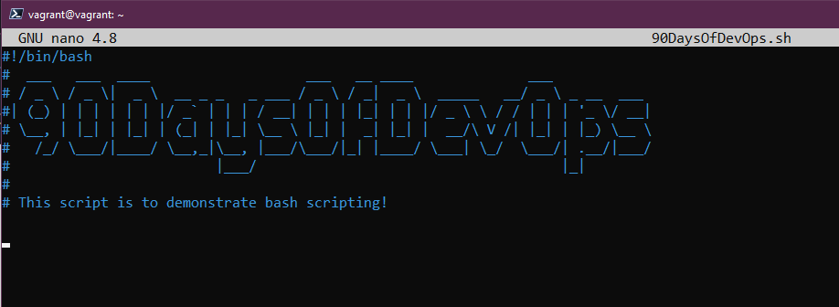
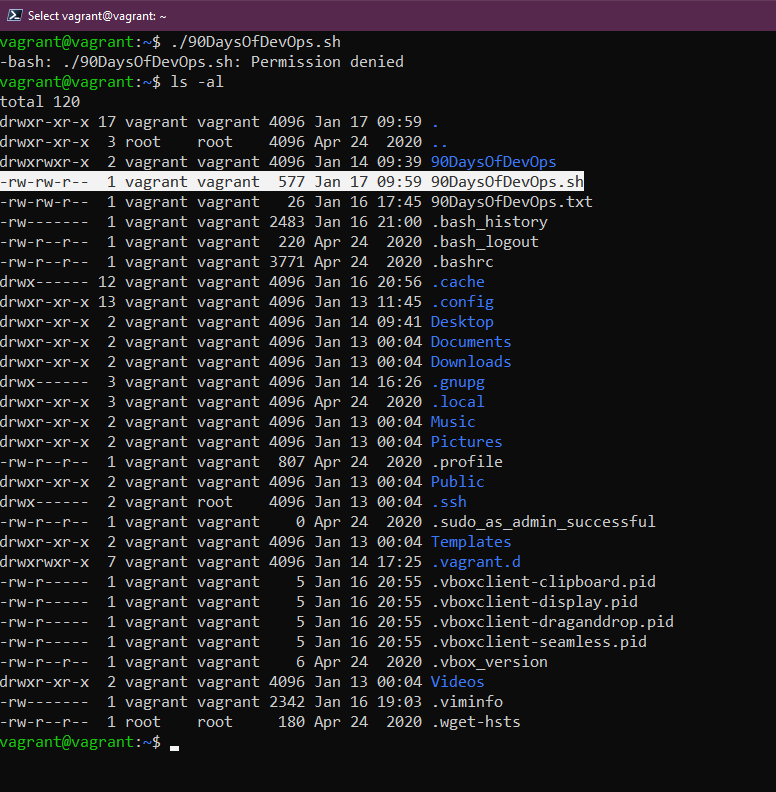
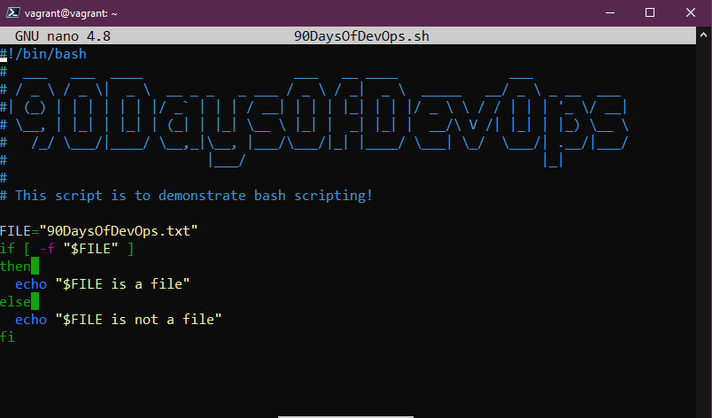
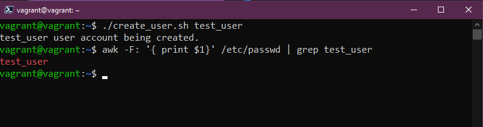
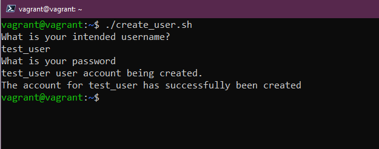

## bashスクリプトによるタスクの自動化

今日使うシェルはbashですが、明日ZSHに潜るときに別のシェルを取り上げる予定です。

BASH - **B**ourne **A**gain **Sh**ell

プログラミング言語と同じように、7日間のうち一節をシェルスクリプトに捧げることができるほど、bashは物事を成し遂げるために他の自動化ツールと一緒に作業する能力を与えてくれます。

私は今でも多くの人と話していますが、彼らは何かを実現するために複雑なシェルスクリプトをセットアップし、ビジネスで最も重要なことのいくつかをこのスクリプトに頼っています。しかし、自動化ツールと一緒に作業したり、アドホックなタスクのためにシェル/bashスクリプトを学ぶべきでしょう。

このセクションで使用した例としては、VMを作成するために使用したVAGRANTFILEがあります。これをシンプルなbashスクリプトにラップして、毎週月曜日の朝にこれを削除して更新し、毎週新しいLinux VMのコピーを持つようにすることができ、このLinuxマシンに必要なすべてのソフトウェアスタックを追加するなど、すべてをこの1つのbashスクリプトで行うことができます。

もうひとつ、あらゆる面接において、スクリプトの実践的な質問がますます多くなってきているようです。

### はじめに

この90日間で扱う多くの事柄と同様に、学ぶための唯一の本当の方法は、実際にやってみることです。実際に体験することで、すべてのことを筋肉に記憶させることができるのです。

まず最初に、テキストエディタが必要です。[17日目](Day17.md)では、おそらく最も一般的な2つのテキストエディタとその使い方を少し説明しました。

さっそく、最初のシェルスクリプトを作ってみましょう。

`touch 90DaysOfDevOps.sh`

続いて、`nano 90DaysOfDevOps.sh` とすると、nano で新しい空のシェルスクリプトが開かれます。ここでもあなたの好きなテキストエディタを選択することができます。

すべてのbashスクリプトの最初の行は、次のようなものである必要があります。

もしUbuntuを使っていないなら、ターミナルで `which bash` を実行して、このパスを確認する必要があります。

しかし、すでに作成されているシェルスクリプトでは、他のパスが表示されることがあります。

- `#!/bin/bash`
- `#!/usr/bin/env bash`

スクリプトの次の行では、コメントを追加して、スクリプトの目的か、少なくとも私に関する情報を追加したいです。これは `#` を使うことで可能です。これにより、コードの特定の行をコメントアウトして、これから実行するコマンドの説明を提供することができます。特にこれを共有する場合は、メモが多いほどユーザーエクスペリエンスに優れていると思います。

Linuxのセクションで紹介したfigletを使って、スクリプトを書き出すときにasciアートを作成することもあります。



このLinuxセクション（[Day15](Day15.md)）で以前に経験したすべてのコマンドは、ここで私たちのスクリプトをテストするための簡単なコマンドとして使用することができました。

スクリプトに簡単なコードブロックを追加してみましょう。

``` 
mkdir 90DaysOfDevOps
cd 90DaysOfDevOps
touch Day19
ls 
```

もし私たちが `./90DaysOfDevOps.sh` でスクリプトを実行すると、パーミッションが拒否されたというメッセージが表示されるはずです。このファイルのパーミッションを `ls -al` コマンドで確認すると、このファイルには実行権限がないことがわかります。



`chmod +x 90DaysOfDevOps.sh` を使って変更することができます。
`x` が表示されているのは、スクリプトを実行できるようになったことを意味します。


スクリプトの実行後、`./90DaysOfDevOps.sh`を使用してスクリプトを再度実行すると、新しいディレクトリが作成され、そのディレクトリに移動して新しいファイルが作成されます。


かなり基本的なことですが、これを利用して他のツールを呼び出すことで、生活を楽にしたり、物事を自動化したりする方法の一端が見えてくるはずです。

### 変数, 条件分岐

このセクションの多くは、Golangを学習したときに説明したことの繰り返しですが、もう一度ここに潜り込む価値はあると思います。

- ### 変数

変数によって、複雑なスクリプトの中で繰り返し使用される特定の用語を一度に定義することができます。

変数を追加するには、スクリプトのきれいな行に次のように追加するだけです。

`challenge="90DaysOfDevOps"`

こうすることで、いつどこで `$challenge` を使っても、変数を変更すればそれが全体に反映されるようになります。


ここで、`sh`スクリプトを実行すると、スクリプトに追加されたプリントアウトが表示されます。


また、次のようにすると、変数の設定に関するユーザー入力を求めることができます。

``` 
echo "Enter your name"
read name
```

これは、入力を `$name` という変数として定義するものです。

- ### 条件分岐 

例えば、チャレンジの参加者とその参加者が何日目かを知りたい場合、`if` `if-else` `else-if` 条件式を使用して定義することができます。

```
#!/bin/bash
#  ___   ___  ____                   ___   __ ____              ___
# / _ \ / _ \|  _ \  __ _ _   _ ___ / _ \ / _|  _ \  _____   __/ _ \ _ __  ___
#| (_) | | | | | | |/ _` | | | / __| | | | |_| | | |/ _ \ \ / / | | | '_ \/ __|
# \__, | |_| | |_| | (_| | |_| \__ \ |_| |  _| |_| |  __/\ V /| |_| | |_) \__ \
#   /_/ \___/|____/ \__,_|\__, |___/\___/|_| |____/ \___| \_/  \___/| .__/|___/
#                         |___/                                     |_|
#
# This script is to demonstrate bash scripting!

# Variables to be defined

ChallengeName=#90DaysOfDevOps
TotalDays=90

# User Input

echo "Enter Your Name"
read name
echo "Welcome $name to $ChallengeName"
echo "How Many Days of the $ChallengeName challenge have you completed?"
read DaysCompleted

if [ $DaysCompleted -eq 90 ]
then
  echo "You have finished, well done"
elif [ $DaysCompleted -lt 90 ]
then
  echo "Keep going you are doing great"
else
  echo "You have entered the wrong amount of days"
fi
```

また、上の例から、次のステージに進むために、いくつかの比較や値同士のチェックを行っていることがわかります。ここで注目すべきは、さまざまなオプションがあることです。 

- `eq` - 2つの値が等しい場合に TRUE を返します。
- `ne` - 2つの値が等しくない場合は、TRUE を返します。
- `gt` - 1つ目の値が2つ目の値より大きい場合、TRUE を返します。
- `ge` - 1つ目の値が2つ目の値より大きいか等しい場合は、TRUE を返します。
- `lt` - 1番目の値が2番目の値よりも小さい場合は、TRUE を返します。
- `le` - 1つ目の値が2つ目の値より小さいか等しい場合、TRUE を返します。

また、bashスクリプトを使ってファイルやフォルダの情報を判断することもあります。これはファイルコンディションと呼ばれています。

- `-d file` ファイルがディレクトリであれば真。
- `-e file` ファイルが存在するかどうか。
- `-f file` 与えられた文字列がファイルである場合に真。
- `-g file` ファイルにグループ ID が設定されている場合に true となる。
- `-r file` ファイルが読み取り可能かどうか？
- `-s file` ファイルサイズが0でない場合に true となる。

```
FILE="90DaysOfDevOps.txt"
if [ -f "$FILE" ]
then 
  echo "$FILE is a file"
else 
  echo "$FILE is not a file"
fi
```



そのファイルがまだディレクトリにある場合は、最初のechoコマンドが返ってくるはずです。しかし、そのファイルを削除すると、2番目のechoコマンドが返ってくるはずです。


これで、システムから特定のアイテムを検索する時間を節約できることがおわかりいただけたと思います。

GitHubで見つけたこの素晴らしいリポジトリには、数え切れないほどのスクリプトがあります[DevOps Bash Tools](https://github.com/HariSekhon/DevOps-Bash-tools/blob/master/README.md)

### 例

**シナリオ**。私たちは "90DaysOfDevOps "と呼ばれる会社を持っており、しばらく運営されてきました。

**必要条件**:
- ユーザはコマンドライン引数で渡すことができます。
- コマンドライン引数で指定した名前でユーザが作成される。
- パスワードはコマンドライン引数として解析することができます。
- パスワードがユーザーに設定される。
- アカウントの作成に成功した旨のメッセージが表示されます。

まず、`touch create_user.sh`でシェルスクリプトを作成することから始めましょう。

次に進む前に、`chmod +x create_user.sh` を使ってこのスクリプトを実行可能な状態にします。

次に、`nano create_user.sh` を使って、設定したシナリオに沿ったスクリプトの編集を開始します。

最初の要件である「コマンドライン引数としてユーザーを渡すことができる」については、次のように記述します。

```
#! /usr/bin/bash

#A user can be passed in as a command line argument
echo "$1"
```


`./create_user.sh Michael` を使って実行します。スクリプトを実行するときは、Michael を自分の名前に置き換えてください。


次に、2つ目の要件である「コマンドライン引数の名前でユーザーを作成する」ですが、これは `useradd` コマンドで実行できます。m`オプションは、ユーザーのホームディレクトリを/home/usernameとして作成するためのものです。

```
#! /usr/bin/bash

#A user can be passed in as a command line argument
echo "$1 user account being created."

#A user is created with the name of command line argument
sudo useradd -m "$1"

```

警告:ユーザーアカウント名を指定しない場合は、変数 `$1` が埋まっていないためエラーになります。

このアカウントが作成されたことを確認するには、`awk -F: '{ print $1}' /etc/passwd`コマンドを実行します。



次の要件は「コマンドライン引数としてパスワードを解析できること」です。まず第一に、私たちはこれを実稼働させるつもりはありません。これは、研究室で要件のリストを理解するために作業するためです。

```
#! /usr/bin/bash

#A user can be passed in as a command line argument
echo "$1 user account being created."

#A user is created with the name of command line argument
sudo useradd -m "$1"

#A password can be parsed in as a command line argument.
sudo chpasswd <<< "$1":"$2"
```

このスクリプトを2つのパラメータ `./create_user.sh 90DaysOfDevOps password` を指定して実行すると、次のようになります。

下の画像から、スクリプトを実行してユーザーとパスワードを作成し、そのユーザーに手動でジャンプして `whoami` コマンドで確認したことがわかります。


最後の要件は、"アカウント作成成功のメッセージが表示されること "です。実はこれ、コードのトップラインにすでにあり、上のスクリーンショットでは`90DaysOfDevOpsユーザーアカウントが作成されました`と表示されていることがわかります。これは、`$1`パラメータを使用したテストから残されたものです。

このスクリプトは、Linuxシステムに新しいユーザーを素早く取り込み、セットアップするために使用することができます。しかし、数人の歴史的な人がこの作業を行い、他の人に新しいユーザー名やパスワードを取得する代わりに、先に説明したユーザー入力を追加して、変数を取得することができるかもしれません。

``` 
#! /usr/bin/bash

echo "What is your intended username?"
read  username
echo "What is your password"
read  password

#A user can be passed in as a command line argument
echo "$username user account being created."

#A user is created with the name of command line argument
sudo useradd -m $username

#A password can be parsed in as a command line argument.
sudo chpasswd <<< $username:$password
```

ステップがよりインタラクティブになったことで 


最後に、新しいユーザー・アカウントが作成されたことを示す成功出力を出力することもできます。

。

一つ気になったのは、入力にパスワードが表示されていることです。これを隠すには、`read -s password`の行で`s`フラグを使用します。



もし、実験用に作成したユーザーを削除したい場合は、`sudo userdel test_user` を使って削除することができます。

[スクリプト例](Linux/create-user.sh)

もう一度言いますが、これは日常的に作成するようなものではありませんが、シェルスクリプトの柔軟性を強調するために思いついたものです。

毎日、毎週、毎月行っている繰り返しの作業を考えてみてください。

私は、非常にシンプルなbashファイルを作成しました。このファイルは、私のローカルマシンでminikubeを使用してKubernetesクラスタをスピンアップし、データサービスとKasten K10を使用して、データ管理に関する要件と必要性を示すのに役立ちます。[Project Pace](https://github.com/MichaelCade/project_pace/blob/main/singlecluster_demo.sh) しかし、私たちはまだKubernetesをカバーしていないので、ここで提起するのは適切ではないと思いました。

## リソース

- [Bash in 100 seconds](https://www.youtube.com/watch?v=I4EWvMFj37g)
- [Bash script with practical examples - Full Course](https://www.youtube.com/watch?v=TPRSJbtfK4M)
- [Client SSH GUI - Remmina](https://remmina.org/)
- [The Beginner's guide to SSH](https://www.youtube.com/watch?v=2QXkrLVsRmk)
- [Vim in 100 Seconds](https://www.youtube.com/watch?v=-txKSRn0qeA)
- [Vim tutorial](https://www.youtube.com/watch?v=IiwGbcd8S7I)
- [Learn the Linux Fundamentals - Part 1](https://www.youtube.com/watch?v=kPylihJRG70)
- [Linux for hackers (don't worry you don't need to be a hacker!)](https://www.youtube.com/watch?v=VbEx7B_PTOE)

ではまた[Day20](day20.md)でお会いしましょう。
