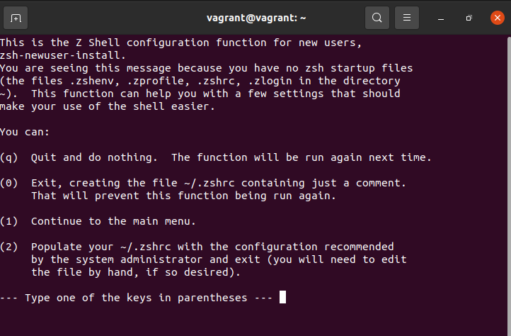

## 開発用ワークステーションのセットアップ - きれいなものばかり

Linuxサーバをこのように設定するのと混同しないように、私はLinuxデスクトップが持つ選択肢と柔軟性を見せたいと思ったんだ。

私は、Linuxデスクトップを1年近く使っていますが、見た目も使い勝手も思い通りに設定できています。Virtual Box上のUbuntu VMを使って、私が日常的に使っているPCに施したカスタマイズのいくつかを紹介します。

YouTubeのビデオに残りの部分をまとめましたので、もっとよく理解できるかもしれません。

このシステムには、以下のようなものがあります。

また、以下にデフォルトのbashシェルが表示されます。

このシリーズの最後のLinuxセッションで取り上げるdotfilesに起因するものが多いのです。

### dotfiles

まず最初に、ドットファイルについて掘り下げたいと思います。Linuxは設定ファイルでできていると前日に述べました。このドットファイルはLinuxのシステムやアプリケーションの設定ファイルです。

また、ドットファイルは単にデスクトップのカスタマイズや見栄えを良くするためだけに使われるのではなく、生産性を高めるために役立つドットファイルの変更や設定もあることを付け加えます。

先に述べたように、多くのソフトウェアプログラムは、その設定をこのドットファイルに保存しています。これらのドットファイルは機能管理を支援するものです。

各ドットファイルは `.` で始まります。この命名の由来はおわかりになるでしょうか。

今までのところ、シェルとしてbashを使っているので、ホームフォルダに.bashrcと.bash_profileがあるはずです。以下に、私たちのシステム上にあるいくつかのドットファイルを示します。

これからシェルを変更するので、後で新しい `.zshrc` 設定ドットファイルを見ることになります。

しかし、これでドットファイルを参照する場合、それが設定ファイルであることがわかるでしょう。ドットファイルを使って、コマンドプロンプトにエイリアスを追加したり、別の場所へのパスを追加したりすることができます。ドットファイルを公開している人もいます。私のものは私のGitHub [MichaelCade/dotfiles](https://github.com/MichaelCade/dotfiles) にあります。ここには私のカスタム `.zshrc` ファイルがあり、私が選んだターミナルは terminator で、そのフォルダにはいくつかの設定ファイルと、背景オプションも入っています。

### ZSH 

これまで述べてきたように、私たちはUbuntuのデフォルトシェルであるbashシェルを使ってきました。ZSH は非常によく似ていますが、bash よりも優れている点がいくつかあります。 

Zsh は対話的なタブ補完、自動ファイル検索、正規表現の統合、コマンドスコープを定義するための高度な省略記法、豊富なテーマエンジンなどの機能を備えています。

私たちのシステムに zsh をインストールするには、`apt` パッケージマネージャを使 用します。bashターミナルから `sudo apt install zsh` を実行してみましょう。SSH で接続している場合ではなく、VM コンソールから実行するつもりです。

インストールが完了したら、ターミナルで `zsh` を実行すると、シェルの設定スクリプトが起動します。

上の質問で`1`を選択したところ、さらにいくつかの選択肢ができました。

このメニューから、ZSH を私たちのニーズに合わせて設定するために、いくつかの編集を行うことができることがわかるでしょう。

`0` でウィザードを終了し、`ls -al | grep .zshrc` を実行すると、新しい設定ファイルができているのがわかると思います。

ここで、ターミナルを開くたびに zsh をデフォルトのシェルにしたいと思います。これを行うには、次のコマンドを実行してシェルを変更します `chsh -s $(which zsh)` その後、ログアウトして変更を反映させるために再びログインする必要があります。

ログアウトしてターミナルを開くと、このような状態になっているはずです。また、`which $SHELL` を実行することで、シェルが変更されたことを確認することができます。

私は通常、スピンアップする各Ubuntuデスクトップ上でこのステップを実行し、それ以上のことをしなくても、一般的にzshシェルはbashよりも少し速いことがわかります。

### OhMyZSH 

次はもう少し見栄えを良くして、ターミナル内の移動を助ける機能を追加したいと思います。

OhMyZSH は zsh の設定を管理するためのフリーでオープンソースのフレームワークです。たくさんのプラグインやテーマ、その他のものがあり、zsh シェルとのやりとりをより快適にしてくれます。

ohmyzsh](https://ohmyz.sh/)についてもっと知ることができます。

Oh My ZSHをインストールしましょう。`curl` `wget` や `fetch` などのオプションがありますが、私たちのシステムでは最初の2つが利用可能です。

`sh -c "$(curl -fsSL https://raw.githubusercontent.com/ohmyzsh/ohmyzsh/master/tools/install.sh)"`

上記のコマンドを実行すると、以下のような出力が表示されるはずです。

 Oh My ZSHには100以上のテーマが同梱されていますが、私が一番よく使うのはドラキュラのテーマです。

 また、Oh My ZSHを使用する際には、この2つのプラグインは必須であることを付け加えておきます。

 `git clone https://github.com/zsh-users/zsh-autosuggestions.git $ZSH_CUSTOM/plugins/zsh-autosuggestions`

 `git clone https://github.com/zsh-users/zsh-syntax-highlighting.git $ZSH_CUSTOM/plugins/zsh-syntax-highlighting`

 `nano ~/.zshrc`

 プラグインを編集して、`plugins=(git zsh-autosuggestions zsh-syntax-highlighting)` を含めるようにします。

## Gnome 拡張

また、Gnomeの拡張機能を使用しており、特に以下のリストを参考にしています。

[Gnome extensions](https://extensions.gnome.org)

    - Caffeine 
    - CPU Power Manager
    - Dash to Dock 
    - Desktop Icons 
    - User Themes 

## ソフトウェアのインストール

私が `apt` を使ってマシンにインストールしているプログラムの短いリストです。

    - VSCode 
    - azure-cli 
    - containerd.io
    - docker
    - docker-ce 
    - google-cloud-sdk 
    - insomnia 
    - packer
    - terminator
    - terraform 
    - vagrant

### Dracula テーマ

このサイトは、私が今使っている唯一のテーマです。見た目もスッキリしていて、全てが素晴らしく見えます。[ドラクエのテーマ](https://draculatheme.com/) また、あなたのマシンで使用する他のプログラムをたくさん持っている場合にも、このサイトでカバーされています。

上記のリンクから、サイト上でzshを検索すると、少なくとも2つのオプションが見つかります。

記載されている手順に従って、手動または git を使ってインストールします。そして、最後に `.zshrc` 設定ファイルを以下のように編集する必要があります。

次に、[Gnome Terminal Dracula theme](https://draculatheme.com/gnome-terminal)が必要です。すべての手順はここで入手できます。

一つ一つの手順を記録するのは時間がかかるので、ビデオで手順を説明します。(**下の画像をクリックしてください**)

[!](Images/Day20_YouTube.png)](https://youtu.be/jeEslAtHfKc)

ここまで来れば、#90DaysOfDevOpsのLinuxセクションは終了です。今回もまた、フィードバックやリソースの追加をお待ちしています。

また、今回、多くのステップをビデオで紹介する方が、ここに書き出すよりも簡単だと思ったのですが、いかがでしょうか？私は、これらの日々を振り返って、可能であればビデオ・ウォークスルーを作成して、私たちがカバーした事柄のいくつかをより良く説明し、示すという目標を持っています。いかがでしょうか？

## リソース

- [Bash in 100 seconds](https://www.youtube.com/watch?v=I4EWvMFj37g)
- [Bash script with practical examples - Full Course](https://www.youtube.com/watch?v=TPRSJbtfK4M)
- [Client SSH GUI - Remmina](https://remmina.org/)
- [The Beginner's guide to SSH](https://www.youtube.com/watch?v=2QXkrLVsRmk)
- [Vim in 100 Seconds](https://www.youtube.com/watch?v=-txKSRn0qeA)
- [Vim tutorial](https://www.youtube.com/watch?v=IiwGbcd8S7I)
- [Learn the Linux Fundamentals - Part 1](https://www.youtube.com/watch?v=kPylihJRG70)
- [Linux for hackers (don't worry you don't need to be a hacker!)](https://www.youtube.com/watch?v=VbEx7B_PTOE)

明日から7日間、ネットワークに潜り込み、DevOpsを中心としたネットワークの基礎知識と理解を深めたいと思います。

それでは [Day21] (day21.md) でお会いしましょう。
