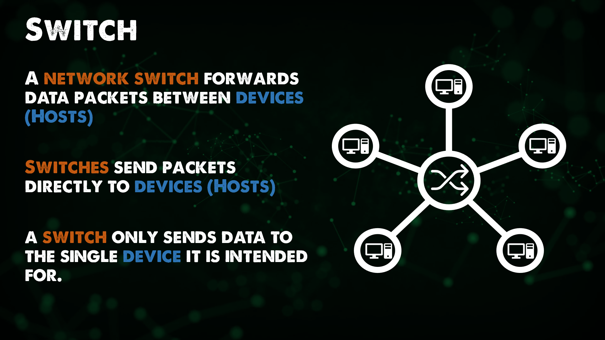

## 全体像: DevOpsとネットワーキング

21日目へようこそ! ネットワークとDevOpsは包括的なテーマですが、ネットワークの基本的な部分にも触れる必要があります。

最終的には、これまで述べてきたように、DevOpsは組織内の文化やプロセスを変えることなのです。
私たちは、仮想マシン、コンテナ、Kubernetesについて議論してきました。もし私たちがインフラストラクチャにDevOpsの原則を用いるのであれば、DevOpsの観点からすると、ネットワークも含まれなければなりません。ネットワークについても、さまざまなトポロジーやネットワーク・ツール、スタックについて知っておく必要があります。

私は、インフラストラクチャー・アズ・コードを使ってネットワーク機器を設定し、仮想マシンのようにすべてを自動化すべきだと主張します。しかし、そのためには、何を自動化するのかをよく理解しなければなりません。

### NetDevOpsとは

また、Network DevOpsやNetDevOpsという言葉も耳にすることがあるかもしれません。あなたはすでにネットワーク・エンジニアで、インフラ内のネットワーク・コンポーネントをよく理解しており、DHCP、DNS、NATなど、ネットワーキングで使用される要素を理解しているかもしれません。また、ハードウェアやソフトウェア定義のネットワークオプション、スイッチ、ルーターなどについてもよく理解していることでしょう。

しかし、もしあなたがネットワークエンジニアでないなら、ネットワークDevOpsの最終目標を理解するために、これらの分野の基礎知識を得る必要があるかもしれません。

しかし、これらの用語に関して、NetDevOpsまたはネットワークDevOpsは、DevOpsの原則と実践をネットワークに適用し、バージョン管理と自動化ツールをネットワークの作成、テスト、監視、デプロイメントに適用することだと考えることができます。

自動化を必要とするネットワークDevOpsを考える場合、DevOpsはチーム間のサイロを破壊すると前述した。もしネットワーク・チームが同じようなモデルとプロセスに変わらなければ、彼らがボトルネックになったり、全体的に失敗したりすることになります。

プロビジョニング、コンフィグレーション、テスト、バージョン管理、デプロイメントに関する自動化の原則を使用することは、素晴らしいスタートとなります。自動化は全体として、展開のスピード、ネットワークインフラの安定性、一貫した改善を可能にし、一度テストされたプロセスは複数の環境間で共有されるようになる。例えば、ある環境で完全にテストされたネットワークポリシーは、以前は手動でオーサリングされたプロセスであったのに対し、コード化されているため、別の場所でもすぐに使用することができる。
この考え方の良い視点とアウトラインは、ここで見ることができます。[Network DevOps](https://www.thousandeyes.com/learning/techtorials/network-devops)

## ネットワーク基本

ここでは、まずDevOpsの側面を忘れて、ネットワークの基本的な部分をごく簡単に見ていく必要があります。

### ネットワークデバイス

**ホスト**は、トラフィックを送信または受信するすべてのデバイスです。

**IPアドレス** 各ホストのID。

**ネットワーク**は、ホスト間のトラフィックを転送するものです。もしネットワークがなければ、手作業によるデータの移動がたくさんあったことでしょう。

ネットワークとは、同じような接続性を必要とするホストの論理的なグループです。

**スイッチ**は、ネットワーク内の通信を容易にします。スイッチは、ホスト間でデータパケットを転送します。スイッチは、パケットをホストに直接送信します。

- ネットワークは、同じような接続性を必要とするホストのグループ化。
- ネットワーク上のホストは、同じIPアドレス空間を共有する。

**ルータ**はネットワーク間の通信を容易にします。スイッチがネットワーク内の通信を管理すると言った場合、ルータはこれらのネットワークを結合したり、許可されていれば少なくとも相互にアクセスできるようにします。

ルーターは、トラフィック制御ポイント（セキュリティ、フィルタリング、リダイレクト）を提供することができます。

ルーターは、自分がどのネットワークに接続しているかを学習します。これはルートとして知られており、ルーティングテーブルは、ルータが知っているすべてのネットワークです。

ルータは、それらが接続されているネットワークにIPアドレスを持っています。このIPはまた、ゲートウェイとして知られている彼らのローカルネットワークから各ホストの方法であることを行っている。

ルータはまた、私が先に述べたネットワーク内の階層を作成します。

## スイッチとルーター

**ルーティング**とは、ネットワーク間でデータを移動させる処理のことです。

- ルーターは、ルーティングを主目的とする装置である。

**スイッチング**は、ネットワーク内でデータを移動させるプロセスです。

- スイッチとは、スイッチングを主目的とするデバイスのことです。

ネットワーク機器には、次のようなさまざまなものがあるため、ここでは機器の基礎的な概要を説明します。

- Access Points 
- Firewalls 
- Load Balancers 
- Layer 3 Switches
- IDS / IPS 
- Proxies 
- Virtual Switches 
- Virtual Routers 

これらのデバイスはすべてルーティングとスイッチングを実行するものですが、このリストについてもう少し詳しく説明します。

これから数日間で、このリストについてもう少し詳しく知ることになります。

- OSI Model 
- Network Protocols 
- DNS (Domain Name System)
- NAT 
- DHCP
- Subnets 

## リソース

[Computer Networking full course](https://www.youtube.com/watch?v=IPvYjXCsTg8)

また[Day22](day22.md)でお会いしましょう。
