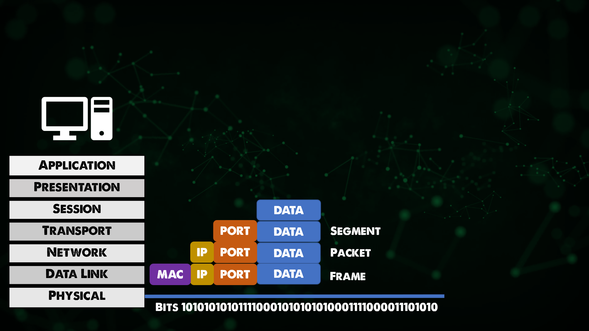

## OSIモデル - 7つのレイヤー

産業としてのネットワークの全体的な目的は、ネットワーク化する前に2つのホストがデータを共有できるようにすることです。
このホストからこのホストにデータを送るには、このホストに何かを差し込んで、もう一方のホストまで歩いて行って、もう一方のホストに差し込まなければなりません。

ネットワーク化によって、ホストがワイヤーを介して自動的にデータを共有できるようになり、これを自動化することができるようになりました。

これは、英語には英語を話す者同士が守らなければならないルールがあり、スペイン語にはスペイン語のルールがあり、フランス語にはフランス語のルールがあるのと同じで、ネットワークにもルールがあります。

ネットワークのルールは7つの層に分かれており、それらの層はOSIモデルとして知られています。

### OSIモデルの紹介

OSIモデル（Open Systems Interconnection Model）は、ネットワークシステムの機能を記述するために使用されるフレームワークである。OSIモデルは、異なる製品やソフトウェア間の相互運用性をサポートするために、コンピューティング機能を普遍的な規則と要件のセットに特徴付けます。OSI参照モデルでは、コンピュータシステム間の通信は、7つの異なる抽象化層に分割されています。**物理層、データリンク層、ネットワーク層、トランスポート層、セッション層、プレゼンテーション層、アプリケーション層です。

### 物理層

OSIモデルの第1層は物理層と呼ばれ、あるホストから別のホストへ、物理ケーブルやWi-Fiなどの手段でデータを転送することを前提にしています。また、あるホストから別のホストへデータを転送するために、ハブやリピータなどのレガシーハードウェアも見られるかもしれません。

### データリンク層

レイヤ2、データリンクは、データがフレームにパッケージされているノード間の転送を可能にします。また、物理層で発生したであろうエラー訂正のレベルも存在する。また、MACアドレスを導入したり、初めて目にするのもこの層です。

21 日目](day21.md) のネットワーキングの初日で取り上げたスイッチについても、ここで初めて言及されています。

### ネットワーク層

レイヤー3スイッチやレイヤー2スイッチという言葉を聞いたことがあると思います。OSIモデルのレイヤ3では、ネットワークはエンドツーエンドの配信を目標としており、初日の概要でも触れたIPアドレスはここにあたります。

ルータとホストはレイヤ3に存在し、ルータは複数のネットワーク間をルーティングする機能であることを忘れないでください。IPを持つものはすべてレイヤー3と考えることができます。

では、なぜレイヤ2と3の両方でアドレス方式が必要なのでしょうか？ (MACアドレスとIPアドレスの比較) 

あるホストから別のホストにデータを送ることを考えると、各ホストはIPアドレスを持っていますが、その間にはいくつかのスイッチやルーターがあります。それぞれの機器には、そのレイヤー2のMACアドレスがあります。

レイヤー2 MACアドレスは、ホストからスイッチ/ルーターに移動するだけで、レイヤー3 IPアドレスがそのデータのパケットがエンドホストに到達するまで残るのに対し、ホップに焦点が当てられています。(エンド・ツー・エンド)

IPアドレス - レイヤ3 = エンド・トゥ・エンド配送

MACアドレス - レイヤ2 = ホップ・トゥ・ホップ配送

さて、レイヤ3とレイヤ2のアドレスを結びつけるARP（Address Resolution Protocol）というネットワークプロトコルがありますが、今日は触れません。

### トランスポート層

サービスからサービスへ、レイヤ4はデータストリームを区別するために存在する。レイヤー3とレイヤー2がアドレス方式を持つのと同じように、レイヤー4にはポートがあります。

### セッション層、プレゼンテーション層、アプリケーション層

レイヤー5,6,7の区別は、やや曖昧になっている、あるいはなっていた。

[TCP IPモデル](https://www.geeksforgeeks.org/tcp-ip-model/)を見ると、より最新の理解が得られるでしょう。

では、このネットワークスタックを使ってホスト同士が通信しているときに、実際に何が起こっているかを説明しましょう。このホストには、別のホストに送信するデータを生成するアプリケーションがあります。

送信元のホストは、カプセル化プロセスと呼ばれるものを通過することになります。そのデータはまずレイヤー4に送られます。

レイヤ4はそのデータにヘッダを追加し、レイヤ4の目標であるサービス間デリバリーを容易にします。これは、TCPまたはUDPを使用したポートになります。また、送信元ポートと送信先ポートも含まれます。

これは、セグメント（データとポート）とも呼ばれます。

このセグメントは、osiスタックからレイヤー3、ネットワーク層に渡されます。ネットワーク層はこのデータに別のヘッダを追加します。
このヘッダはレイヤ3の目的であるエンド・ツー・エンド・デリバリを容易にします。つまり、このヘッダにはソースIPアドレスとデスティネーションIPがあり、ヘッダとデータはパケットと呼ばれることがあります。

レイヤ3はそのパケットをレイヤ2に渡します。レイヤ2は再びそのデータに別のヘッダを追加し、レイヤ2の目標であるホップ・トゥ・ホップ配送を達成します。
このレイヤー2のヘッダーとデータを合わせて1つのフレームと呼びます。

このフレームは、1と0に変換され、レイヤ1物理ケーブルまたは無線LANで送信されます。

ヘッダー＋データの各レイヤーのネーミングについては前述しましたが、これも描き出すことにしました。

明らかに、データを送信しているアプリケーションは、どこかに送信されているので、受信側では逆にスタックを上がって受信側のホストにデータを戻します。

## リソース

- [Computer Networking full course](https://www.youtube.com/watch?v=IPvYjXCsTg8)
- [Practical Networking](http://www.practicalnetworking.net/)

[23日目](day23.md)でお会いしましょう。
