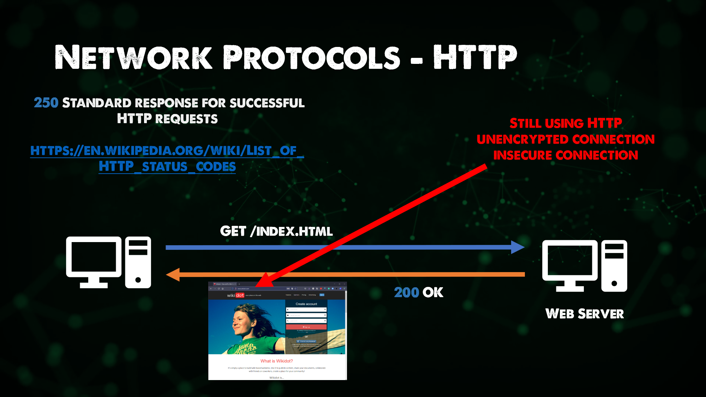
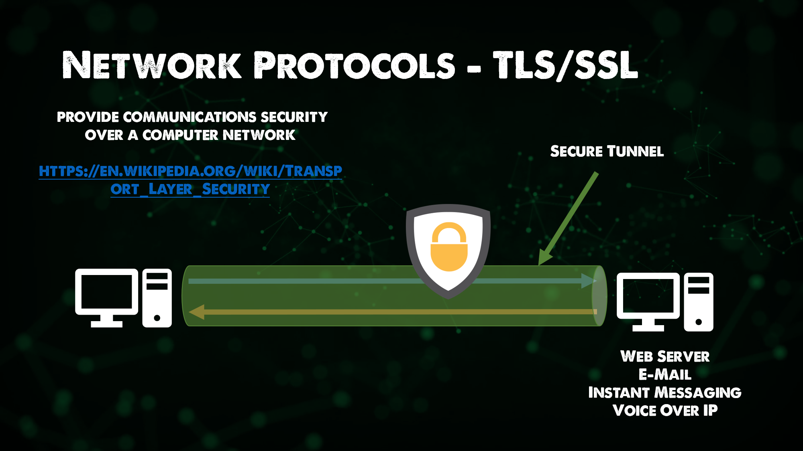
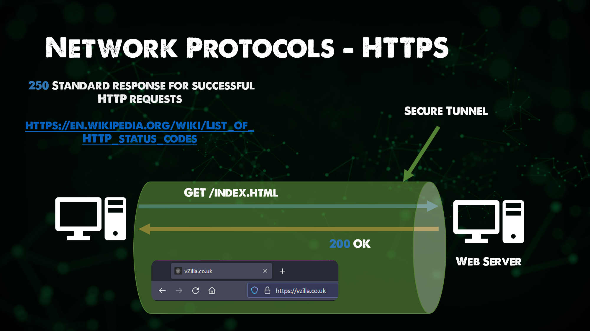
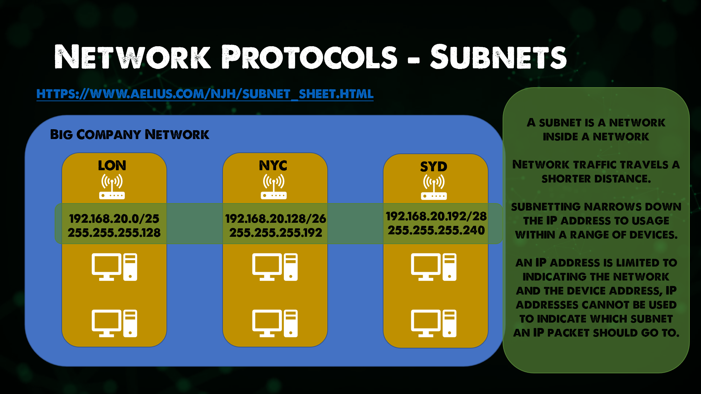

## ネットワークプロトコル

標準を形成する一連の規則とメッセージ。
インターネット標準の一つ。

- ARP - アドレス解決プロトコル

ARPについてもっと詳しく知りたい方は、こちらのインターネット標準をご覧ください。[RFC 826](https://datatracker.ietf.org/doc/html/rfc826)

レイヤ2ネットワークにおいて、IPアドレスをMACアドレスと呼ばれる固定物理マシンアドレスに接続する。

- FTP - ファイル転送プロトコル

送信元から送信先へのファイル転送を可能にする。一般に、このプロセスは認証されますが、匿名アクセスを使用するように設定されている場合は、その機能があります。現在では、より高いセキュリティのために、クライアントからFTPサーバーにSSL/TLS接続を提供するFTPSを目にすることが多くなっています。このプロトコルは、OSIモデルのアプリケーション層に位置づけられます。

- SMTP - シンプルなメール転送プロトコル

電子メールの送信に使用され、メールサーバーはメールメッセージの送受信にSMTPを使用します。Microsoft 365 でも、SMTP プロトコルが同じ目的で使用されていることがわかります。

- HTTP - ハイパーテキスト転送プロトコル

HTTPは、インターネットとコンテンツ閲覧の基礎となるものです。お気に入りのWebサイトに簡単にアクセスできる機能を提供します。HTTPは今でもよく使われていますが、HTTPSはより多く使われており、お気に入りのサイトのほとんどで使われているはずです。

- SSL - セキュア・ソケット・レイヤー｜TLS - トランスポート・レイヤー・セキュリティ

TLSはSSLから引き継がれたもので、ネットワーク上でセキュリティ通信を提供する[暗号プロトコル]()です。TLSは、メール、im、その他のアプリケーションで使用されますが、最も一般的なのはHTTPSを保護するために使用されることです。

- HTTPS - SSL/TLSで保護されたHTTP

ネットワーク上で安全な通信を行うために使用されるHTTPの拡張機能で、HTTPSは前述のようにTLSで暗号化されています。ホスト間でデータをやり取りする際に、信頼性、プライバシー、完全性を確保することに主眼が置かれています。

- DNS - ドメインネームシステム

DNSは、人間が自由に使えるドメイン名をマッピングするために使用されます。例えば、私たちは皆[google.com](https://google.com)を知っていますが、もしブラウザを開いて[8.8.8]（https://8.8.8.8）を入力すれば、私たちがよく知るGoogleが得られるでしょう。しかし、我々は情報を見つけるためにGoogleを使用しても、それらのいくつかは、すべてのWebサイトのIPアドレスを覚えている幸運。

DNSは、ホスト、サービス、およびその他のリソースが到達可能であることを保証するために、ここで登場します。

すべてのホストで、それらがインターネット接続を必要とする場合、彼らはこれらのドメイン名を解決することができるようにDNSを持っている必要があります。DNSは、何日も何年もかけて学ぶべき分野です。また、経験上、DNSはネットワークに関わるすべてのエラーの共通原因です。ネットワーク・エンジニアがそう思うかどうかは分かりませんが。

- DHCP - ダイナミックホストコンフィギュレーションプロトコル

これまで、インターネットへのアクセスやファイル転送など、ホストを動作させるために必要なプロトコルについて、たくさん説明してきました。

これらのタスクを達成するために、すべてのホストに必要なものが4つあります。

- IPアドレス
- サブネットマスク
- デフォルトゲートウェイ
- DNS

IPアドレスは、ホストが存在するネットワーク上の一意のアドレスであり、私たちの家の番号のように考えることができます。

サブネットマスクについては、後ほど説明しますが、郵便番号のようなものだと考えてください。

デフォルトゲートウェイは、レイヤー3接続を提供するネットワーク上のルーターのIPです。これは、道路から外に出るための一本道と考えることができます。

DNSは、複雑なパブリックIPアドレスを、より適切で覚えやすいドメイン名に変換するためのものです。これは、正しい郵便物を受け取るための巨大な仕分け局と考えることができるかもしれません。

各ホストにはこの4つが必要ですが、もし1000台や1万台のホストがある場合、それぞれを個別に決定するには非常に長い時間がかかります。そこでDHCPが登場し、ネットワークのスコープを決定し、このプロトコルがネットワーク内の利用可能なすべてのホストに配布されるようになります。

別の例として、あなたはコーヒーショップに向かい、コーヒーを飲んで、ラップトップや携帯電話を持って座り、それをあなたのホストと呼ぶことができます。コーヒーショップの無線LANにホストを接続すると、インターネットにアクセスできるようになり、メッセージやメールがPing送信され、Webページやソーシャルメディアを操作できるようになります。コーヒーショップの無線LANに接続すると、あなたのマシンは、専用のDHCPサーバから、または最も可能性の高いルータからもDHCPを処理するDHCPアドレスを拾っただろう。

### サブネット

サブネットは、IP ネットワークを論理的に細分化したものです。

サブネットは、大規模なネットワークを、より効率的に動作する、より小さな、管理しやすいネットワークに分割します。

各サブネットは、より大きなネットワークの論理的な小区画です。十分なサブネットに接続されたデバイスは、共通のIPアドレス識別子を共有し、互いに通信できるようになります。

ルーターは、サブネット間の通信を管理します。

サブネットのサイズは、接続要件と使用するネットワーク技術に依存します。

サブネットのサイズは、接続要件と使用するネットワーク技術に依存します。
サブネットのサイズと数は、接続要件と使用するネットワーク技術によって異なります。サブネットは、Point to Pointリンクや、少数のデバイスをサポートするサブネットワークなどのために、さらに小さなサブネットにセグメント化することも可能です。

特に、大規模なネットワークをサブネットに分割することで
サブネットに分割することで、IPアドレスの再割り当てが可能になり
を再割り当てし、ネットワークの混雑を緩和し、ネットワークの通信を合理化し、効率化することができます。

また、サブネットはネットワークの安全性を向上させることができます。
ネットワークの一部が侵害された場合、その部分を隔離することができ、悪質な業者が大規模なネットワークを動き回ることを困難にすることができます。

## リソース

- [Computer Networking full course](https://www.youtube.com/watch?v=IPvYjXCsTg8)
- [Practical Networking](http://www.practicalnetworking.net/)

[24日目](day24.md)でお会いしましょう。

