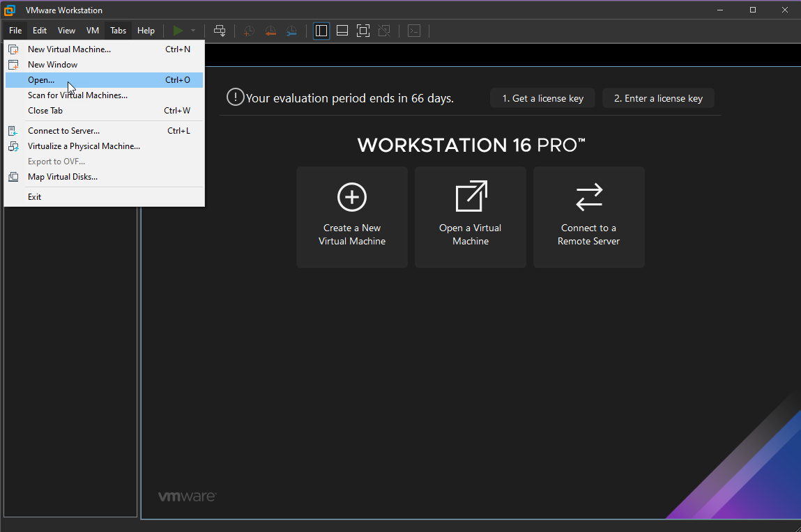

## Pythonによるネットワーク自動化

Pythonはネットワーク運用の自動化に使われる標準的な言語です。

Pythonはネットワークの自動化だけではありませんが、リソースを探しているときはどこにでもあるように見えますし、前述のようにPythonでない場合は、一般的に同じくPythonで書かれたAnsibleです。

これはすでに述べたと思いますが、「プログラミング言語を学ぶ」のセクションで、私はPythonではなくGolangを選びました。私の会社がGoで開発しているので、学ぶのに良い理由でしたが、そうでなければ、Pythonにその時間を取られていたことでしょう。

- 読みやすさと使いやすさ - Pythonは理にかなっているように思えます。ブロックの開始と終了のために、コードに `{}` のような要件はないようです。VS Codeのような強力なIDEと組み合わせると、Pythonのコードを実行したいときにかなり簡単に始めることができます。

Pycharmは、ここで言及する価値のある別のIDEかもしれません。

- ライブラリ - Pythonの拡張性は、ここでの本当の金鉱です。私は、これがネットワークオートメーションのためだけではないことを前に述べましたが、実際には、あらゆる種類のデバイスと構成のための多くのライブラリが存在します。PyPi](https://pypi.python.org/pypi)でその膨大な量を見ることができます。

ライブラリをワークステーションにダウンロードしたい場合は、`pip`というツールを使ってPyPIに接続し、ローカルにダウンロードします。Cisco、Juniper、Aristaのようなネットワークベンダーは、彼らのデバイスへのアクセスを容易にするためにライブラリを開発しました。

- パワフルで効率的 - Goの時代に "Hello World "のシナリオで、確か6行のコードを書いたのを覚えていますか？Pythonでは、次のようになります。

``` 
print('hello world')
```

上記の点をまとめると、なぜPythonが自動化に取り組む際のデファクト・ツールとして一般的に言及されるのか、容易に理解できるはずです。

数年前までは、ネットワークデバイスと対話し、設定のバックアップを自動化したり、デバイスに関するログやその他の洞察を収集したりするスクリプトがあったかもしれない、ということは重要だと思います。私達がここで話している自動化は少し違います。それは全体的なネットワーク環境もこの考え方に合うように変化し、より多くの自動化が可能になったからです。

- Software-Defined Network - SDN コントローラはネットワーク上の全てのデバイスにコントロールプレーンのコンフィグレーションを提供するという責任を負います。

- ハイレベルなオーケストレーション - SDN コントローラから一段上がって、サービスレベルのオーケストレーションが可能になり、このオーケストレーションレイヤーを VMware、Kubernetes、パブリッククラウド等、あなたの選んだプラットフォームに統合することができるようになります。

- ポリシーベースの管理 - どのような状態にしたいのか？どのような状態が望ましいのか？これを記述すると、システムはそれをどのように把握し、望ましい状態にするのか、すべての詳細を持っています。

## ラボ環境のセットアップ

誰もが物理的なルータやスイッチ、その他のネットワーク機器にアクセスできるわけではありません。

私は、前述のツールのいくつかを見るだけでなく、実際に手を動かして、ネットワークの設定を自動化する方法を学ぶことができるようにしたいと思いました。

オプションとして、以下のようなものがあります。 

- [GNS3 VM](https://www.gns3.com/software/download-vm)
- [Eve-ng](https://www.eve-ng.net/)
- [Unimus](https://unimus.net/) ラボ環境ではありませんが、興味深いコンセプトです。

[Eve-ng](https://www.eve-ng.net/)を使ってラボを構築します。前述のように物理デバイスを使うこともできますが、正直なところ、仮想環境は、さまざまなシナリオをテストするサンドボックス環境を提供することを意味します。さらに、さまざまなデバイスやトポロジーで遊ぶことができるのも魅力的です。

EVE-NGでは、コミュニティ版ですべてを行う予定です。

### はじめに

コミュニティ版にはISOとOVFのフォーマットがあり、[ダウンロード](https://www.eve-ng.net/index.php/download/)することができます。

今回はOVFを使用しますが、ISOではハイパーバイザーを使用せずにベアメタルサーバーでビルドアウトすることも可能です。

このチュートリアルは、以下のような内容になっています。

このウォークスルーでは、私はvExpertのライセンスを持っているので、VMware Workstationを使用しますが、VMware Playerや[ドキュメント](https://www.eve-ng.net/index.php/documentation/installation/system-requirement/)に記載されている他のオプションも同様に使用できます。残念ながら、以前使用したVirtual boxは使用できません!

GNS3がサポートされていても、Virtual Boxで問題があったのはここでも同じです。

[Download VMware Workstation Player - FREE](https://www.vmware.com/uk/products/workstation-player.html) 

[VMware Workstation PRO](https://www.vmware.com/uk/products/workstation-pro.html) Also noted that there is an evaluation period for free! 

### VMware Workstation PROへのインストール 

ハイパーバイザーソフトウェアのダウンロードとインストール、そしてEVE-NG OVFのダウンロードが完了しました。VMware Playerをお使いの方は、この手順が同じかどうか教えてください。

これで、設定を行う準備が整いました。

VMware Workstationを起動し、`ファイル`と`開く`を選択します。



EVE-NG OVF Imageをダウンロードすると、圧縮されたファイルに入っているはずです。そのフォルダに中身を取り出すと、以下のようになります。


EVE-NG OVF イメージをダウンロードした場所に移動し、インポートを開始します。

わかりやすい名前を付けて、仮想マシンをシステムのどこかに保存してください。


インポートが完了したら、プロセッサの数を 4 に、割り当てられたメモリを 8GB に増やします。(最新バージョンでインポートした場合は、このようになるはずです。）

また、Virtualise Intel VT-x/EPT or AMD-V/RVIチェックボックスが有効であることを確認してください。このオプションは、VMware Workstationに仮想化フラグをゲストOSに渡すように指示します（ネストされた仮想化）これは、私のCPUがこれを可能にするにもかかわらず、Virtual BoxでGNS3が抱えていた問題でした。


### パワーオン＆アクセス

補足＆うさぎの穴。VirtualBoxでは動作しないと書いたのを覚えていますか？VMware WorkstationとEVE-NGで同じ問題が発生しましたが、仮想化プラットフォームのせいではありませんでした!

私はWindowsマシンでWSL2を走らせていますが、これはあなたの環境の中でネストされたものを走らせる能力を取り除くようです。WSL2 を使用すると、CPU の Intel VT-d 仮想化機能が削除されるようなので、Ubuntu VM が実行されるのはなぜか、混乱しています。

これを解決するには、Windowsマシンで次のコマンドを実行し、システムを再起動します。

`bcdedit /set hypervisorlaunchtype off`

WSL2に戻りたい場合は、このコマンドを実行し、再起動する必要があります。

`bcdedit /set hypervisorlaunchtype auto`

これらのコマンドは両方とも管理者として実行する必要があります。

これでVMware Workstationに電源が入り、次のようなプロンプトが表示されるはずです。


上のプロンプトで、あなたは使うことができます。

username = root
password = eve

このパスワードは後でホストに SSH 接続するために使用されます。

これで、ホスト名を変更することができます。


次に、DNS Domain Nameを定義します。私は以下のものを使用しましたが、これは後で変更する必要があるかどうかはわかりません。


次にネットワークの設定を行いますが、私は与えられたIPアドレスが再起動後も持続するように静的を選択しています。


最後のステップでは、ワークステーションから到達可能なネットワークから固定IPアドレスを提供します。


ここで、ネットワークのサブネットマスク、デフォルトゲートウェイ、DNSを指定する手順が追加されます。

終了すると再起動します。再起動後、固定IPアドレスを取得し、これをブラウザに入力することができます。


GUIのデフォルトのユーザー名は `admin` でパスワードは `eve` です。SSHのデフォルトのユーザー名は `root` でパスワードは `eve` ですが、セットアップ中に変更した場合は、このユーザー名も変更されているはずです。


コンソールにHTML5を選択したのは、異なるコンソールをナビゲートするときに、ブラウザで新しいタブを開くためです。

次は、次のことを行います。

- EVE-NGクライアントパックをインストールします
- EVE-NGにいくつかのネットワークイメージをロードします
- ネットワークトポロジーの構築
- ノードの追加
- ノードの接続
- Pythonスクリプトのビルドを開始
- telnetlib、Netmiko、Paramiko、Pexpectを見ます

## リソース

- [Free Course: Introduction to EVE-NG](https://www.youtube.com/watch?v=g6B0f_E0NMg)
- [EVE-NG - Creating your first lab](https://www.youtube.com/watch?v=9dPWARirtK8)
- [3 Necessary Skills for Network Automation](https://www.youtube.com/watch?v=KhiJ7Fu9kKA&list=WL&index=122&t=89s)
- [Computer Networking full course](https://www.youtube.com/watch?v=IPvYjXCsTg8)
- [Practical Networking](http://www.practicalnetworking.net/)
- [Python Network Automation](https://www.youtube.com/watch?v=xKPzLplPECU&list=WL&index=126)

[26日目](day26.md)でお会いしましょう。
