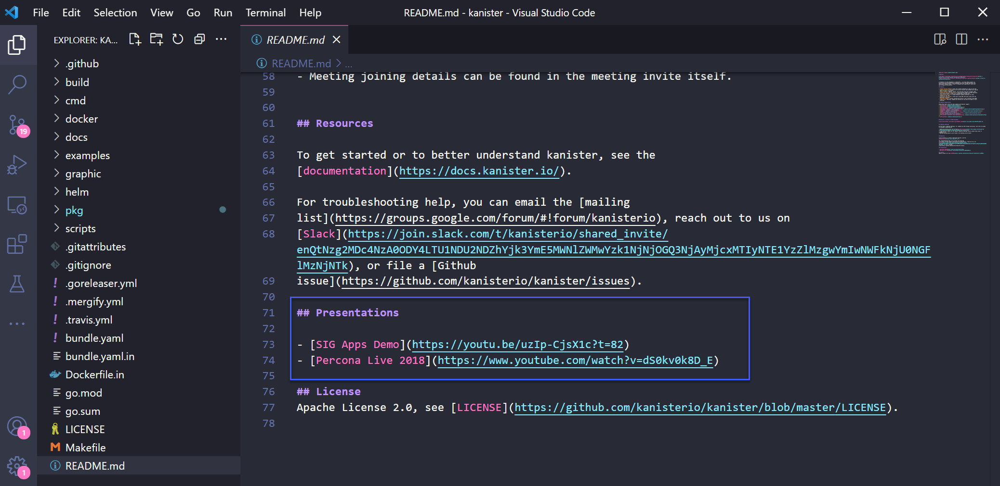
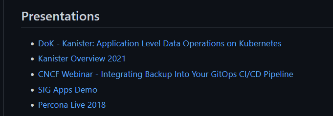

## The Open Source Workflow 
    
Hopefully through the last 7 sections of Git we have a better understanding of what git is and then how a git based service such as GitHub integrates with git to provide a source code repository but also a way in which the wider community can collaborate on code and projects together. 

When we went through the GitHub fundamentals we went through the process of forking a random project and making a change to our local repository. Here we want to go one step further and contribute to an open source project. Remember that contributing doesn't need to be bug fixes, coding features but it could also be documentation. Every little helps and it also allows you to get hands on with some of the git functionality we have covered. 

## Fork a Project 

The first thing we have to do is find a project we can contribute to. I have recently been presenting on the [Kanister Project](https://github.com/kanisterio/kanister) and I would like to share my presentations that are now on YouTube to the main readme.mdfile in the project. 

First of all we need to fork the project. Let's run through that process. I am going to navigate to the link share above and fork the repository. 

We now have our copy of the whole repository. 

For reference on the Readme.mdfile the original Presenations listed are just these two so we need to fix this with our process. 

## Clones to local machine 

Now we have our own fork we can bring that down to our local and we can then start making our edits to the files. Using the code button on our repo we can grab the URL and then use `git clone url` in a directory we wish to place the repository. 

## Make our changes 

We have our project local so we can open VSCode or an IDE or text editor of your choice to add your modifications. 

The readme.mdfile is written in markdown language and because I am modifying someone else's project I am going to follow the existing project formatting to add our content. 

## Test your changes

We must as a best practice test our changes, this makes total sense if this was a code change to an application you would want to ensure that the application still functions after code change, well we also must make sure that documentation is formatted and looks correct. 

In VScode we have the ability to add a lot of plugins one of these is the ability to preview markdown pages. 

## Push changes back to our forked repository

We do not have the authentication to push our changes directly back to the Kanister repository so we have to take this route. Now that I am happy with our changes we can run through some of those now well known git commands.

Now we go back into GitHub to check the changes once more and then contribute back to the master project. 

Looks good. 

Now we can go back to the top of our forked repository for Kanister and we can see that we are 1 commit ahead of the kanisterio:master branch. 

Next we hit that contribute button highlighted above. We see the option to "Open Pull Request"

## Open a pull request 

There is quite a bit going on in this next image, top left you can now see we are in the original or the master repository. then you can see what we are comparing and that is the original master and our forked repository. We then have a create pull request button which we will come back to shortly. We have our single commit but if this was more changes you might have multiple commits here. then we have the changes we have made in the readme.mdfile. 

We have reviewed the above changes and we are ready to create pull request hitting the green button. 

Then depending on how the maintainer of a project has set out their Pull Request functionality on their repository you may or may not have a template that gives you pointers on what the maintainer wants to see. 

This again where you want to make a meaningful description of what you have done, clear and concise but enough detail. You can see I have made a simple change overview and I have ticked documentation. 

## Create pull request

We are now ready to create our pull request. After hitting the "Create Pull Request" at the top of the page you will get a summary of your pull request. 

Scrolling down you are likely to see some automation taking place, in this instance we require a review and some checks are taking place. We can see that Travis CI is in progress and a build has started and this will check our update, making sure that before anything is merged we are not breaking things with our additions. 

Another thing to note here is that the red in the screen shot above, can look a little daunting and look as if you have made mistakes! Don't worry you have not broken anything, my biggest tip here is this process is there to help you and the maintainers of the project. If you have made a mistake at least from my experience the maintainer will contact and advise on what to do next. 

This pull request is now public for everyone to see [added Kanister presentation/resource #1237](https://github.com/kanisterio/kanister/pull/1237)

I am going to publish this before the merge and pull request is accepted so maybe we can get a little prize for anyone that is still following along and is able to add a picture in of the successful PR? 

1. Fork this repository to your own GitHub account 
2. Add your picture and possibly text 
3. Push the changes to your forked repository 
4. Create a PR that I will see and approve. 
5. I will think of some sort of prize 

This then wraps up our look into Git and GitHub, next we are diving into containers which starts with a big picture look into how, why containers and also a look into virtualisation and how we got here. 

## Resources 

- [Learn GitLab in 3 Hours | GitLab Complete Tutorial For Beginners](https://www.youtube.com/watch?v=8aV5AxJrHDg)
- [BitBucket Tutorials Playlist](https://www.youtube.com/watch?v=OMLh-5O6Ub8&list=PLaD4FvsFdarSyyGl3ooAm-ZyAllgw_AM5)
- [What is Version Control?](https://www.youtube.com/watch?v=Yc8sCSeMhi4)
- [Types of Version Control System](https://www.youtube.com/watch?v=kr62e_n6QuQ)
- [Git Tutorial for Beginners](https://www.youtube.com/watch?v=8JJ101D3knE&t=52s) 
- [Git for Professionals Tutorial](https://www.youtube.com/watch?v=Uszj_k0DGsg) 
- [Git and GitHub for Beginners - Crash Course](https://www.youtube.com/watch?v=RGOj5yH7evk&t=8s) 
- [Complete Git and GitHub Tutorial](https://www.youtube.com/watch?v=apGV9Kg7ics)
- [Git cheatsheet](https://www.atlassian.com/git/tutorials/atlassian-git-cheatsheet)

See you on [Day 42](day42.md) 
