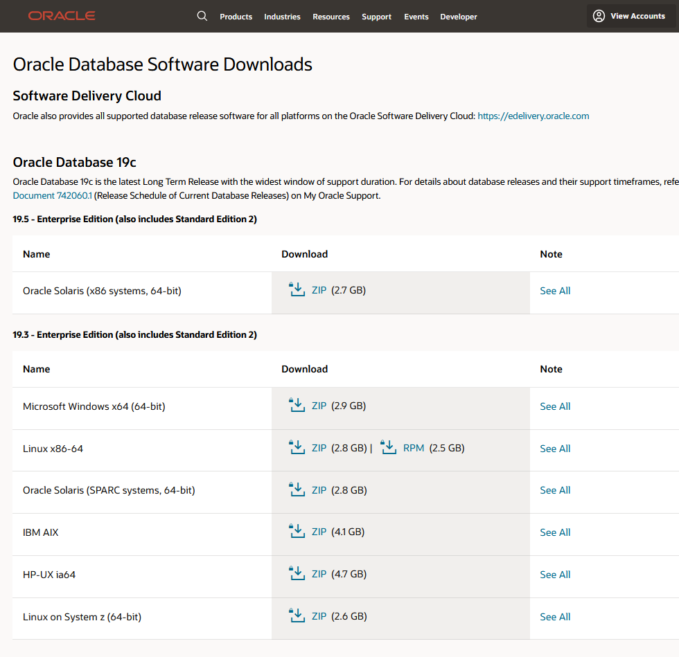
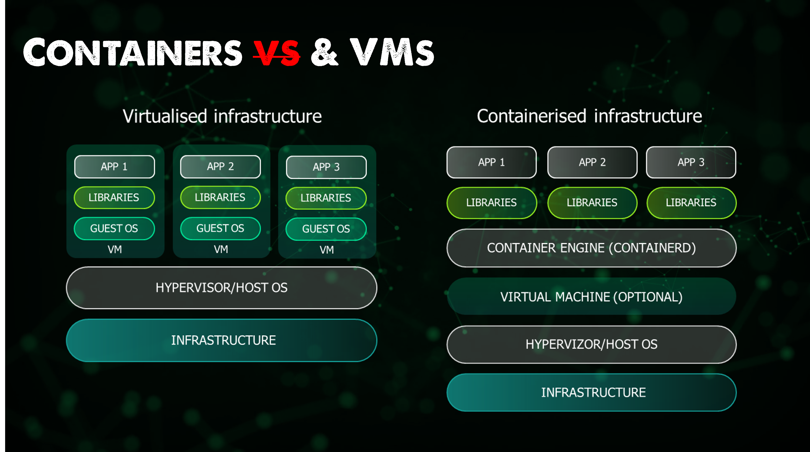

## The Big Picture: Containers

We are now starting the next section and this section is going to be focused on containers in particular we are going to be looking into Docker getting into some of the key areas to understand more about Containers. 

I will also be trying to get some hands-on here to create the container that we can use during this section but also future sections later on in the challenge. 

As always this first post is going to be focused on the big picture of how we got here and what it all means. 

#History of platforms and application development
#do we want to talk about Virtualisation & Containerisation 

### Why another way to run applications? 

The first thing we have to take a look at is why do we need another way to run our software or applications? Well it is just that choice is great, we can run our applications in many different forms, we might see applications deployed on physical hardware with an operating system and a single application deployed there, we might see the virtual machine or cloud-based IaaS instances running our application which then integrate into a database again in a VM or as PaaS offering in the public cloud. Or we might see our applications running in containers. 

None of the above options is wrong or right, but they each have their reasons to exist and I also strongly believe that none of these is going away. I have seen a lot of content that walks into Containers vs Virtual Machines and there really should not be an argument as that is more like apples vs pears argument where they are both fruit (ways to run our applications) but they are not the same. 

I would also say that if you were starting and you were developing an application you should lean towards containers simply because we will get into some of these areas later, but it's about efficiency, speed and size. But that also comes with a price, if you have no idea about containers then it's going to be a learning curve to force yourself to understand the why and get into that mindset. If you have developed your applications a particular way or you are not in a greenfield environment then you might have more pain points to deal with before even considering containers. 

We have many different choices then when it comes to downloading a given piece of software, there are a variety of different operating systems that we might be using. And specific instructions for what we need to do to install our applications. 

More and more recently I am finding that the applications we might have once needed a full server OS, A VM, Physical or cloud instance are now releasing container-based versions of their software. I find this interesting as this opens the world of containers and then Kubernetes to everyone and not just a focus on application developers. 

As you can probably tell as I have said before, I am not going to advocate that the answer is containers, what's the question! But I would like to discuss how this is another option for us to be aware of when we deploy our applications. 

We have had container technology for a long time, so why now over the last say 10 years has this become popular, I would say even more popular in the last 5. We have had containers for decades. It comes down to the challenge containers or should I say images as well, to how we distribute our software, because if we just have container technology, then we still will have many of the same problems we've had with software management. 

If we think about Docker as a tool, the reason that it took off, is because of the ecosystem of images that are easy to find and use. Simple to get on your systems and get up and running. A major part of this is consistency across the entire space, of all these different challenges that we face with software. It doesn't matter if it's MongoDB or nodeJS, the process to get either of those up and running will be the same. The process to stop either of those is the same. All of these issues will still exist, but the nice thing is, when we bring good container and image technology together, we now have a single set of tools to help us tackle all of these different problems. Some of those issues are listed below: 

- We first have to find software on the internet. 
- We then have to download this software. 
- Do we trust the source? 
- Do we then need a license? Which License? 
- Is it compatible with different platforms? 
- What is the package? binary? Executable? Package manager? 
- How do we configure the software? 
- Dependencies? Did the overall download have us covered or do we need them as well? 
- Dependencies of Dependencies? 
- How do we start the application? 
- How do we stop the application? 
- Will it auto-restart? 
- Start on boot? 
- Resource conflicts? 
- Conflicting libraries? 
- Port Conflicts
- Security for the software? 
- Software updates? 
- How can I remove the software? 

We can split the above into 3 areas of the complexity of the software that containers and images do help with these. 

| Distribution | Installation | Operation          |
| ------------ | ------------ | -----------------  |
| Find         | Install      | Start              |
| Download     | Configuration| Security           |
| License      | Uninstall    | Ports              |
| Package      | Dependencies | Resource Conflicts |
| Trust        | Platform     | Auto-Restart       |
| Find         | Libraries    | Updates            |

Containers and images are going to help us remove some of these challenges that we have with possibly other software and applications. 

At a high level we could move installation and operation into the same list, Images are going to help us from a distribution point of view and containers help with the installation and operations. 

Ok, probably sounds great and exciting but we still need to understand what is a container and now I have mentioned images so let's cover those areas next. 

Another thing you might have seen a lot when we talk about Containers for software development is the analogy used alongside shipping containers, shipping containers are used to ship various goods across the seas using large vessels. 

What does this have to do with our topic of containers? Think about the code that software developers write, how can we ship that particular code from one machine to another machine?

If we think about what we touched on before about software distribution, installation and operations but now we start to build this out into an environment visual. We have hardware and an operating system where you will run multiple applications. For example, nodejs has certain dependencies and needs certain libraries. If you then want to install MySQL then it needs its required libraries and dependencies. Each software application will have its library and dependency. We might be massively lucky and not have any conflicts between any of our applications where specific libraries and dependencies are clashing causing issues but the more applications the more chance or risk of conflicts. However, this is not about that one deployment when everything fixes your software applications are going to be updated and then we can also introduce these conflicts. 

Containers can help solve this problem. Containers help **build** your application, **ship** the application, **deploy** and **scale** these applications with ease independently. let's look at the architecture, you will have hardware and operating system then on top of it you will have a container engine like docker which we will cover later. The container engine software helps create containers that package the libraries and dependencies along with it so that you can move this container seamlessly from one machine to another machine without worrying about the libraries and dependencies since they come as a part of a package which is nothing but the container so you can have different containers this container can be moved across the systems without worrying about the underlying dependencies that the application
needs to run because everything the application needs to run is packaged as
a container that you can move. 

### The advantages of these containers 

- Containers help package all the dependencies within the container and
isolate it. 

- It is easy to manage the containers 

- The ability to move from one system to another. 

- Containers help package the software and you can easily ship it without any duplicate efforts 

- Containers are easily scalable.

Using containers you can scale independent containers and use a load balancer
or a service which help split the traffic and you can scale the applications horizontally. Containers offer a lot of flexibility and ease how you manage your applications 

### What is a container? 

When we run applications on our computer, this could be the web browser or VScode that you are using to read this post. That application is running as a process or what is known as a process. On our laptops or systems, we tend to run multiple applications or as we said processes. When we open a new application or click on the application icon this is an application we would like to run, sometimes this application might be a service that we just want to run in the background, our operating system is full of services that are running in the background providing you with the user experience you get with your system. 

That application icon represents a link to an executable somewhere on your file system, the operating system then loads that executable into memory. Interestingly, that executable is sometimes referred to as an image when we're talking about a process. 

Containers are processes, A container is a standard unit of software that packages up code and all its dependencies so the application runs quickly and reliably from one computing environment to another. 

Containerised software will always run the same, regardless of the infrastructure. Containers isolate software from its environment and ensure that it works uniformly despite differences for instance between development and staging.

I mentioned images in the last section when it comes to how and why containers and images combined made containers popular in our ecosystem. 

### What is an Image? 

A container image is a lightweight, standalone, executable package of software that includes everything needed to run an application: code, runtime, system tools, system libraries and settings. Container images become containers at runtime. 

## Resources 

- [TechWorld with Nana - Docker Tutorial for Beginners](https://www.youtube.com/watch?v=3c-iBn73dDE)
- [Programming with Mosh - Docker Tutorial for Beginners](https://www.youtube.com/watch?v=pTFZFxd4hOI)
- [Docker Tutorial for Beginners - What is Docker? Introduction to Containers](https://www.youtube.com/watch?v=17Bl31rlnRM&list=WL&index=128&t=61s)

See you on [Day 43](day43.md) 
