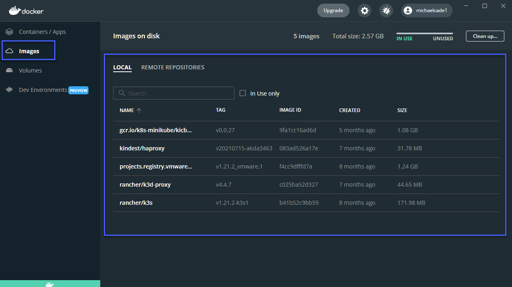
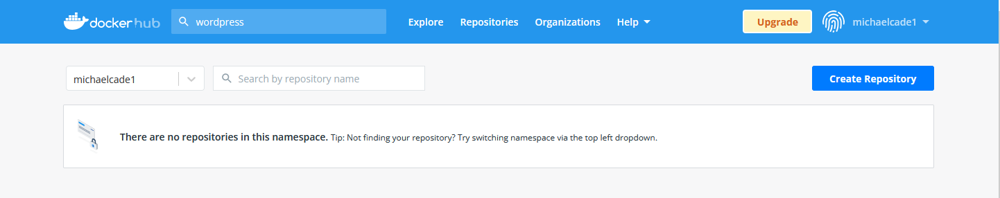
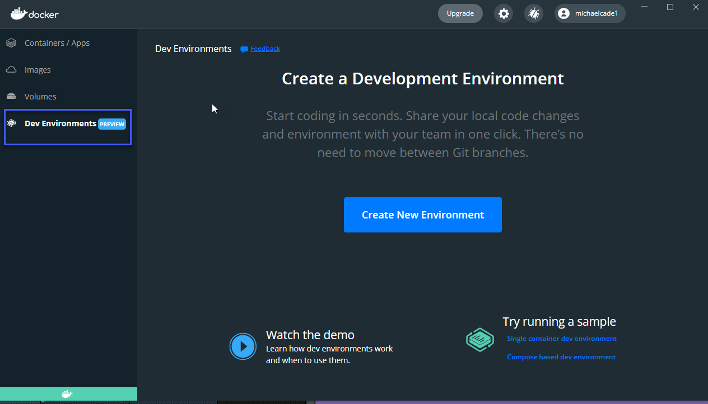
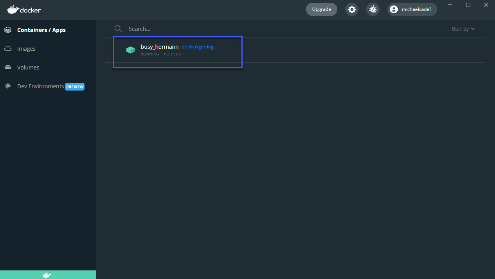
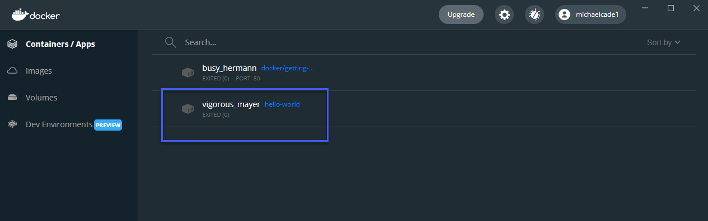

## Docker Images & Hands-On with Docker Desktop

We now have Docker Desktop installed on our system. (If you are running Linux then you still have options but no GUI but docker obviously does work on Linux.)[Install Docker Engine on Ubuntu](https://docs.docker.com/engine/install/ubuntu/) (Other distributions also available.)

In this post we are going to get started with deploying some images into our environment. A recap on what a Docker Image is - A Docker image is a file used to execute code in a Docker container. Docker images act as a set of instructions to build a Docker container, like a template. Docker images also act as the starting point when using Docker.

Now is a good time to go and create your account on [DockerHub](https://hub.docker.com/) 

DockerHub is a centralised resource for working with Docker and its components. Most commonly known as a registry to host docker images. But there is a lot of additional services here which can be used in part with automation or integrated into GitHub as well as security scanning.

If you scroll down once logged in you are going to see a list of container images, You might see database images for mySQL, hello-world etc etc. Think of these as great baseline images or you might in fact just need a database image and you are best to use the official one which means you don't need to create your own. 

We can drill deeper into the view of available images and search across categories, operating systems and architectures. The one thing I highlight below is the Office Image, this should give you peace of mind of the origin of this container image.  

We can also search for a specific image, for example wordpress might be a good base image that we want we can do that in the top and find all container images related to wordpress. Below notice that we also have verified publisher. 

- Official Image - Docker Official images are a curated set of Docker open source and "drop-in" solution repositories. 

- Verified Publisher - High-quality Docker content from verified publishers. These products are published and maintained directly by a commercial entity. 

### Exploring Docker Desktop 

We have Docker Desktop installed on our system and if open this I expect unless you had this already installed you will see something similar to the image below. As you can see we have no containers running and our docker engine is running. 

Because this was not a fresh install for me, I do have some images already downloaded and available on my system. You will likely see nothing in here. 

Under remote repositories this is where you will find any container images you have stored in your docker hub. You can see from the below I do not have any images. 

We can also clarify this on our dockerhub site and confirm that we have no repositories there.

Next we have the Volumes tab, If you have containers that require persistence then this is where we can add these volumes on your local file system or a shared file system. 

At the time of writing there is also a Dev Environments tab, this is going to help you collaborate with your team instead of moving between different git branches. We won't be covering this. 

Going back to the first tab you can see that there is a command we can run which is a getting started container. Let's run `docker run -d -p 80:80 docker/getting-started` in our terminal. 

If we go and check our docker desktop window again, we are going to see that we have a running container. 

You might have noticed that I am using WSL2 and in order for you to be able to use that you will need to make sure this is enabled in the settings. 

If we now go and check our Images tab again, you should now see an in use image called docker/getting-started. 

Back to the Containers/Apps tab, click on your running container. You are going to see the logs by default and along the top you have some options to choose from, in our case I am pretty confident that this is going to be a web page running in this container so we are going to choose the open in browser. 

When we hit that button above sure enough a web page should open hitting your localhost and display something similar to below. 

This container also has some more detail on what are containers and images. 

We have now ran our first container. Nothing too scary just yet. What about if we wanted to pull one of the container images down from DockerHub? Maybe there is a `hello world` docker container we could use. 

I went ahead and stopped the getting started container not that it's taking up any mass amount of resources but for tidyness as we walk through some more steps. 

Back in our terminal lets go ahead and run `docker run hello-world` and see what happens. 

You can see we did not have the image locally so we pulled that down and then we got a message that is written into the container image with some information on what it did to get up and running and some links to reference points. 

However, if we go and look in Docker Desktop now we have no running containers but we do have an exited container that used the hello-world message, meaning it came up, it delivered the message and then it terminated. 

And for the last time, let's just go and check the images tab and see that we have a new hello-world image locally on our system, meaning that if we run the `docker run hello-world` command again in our terminal we would not have to pull anything unless a version changes. 

In the message from the hello-world container it set down a challenge of running something a little more ambitious. 

Challenge Accepted!

In running `docker run -it ubuntu bash` in our terminal we are going to run a containerised version of Ubuntu well not a full copy of the Operating system. You can find out more about this particular image on [DockerHub](https://hub.docker.com/_/ubuntu)

You can see below when we run the command we now have an interactive prompt (`-it`) and we have bash shell into our container. 

We have a bash shell but we don't have much more which is why this container image is less than 30mb. 

But we can still use this image and we can still install software using our apt package manager, we can update our container image and upgrade also. 

Or maybe we want to install some software into our container, I have chosen a really bad example here as pinta is an image editor and its over 200mb but hopefully you get where I am going with this. This would increase the size of our container considerably but still we are going to be in the mb and not into the gb. 

I wanted that to hopefully give you an overview of Docker Desktop and the not so scary world of containers when you break it down with simple use cases, we do need to cover some networking, security and other options we have vs just downloading container images and using them like this. By the end of the section we want to have made something and uploaded to our DockerHub repository and be able to deploy it. 

## Resources 

- [TechWorld with Nana - Docker Tutorial for Beginners](https://www.youtube.com/watch?v=3c-iBn73dDE)
- [Programming with Mosh - Docker Tutorial for Beginners](https://www.youtube.com/watch?v=pTFZFxd4hOI)
- [Docker Tutorial for Beginners - What is Docker? Introduction to Containers](https://www.youtube.com/watch?v=17Bl31rlnRM&list=WL&index=128&t=61s)
- [WSL 2 with Docker getting started](https://www.youtube.com/watch?v=5RQbdMn04Oc)

See you on [Day 45](day45.md) 
