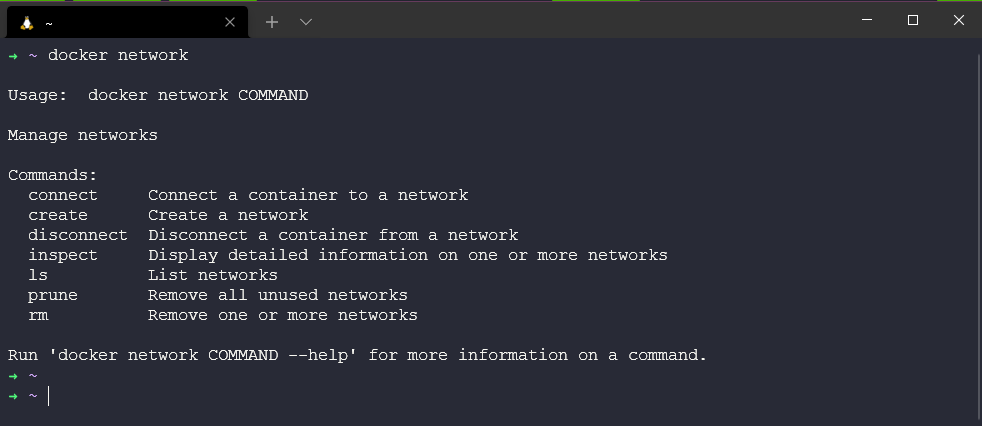
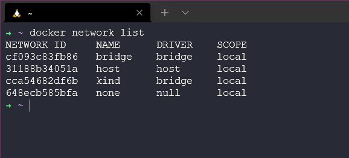
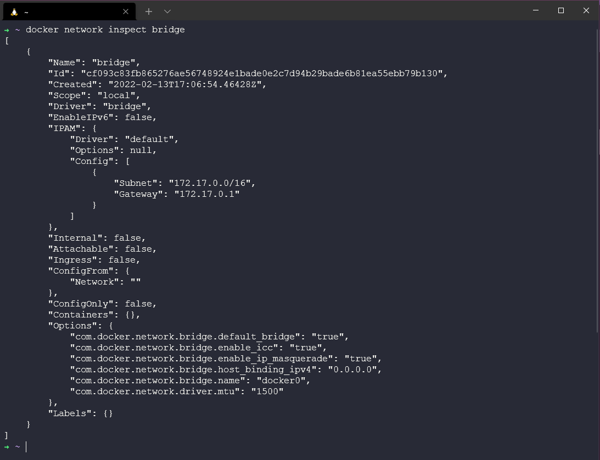
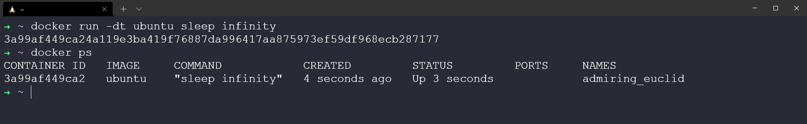
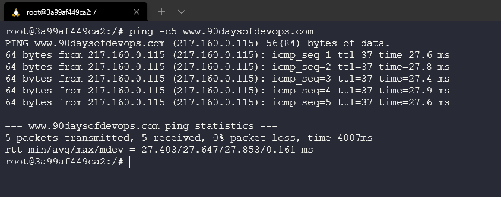
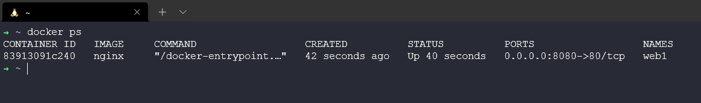
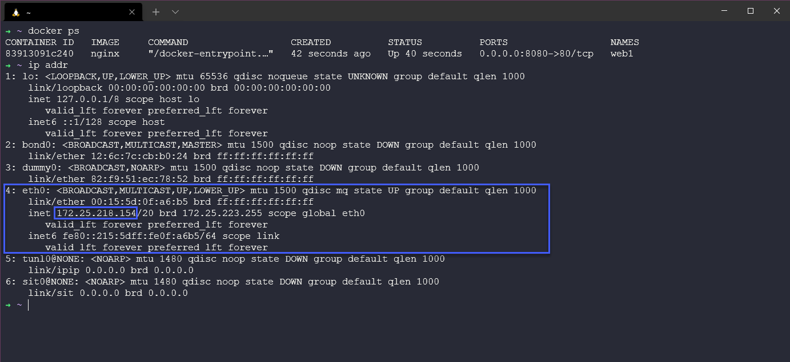
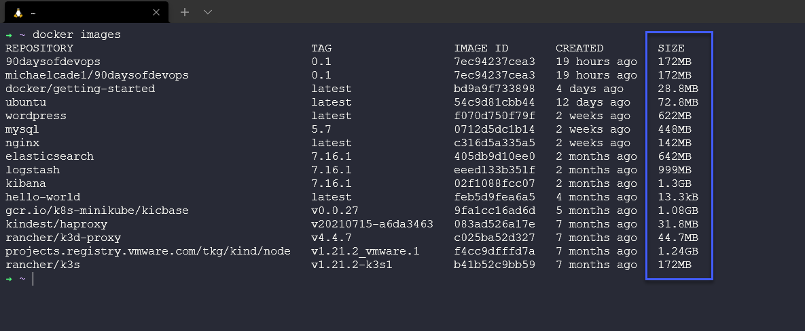

## Docker Networking & Security

During this container session so far we have made things happen but we have not really looked at how things have worked behind the scenes either from a networking point of view but also we have not touched on security, that is the plan for this session. 

### Docker Networking Basics 

Open a terminal, and type the command `docker network` this is the main command for configuring and managing container networks. 

From the below you can see this is how we can use the command, and all of the sub commands available. We can create new networks, list existing, inspect and remove networks. 



Lets take a look at the existing networks we have since our installation, so the out of box Docker networking looks like using the `docker network list` command. 

Each network gets a unique ID and NAME. Each network is also associated with a single driver. Notice that the "bridge" network and the "host" network have the same name as their respective drivers.



Next we can take a deeper look into our networks with the `docker network inspect` command. 

With me running `docker network inspect bridge` I can get all the configuration details of that specific network name. This includes name, ID, drivers, connected containers and as you can see quite a lot more. 



### Docker: Bridge Networking 

As you have seen above a standard installation of Docker Desktop gives us a pre-built network called `bridge` If you look back up to the `docker network list` command, you will see that the networked called bridge is associated with the `bridge` driver. Just because they have the same name doesn't they are the same thing. Connected but not the same thing. 

The output above also shows that the bridge network is scoped locally. This means that the network only exists on this Docker host. This is true of all networks using the bridge driver - the bridge driver provides single-host networking.

All networks created with the bridge driver are based on a Linux bridge (a.k.a. a virtual switch).

### Connect a Container

By default the bridge network is assigned to new containers, meaning unless you specify a network all containers will be connected to the bridge network. 

Lets create a new container with the command `docker run -dt ubuntu sleep infinity`

The sleep command above is just going to keep the container running in the background so we can mess around with it. 



If we then check our bridge network with `docker network inspect bridge` you will see that we have a container matching what we have just deployed because we did not specify a network. 


We can also dive into the container using `docker exec -it 3a99af449ca2 bash` you will have to use `docker ps` to get your container ID. 

From here our image doesn't have anything to ping so we need to run the following command.`apt-get update && apt-get install -y iputils-ping` then ping an external interfacing address. `ping -c5 www.90daysofdevops.com`



To clear this up we can run `docker stop 3a99af449ca2` again use `docker ps` to find your container ID but this will remove our container. 

### Configure NAT for external connectivity 

In this step we'll start a new NGINX container and map port 8080 on the Docker host to port 80 inside of the container. This means that traffic that hits the Docker host on port 8080 will be passed on to port 80 inside the container.

Start a new container based off the official NGINX image by running `docker run --name web1 -d -p 8080:80 nginx`


Review the container status and port mappings by running `docker ps`



The top line shows the new web1 container running NGINX. Take note of the command the container is running as well as the port mapping - `0.0.0.0:8080->80/tcp` maps port 8080 on all host interfaces to port 80 inside the web1 container. This port mapping is what effectively makes the containers web service accessible from external sources (via the Docker hosts IP address on port 8080).

Now we need our IP address for our actual host, we can do this by going into our WSL terminal and using the `ip addr` command. 



Then we can take this IP and open a browser and head to `http://172.25.218.154:8080/` Your IP might be different. This confirms that NGINX is accessible. 


I have taken these instructions from this site from way back in 2017 DockerCon but they are still relevant today. However the rest of the walkthrough goes into Docker Swarm and I am not going to be looking into that here. [Docker Networking - DockerCon 2017](https://github.com/docker/labs/tree/master/dockercon-us-2017/docker-networking)

### Securing your containers 

Containers provide a secure environment for your workloads vs a full server configuration. They offer the ability to break up your applications into much smaller, loosly coupled components each isolated from one another which helps resude the attack surface overall. 

But they are not immune from hackers that are looking to exploit systems. We still need to understand the security pitfalls of the technology and maintain best practices. 

### Move away from root permission 

All of the containers we have deployed have been using the root permission to the process within your containers. Which means they have full administrative access to your container and host environments. Now for the purposes of walking through we knew these systems were not going to be up and running for long. But you saw how easy it was to get up and running. 

We can add a few steps to our process to enable non root users to be our preferred best practice. When creating our dockerfile we can create user accounts. You can find this example also in the containers folder in the repository. 

```
# Use the official Ubuntu 18.04 as base
FROM ubuntu:18.04
RUN apt-get update && apt-get upgrade -y
RUN groupadd -g 1000 basicuser && useradd -r -u 1000 -g basicuser basicuser
USER basicuser
```

We can also use `docker run --user 1009 ubuntu` the Docker run command overrides any user specified in your Dockerfile. Therefore, in the following example, your container will always run with the least privilege—provided user identifier 1009 also has the lowest permission level.

However, this method doesn’t address the underlying security flaw of the image itself. Therefore it’s better to specify a non-root user in your Dockerfile so your containers always run securely.

### Private Registry

Another area we have used heavily is public registries in DockerHub, with a private registry of container images set up by your organisation means that you can host where you wish or there are managed services for this as well, but all in all this gives you complete control of the images available for you and your team. 

DockerHub is great to give you a baseline, but its only going to be providing you with a basic service where you have to put a lot of trust into the image publisher. 

### Lean & Clean 

Have mentioned this throughout, although not related to security. But the size of your container can also affect security in terms of attack surface if you have resources you do not use in your application then you do not need them in your container. 

This is also my major concern with pulling the `latest` images because that can bring a lot of bloat to your images as well. DockerHub does show the compressed size for each of the images in a repository. 

Checking `docker image` is a great command to see the size of your images. 



## Resources 

- [TechWorld with Nana - Docker Tutorial for Beginners](https://www.youtube.com/watch?v=3c-iBn73dDE)
- [Programming with Mosh - Docker Tutorial for Beginners](https://www.youtube.com/watch?v=pTFZFxd4hOI)
- [Docker Tutorial for Beginners - What is Docker? Introduction to Containers](https://www.youtube.com/watch?v=17Bl31rlnRM&list=WL&index=128&t=61s)
- [WSL 2 with Docker getting started](https://www.youtube.com/watch?v=5RQbdMn04Oc)
- [Blog on gettng started building a docker image](https://stackify.com/docker-build-a-beginners-guide-to-building-docker-images/)
- [Docker documentation for building an image](https://docs.docker.com/develop/develop-images/dockerfile_best-practices/)
- [YAML Tutorial: Everything You Need to Get Started in Minute](https://www.cloudbees.com/blog/yaml-tutorial-everything-you-need-get-started)

See you on [Day 48](day48.md) 
