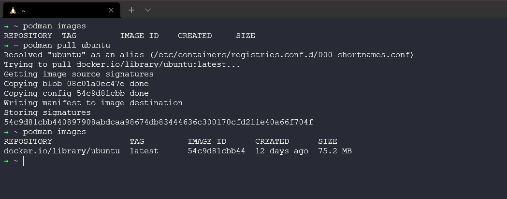

## Alternatives to Docker

I did say at the very beginning of this section that we were going to be using Docker, simply because resource wise there is so much and the community is very big, but also this was really where the indents to making containers popular really came from. I would encourage you to go and watch some of the history around Docker and how it came to be, I found it very useful. 

But as I have alluded to there are other alternatives to Docker. If we think about what Docker is and what we have covered. It is a platform for developing, testing, deploying, and managing applications.

I want to highlight a few alternatives to Docker that you might or will in the future see out in the wild. 

### Podman

What is Podman? Podman is a daemonless container engine for developing, managing, and running OCI Containers on your Linux System. Containers can either be run as root or in rootless mode. 

I am going to be looking at this from a Windows point of view but know that like Docker there is no requirement for virtualisation there as it will use the underlying OS which is cannot do in the Windows world. 

Podman can be ran under WSL2 although not as sleak as the experience with Docker Desktop. There is also a Windows remote client where you can connect to a Linux VM where your containers will run. 

My Ubuntu on WSL2 is the 20.04 release. Following the next steps will enable you to install Podman on your WSL instance. 

```
echo "deb https://download.opensuse.org/repositories/devel:/kubic:/libcontainers:/stable/xUbuntu_20.04/ /" |
sudo tee /etc/apt/sources.list.d/devel:kubic:libcontainers:stable.list
```

Add the GPG Key 

``` 
curl -L "https://download.opensuse.org/repositories/devel:/kubic:\
/libcontainers:/stable/xUbuntu_20.04/Release.key" | sudo apt-key add -
```

Run a system update and upgrade with the `sudo apt-get update && sudo apt-get upgrade` command. Finally we can install podman using `sudo apt install podman` 

We can now use a lot of the same commands we have been using for docker, note though that we do not have that nice docker desktop UI. You can see below I used `podman images` and I have nothing after install then I used `podman pull ubuntu` to pull down the ubuntu container image. 



We can then run our Ubuntu image using `podman run -dit ubuntu` and `podman ps` to see our running image. 


To then get into that container we can run `podman attach dazzling_darwin` your container name will most likely be different. 


If you are moving from docker to podman it is also common to change your config file to have `alias docker=podman` that way any command you run with docker will in fact use podman. 

### LXC 

LXC is a containerisation engine that enables users again to create multiple isolateed Linux container environments. Unlike Docker LXC acts as a hypervisor for create multiple Linux machines with separeate system files, networking features. Was around before Docker and then made a short comeback due to Docker shortcomings. 

LXC is as lightweight though as docker, and easily deployed. 

### Containerd 

A standalone container runtime. Containerd brings simplicity and robustness as well as of course portability. Containerd was formerly a tool that runs as part of Docker container services until Docker decided to graduate its components into standalone components.

A project in the Cloud Native Computing Foundation, placing it in the same class with popular container tools like Kubernetes, Prometheus, and CoreDNS.

### Other Docker tooling

We could also mention toolings and options around Rancher, VirtualBox but we can cover them off in more detail another time.  

[**Gradle**](https://gradle.org/) 

- Build scans allow teams to collaboratively debug their scripts and track the history of all builds.
- Execution options give teams the ability to continuously build so that whenever changes are inputted, the task is automatically executed.
- The custom repository layout gives teams the ability to treat any file directory structure as an artifact repository.

[**Packer**](https://packer.io/) 

- Ability to create multiple machine images in parallel to save developer time and increase efficiency.
- Teams can easily debug builds using Packer’s debugger, which inspects failures and allows teams to try out solutions before restarting builds.
- Support with many platforms via plugins so teams can customize their builds.

[**Logspout**](https://github.com/gliderlabs/logspout) 

- Logging tool - The tool’s customisability allows teams to ship the same logs to multiple destinations.
- Teams can easily manage their files because the tool only requires access to the Docker socket.
- Completely open-sourced and easy to deploy.

[**Logstash**](https://www.elastic.co/products/logstash)

- Customize your pipeline using Logstash’s pluggable framework.
- Easily parse and transform your data for analysis and to deliver business value.
- Logstash’s variety of outputs let you route your data where you want.

[**Portainer**](https://www.portainer.io/)

- Utilise pre-made templates or create your own to deploy applications.
- Create teams and assign roles and permissions to team members.
- Know what is running in each environment using the tool’s dashboard.


## Resources 

- [TechWorld with Nana - Docker Tutorial for Beginners](https://www.youtube.com/watch?v=3c-iBn73dDE)
- [Programming with Mosh - Docker Tutorial for Beginners](https://www.youtube.com/watch?v=pTFZFxd4hOI)
- [Docker Tutorial for Beginners - What is Docker? Introduction to Containers](https://www.youtube.com/watch?v=17Bl31rlnRM&list=WL&index=128&t=61s)
- [WSL 2 with Docker getting started](https://www.youtube.com/watch?v=5RQbdMn04Oc)
- [Blog on gettng started building a docker image](https://stackify.com/docker-build-a-beginners-guide-to-building-docker-images/)
- [Docker documentation for building an image](https://docs.docker.com/develop/develop-images/dockerfile_best-practices/)
- [YAML Tutorial: Everything You Need to Get Started in Minute](https://www.cloudbees.com/blog/yaml-tutorial-everything-you-need-get-started)
- [Podman | Daemonless Docker | Getting Started with Podman](https://www.youtube.com/watch?v=Za2BqzeZjBk)
- [LXC - Guide to building a LXC Lab](https://www.youtube.com/watch?v=cqOtksmsxfg)


See you on [Day 49](day49.md) 
