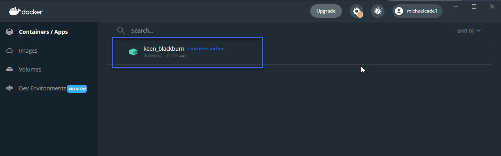
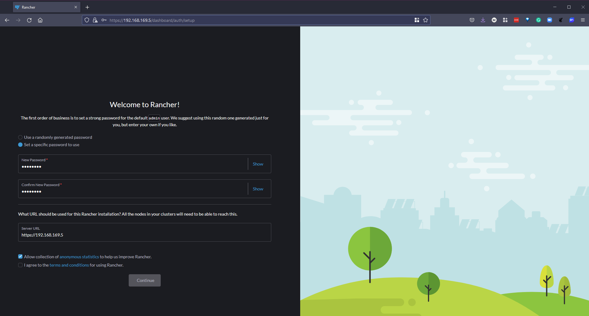
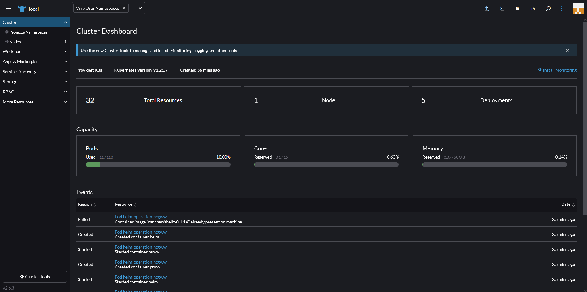

## Rancher Overview - Hands On

In this section we are going to take a look at Rancher, so far everything we have done has been in the cli and using kubectl but we have  a few really good UIs and multi cluster management tools to give our operations teams  good visibility into our cluster management. 

Rancher is according to their [site](https://rancher.com/)

*Rancher is a complete software stack for teams adopting containers. It addresses the operational and security challenges of managing multiple Kubernetes clusters across any infrastructure, while providing DevOps teams with integrated tools for running containerized workloads.*

Rancher enables us to deploy production grade Kubernetes clusters from pretty much any location and then provides centralised authentication, access control and observability. I mentioned in a previous section that there is almost an overwhelming choice when it comes to Kubernetes and where you should or could run them, looking at Rancher it really doesn't matter where they are. 

### Deploy Rancher

The first thing we need to do is deploy Rancher on our local workstation, there are few ways and locations you can choose to proceed with this step, for me I want to use my local workstation and run rancher as a docker container. By running the command below we will pull down a container image and then have access to the rancher UI.  

Other rancher deployment methods are available [Rancher Quick-Start-Guide](https://rancher.com/docs/rancher/v2.6/en/quick-start-guide/deployment/)

`sudo docker run -d --restart=unless-stopped -p 80:80 -p 443:443 --privileged rancher/rancher`

As you can see in our Docker Desktop we have a running rancher container. 



### Accessing Rancher UI

With the above container running we should be able to navigate to it via a web page. `https://localhost` will bring up a login page as per below. 


Follow the instructions below to get the password required. Because I am using Windows I chose to use bash for Windows because of the grep command required. 


We can then take the above password and login, the next page is where we can define a new password. 



Once we have done the above we will then be logged in and we can see our opening screen. As part of the Rancher deployment we will also see a local K3s cluster provisioned. 


### A quick tour of rancher

The first thing for us to look at is our locally deployed K3S cluster You can see below that we get a good visual on what is happening inside our cluster. This is the default deployment and we have not yet deployed anything to this cluster. You can see it is made up of 1 node and has 5 deployments. Then you can also see that there are some stats on pods, cores and memory.  



On the left hand menu we also have an Apps & Marketplace tab, this allows us to choose applications we would like to run on our clusters, as mentioned previously Rancher gives us the capability of running or managing a number of different clusters. With the marketplace we can deploy our applications very easily.  


Another thing to mention is that if you did need to get access to any cluster being managed by Rancher in the top right you have the ability to open a kubectl shell to the selected cluster. 


### Create a new cluster

Over the past two sessions we have created a minikube cluster locally and we have used Vagrant with VirtualBox to create a 3 node Kubernetes cluster, with Rancher we can also create clusters. In the [Rancher Folder](Days/Kubernetes/Rancher) you will find additional vagrant files that will build out the same 3 nodes but without the steps for creating our Kubernetes cluster (we want Rancher to do this for us)

We do however want docker installed and for the OS to be updated so you will still see the `common.sh` script being ran on each of our nodes. This will also install Kubeadm, Kubectl etc. But it will not run the Kubeadm commands to create and join our nodes into a cluster. 

We can navigate to our vagrant folder location and we can simply run `vagrant up` and this will begin that process of creating our 3 VMs in virtualbox. 


Now that we have our nodes or VMs in place and ready, we can then use Rancher to create our new Kubernetes cluster. The first screen to create your cluster gives you some options as to where your cluster is, i.e are you using the public cloud managed Kubernetes services, vSphere or something else. 


We will be choosing "custom" as we are not using one of the integrated platforms. The opening page is where you define your cluster name (it says local below but you cannot use local, our cluster is called vagrant.) you can define Kubernetes versions here, network providers and some other configuration options to get your Kubernetes cluster up and running. 


The next page is going to give you the registration code that needs to be ran on each of your nodes with the appropriate services to be enabled. etcd, controlplane and worker. For our master node we want etcd and controlplane so the command can be seen below. 


```
sudo docker run -d --privileged --restart=unless-stopped --net=host -v /etc/kubernetes:/etc/kubernetes -v /var/run:/var/run  rancher/rancher-agent:v2.6.3 --server https://10.0.0.1 --token mpq8cbjjwrj88z4xmf7blqxcfmwdsmq92bmwjpphdkklfckk5hfwc2 --ca-checksum a81944423cbfeeb92be0784edebba1af799735ebc30ba8cbe5cc5f996094f30b --etcd --controlplane
```

If networking is configured correctly then you should pretty quickly see the following in your rancher dashboard, indicating that the first master node is now being registered and the cluster is being created. 


We can then repeat the registration process for each of the worker nodes with the following command and after some time you will have your cluster up and running with the ability to leverage the marketplace to deploy your applications. 

```
sudo docker run -d --privileged --restart=unless-stopped --net=host -v /etc/kubernetes:/etc/kubernetes -v /var/run:/var/run  rancher/rancher-agent:v2.6.3 --server https://10.0.0.1 --token mpq8cbjjwrj88z4xmf7blqxcfmwdsmq92bmwjpphdkklfckk5hfwc2 --ca-checksum a81944423cbfeeb92be0784edebba1af799735ebc30ba8cbe5cc5f996094f30b --worker
```


Over the last 3 sessions we have used a few different ways to get up and running with a Kubernetes cluster, over the remaining days we are going to look at the application side of the platform arguably the most important. We will look into services and being able to provision and use our service in Kubernetes. 

I have been told since that the requirements around bootstrapping rancher nodes requires those VMs to have 4GB ram or they will crash-loop, I have since updated as our worker nodes had 2GB. 

### What we will cover in the series on Kubernetes 

We have started covering some of these mentioned below but we are going to get more hands on tomorrow with our second cluster deployment then we can start deploying applications into our clusters. 

- Kubernetes Architecture 
- Kubectl Commands 
- Kubernetes YAML 
- Kubernetes Ingress 
- Kubernetes Services
- Helm Package Manager 
- Persistant Storage 
- Stateful Apps 

## Resources 

If you have FREE resources that you have used then please feel free to add them in here via a PR to the repository and I will be happy to include them. 

- [Kubernetes Documentation](https://kubernetes.io/docs/home/)
- [TechWorld with Nana - Kubernetes Tutorial for Beginners [FULL COURSE in 4 Hours]](https://www.youtube.com/watch?v=X48VuDVv0do)
- [TechWorld with Nana - Kubernetes Crash Course for Absolute Beginners](https://www.youtube.com/watch?v=s_o8dwzRlu4)
- [Kunal Kushwaha - Kubernetes Tutorial for Beginners | What is Kubernetes? Architecture Simplified!](https://www.youtube.com/watch?v=KVBON1lA9N8)

See you on [Day 54](day54.md) 
