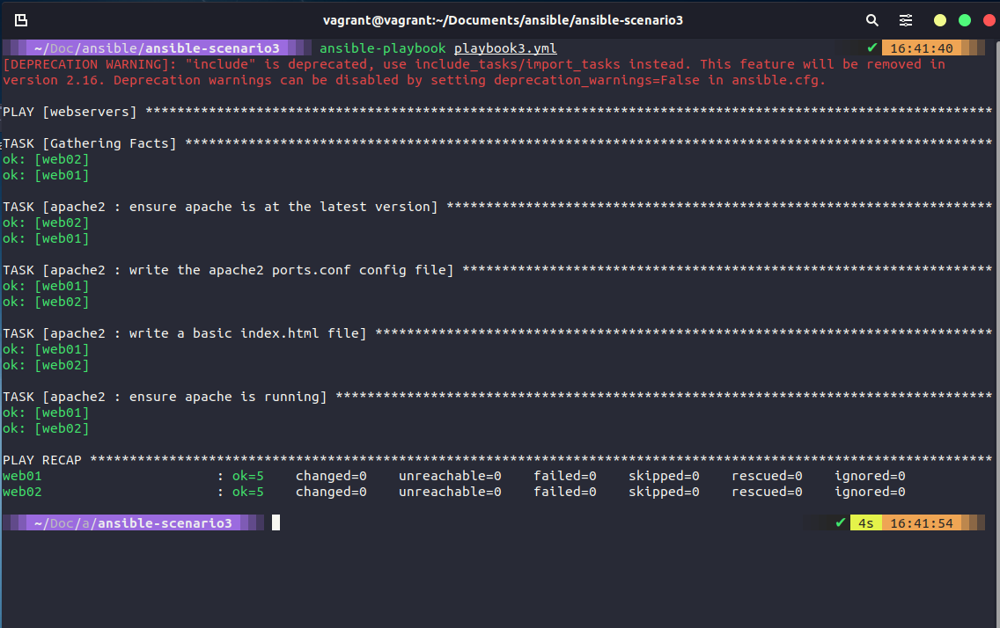

## Ansible Playbooks Continued...

In our last section we started with creating our small lab using a Vagrantfile to deploy 4 machines and we used our Linux machine we created in that section as our ansible control system. 

We also ran through a few scenarios of playbooks and at the end we had a playbook that made our web01 and web02 individual webservers. 


### Keeping things tidy

Before we get into further automation and deployment we should cover the ability to keep our playbook lean and tidy and how we can separate our taks and handlers into subfolders. 

we are basically going to copy our tasks into their own file within a folder.

```
- name: ensure apache is at the latest version
  apt: name=apache2 state=latest

- name: write the apache2 ports.conf config file
  template: 
    src=templates/ports.conf.j2 
    dest=/etc/apache2/ports.conf
  notify: restart apache

- name: write a basic index.html file
  template:
    src: templates/index.html.j2
    dest: /var/www/html/index.html
  notify:
  - restart apache

- name: ensure apache is running
  service:
    name: apache2
    state: started
```

and the same for the handlers. 

```
- name: restart apache
  service:
    name: apache2
    state: restarted
```

then within our playbook now named `playbook2.yml` we point to these files. All of which can be found at [ansible-scenario2](Days/../Configmgmt/ansible-scenario2/)

You can test this on your control machine. If you have copied the files from the repository you should have noticed something changed in the "write a basic index.html file"


Let's find out what simple change I made. Using `curl web01:8000` 


We have just tidied up our playbook and started to separate areas that could make a playbook very overwhelming at scale.

### Roles and Ansible Galaxy

At the moment we have deployed 4 VMs and we have configured 2 of these VMs as our webservers but we have some more specific functions namely, a database server and a loadbalancer or proxy. In order for us to do this and tidy up our repository we can use roles within Ansible. 

To do this we will use the `ansible-galaxy` command which is there to manage ansible roles in shared repositories. 


We are going to use `ansible-galaxy` to create a role for apache2 which is where we are going to put our specifics for our webservers. 


The above command `ansible-galaxy init roles/apache2` will create the folder structure that we have shown above. Our next step is we need to move our existing tasks and templates to the relevant folders in the new structure. 


Copy and paste is easy to move those files but we also need to make a change to the tasks/main.yml so that we point this to the apache2_install.yml. 

We also need to change our playbook now to refer to our new role. In the playbook1.yml and playbook2.yml we determine our tasks and handlers in different ways as we changed these between the two versions. We need to change our playbook to use this role as per below: 

```
- hosts: webservers
  become: yes
  vars:
    http_port: 8000
    https_port: 4443
    html_welcome_msg: "Hello 90DaysOfDevOps - Welcome to Day 66!"
  roles:
    - apache2
```


We can now run our playbook again this time with the new playbook name `ansible-playbook playbook3.yml` you will notice the depreciation, we can fix that next.  



Ok, the depreciation although our playbook ran we should fix our ways now, in order to do that I have changed the include option in the tasks/main.yml to now be import_tasks as per below. 


You can find these files in the [ansible-scenario3](Days/Configmgmt/ansible-scenario3)

We are also going to create a few more roles whilst using `ansible-galaxy` we are going to create: 

- common = for all of our servers (`ansible-galaxy init roles/common`)
- nginx = for our loadbalancer (`ansible-galaxy init roles/nginx`)


I am going to leave this one here and in the next session we will start working on those other nodes we have deployed but have not done anything with yet. 

## Resources 

- [What is Ansible](https://www.youtube.com/watch?v=1id6ERvfozo)
- [Ansible 101 - Episode 1 - Introduction to Ansible](https://www.youtube.com/watch?v=goclfp6a2IQ)
- [NetworkChuck - You need to learn Ansible right now!](https://www.youtube.com/watch?v=5hycyr-8EKs&t=955s)
- [Your complete guide to Ansible](https://www.youtube.com/playlist?list=PLnFWJCugpwfzTlIJ-JtuATD2MBBD7_m3u)

This final playlist listed above is where a lot of the code and ideas came from for this section, a great resource and walkthrough in video format. 

See you on [Day 67](day67.md)
