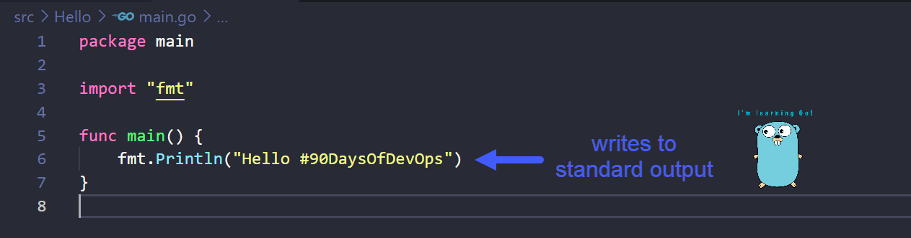

## Giải thích mã Hello World

### Cách Go hoạt động

Trong [Ngày 8](day08.md), chúng ta đã tiến hành cài đặt Go trên máy trạm của bạn sau đó tạo ứng dụng Go đầu tiên của mình.

Trong phần này, chúng ta sẽ xem xét sâu hơn về mã và tìm hiểu thêm một số điều về Go.

### Biên dịch là gì

Trước khi tìm hiểu về [6 dòng mã của Hello World](Go/hello.go), chúng ta cần hiểu về việc biên dịch.

Các ngôn ngữ lập trình mà chúng ta thường sử dụng như Python, Java, Go và C++ là các ngôn ngữ bậc cao. Có nghĩa là mã mà con người có thể đọc được, nhưng khi máy tính thực thi một chương trình, chúng cần phải được dịch ra mã máy. Quá trình đó được gọi là biên dịch.

Bạn có thể thấy những gì chúng ta đã làm vào [Ngày 8](day08.md) ở trên. Chúng ta đã tạo một tệp main.go đơn giản và sử dụng lệnh `go build main.go` để biên dịch ra một tệp thực thi.

### Gói (Packages) là gì?

Gói là một tập hợp các tệp nguồn trong cùng một thư mục và được biên dịch cùng nhau. Nói một cách đơn giản hơn, một gói là một loạt các tệp .go trong cùng một thư mục. Bạn có nhớ thư mục Hello ở Ngày 8 không? Khi bạn viết những chương trình phức tạp hơn bằng Go, bạn có thể thấy có folder1 folder2 và folder3 chứa các tệp .go khác nhau tạo nên chương trình với nhiều gói.

Chúng ta sử dụng các gói để có thể tái sử dụng lại mã của người khác để không phải viết mọi thứ từ đầu. Ví dụ chúng ta muốn có "máy tính" như một phần của chương trình, bạn có thể tìm thấy gói Go chứa các hàm toán học mà bạn có thể sử dụng, giúp bạn tiết kiệm rất nhiều thời gian và công sức.

Go khuyến khích bạn tổ chức mã của mình thành các gói để dễ dàng tái sử dụng và duy trì.

### Hello #90DaysOfDevOps Từng dòng một

Bây giờ hãy xem qua tệp main.go của chúng ta.

Trong dòng đầu tiên, bạn có `package main` có nghĩa là tệp này thuộc về một gói có tên là main. Tất cả các tệp .go cần phải thuộc về một gói, chúng cũng phải có `package gìđó` trong dòng mở đầu.

Một gói có thể được đặt tên tuỳ ý. Chúng ta bắt buộc phải gọi đây là `main` vì nó là điểm bắt đầu của chương trình sẽ có trong gói này, đây là một quy tắc. (Tôi cần hiểu thêm về quy tắc này?)

Bất cứ khi nào chúng ta muốn biên dịch và thực thi mã của mình, chúng ta phải cho máy biết nơi thực thi được bắt đầu. Chúng ta thực hiện điều này bằng cách viết một hàm có tên là main. Máy sẽ tìm kiếm một hàm có tên là main để bắt đầu chương trình.

Hàm là một khối mã có thể thực hiện một số tác vụ cụ thể và có thể được sử dụng trong toàn bộ chương trình.

Bạn có thể khai báo một hàm với bất kỳ tên nào bằng cách sử dụng `func` nhưng trong trường hợp này, chúng ta cần đặt tên nó là` main` vì đây là nơi mã bắt đầu.

Tiếp theo, chúng ta sẽ xem xét dòng 3, nơi chúng ta import, có nghĩa là bạn muốn đưa một gói khác vào chương trình chính của mình. fmt là một gói tiêu chuẩn do Go cung cấp, gói này chứa hàm `Println()` và vì chúng ta đã import hàm này nên có thể sử dụng tại dòng 6. Có một số gói tiêu chuẩn chúng ta có thể đưa vào chương trình và tái sử dụng chúng trong mã, giúp tránh được những rắc rối khi phải viết lại từ đầu. [Thư viện chuẩn của Go](https://pkg.go.dev/std)

Hàm `Println()` mà chúng ta có ở đây là một cách để ghi đầu ra tiêu chuẩn (standard output) tại thiết bị đầu cuối - nơi mà tệp thực thi đã được thực thi thành công. Bạn có thể tự do thay đổi đoạn mã ở giữa ().

### TLDR

- **Dòng 1** = Tệp này sẽ nằm trong gói có tên là `main` và nó cần được gọi là `main` vì đó là điểm bắt đầu của chương trình.
- **Dòng 3** = Để chúng ta có thể sử dụng hàm `Println()`, cần phải import gói fmt để sử dụng gói này tại dòng 6.
- **Dòng 5** = Điểm bắt đầu thực tế, hàm `main`.
- **Dòng 6** = Điều này sẽ cho phép chúng ta in "Hello #90DaysOfDevOps" trên hệ thống.

## Tài liệu tham khảo

- [StackOverflow 2021 Developer Survey](https://insights.stackoverflow.com/survey/2021)
- [Why we are choosing Golang to learn](https://www.youtube.com/watch?v=7pLqIIAqZD4&t=9s)
- [Jake Wright - Learn Go in 12 minutes](https://www.youtube.com/watch?v=C8LgvuEBraI&t=312s)
- [Techworld with Nana - Golang full course - 3 hours 24 mins](https://www.youtube.com/watch?v=yyUHQIec83I)
- [**NOT FREE** Nigel Poulton Pluralsight - Go Fundamentals - 3 hours 26 mins](https://www.pluralsight.com/courses/go-fundamentals)
- [FreeCodeCamp - Learn Go Programming - Golang Tutorial for Beginners](https://www.youtube.com/watch?v=YS4e4q9oBaU&t=1025s)
- [Hitesh Choudhary - Complete playlist](https://www.youtube.com/playlist?list=PLRAV69dS1uWSR89FRQGZ6q9BR2b44Tr9N)

Hẹn gặp lại vào [Ngày 10](day10.md).
