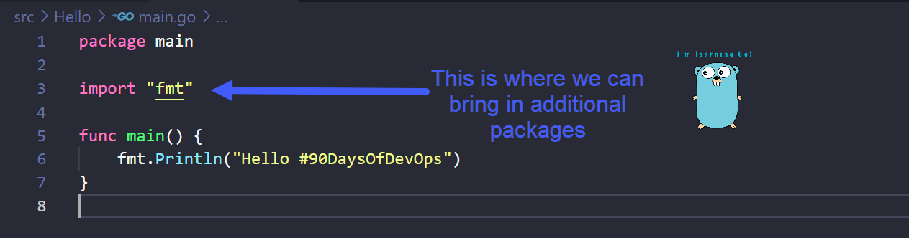

## 解释 Hello World 代码

### Go是如何工作的

在[第八天](day08.md)，我们完成了Go在工作站上的安装，同时创建了第一个Go程序。

在这节，我们将更深入学习这些代码，了解更多Go语言的内容。

### 什么是编译？

在开始[Hello World的6行代码](Go/hello.go)之前，我们需要对编译有一些了解。

像Python、Java、Go和C++这类我们常用的编程语言都是高级语言(high-level languages)。这意味着它们是可以被人们直接阅读的。但当机器想去执行一个程序时，它需要将这些语言转换成机器能读懂的形式。而这个将人类能读懂的代码翻译成机器码的过程被成为编译(compiling)。

从上图可以看到，我们在[第八天](day08.md)做的事情。我们创建了一个简单的Hello World程序main.go，然后使用`go build main.go`命令去将它编译成可执行文件。

### 什么是包(packages)？

包(package)，是在同一目录下编译到一起的源文件的集合。我们可以简单理解为，一个包是同一目录下的一堆\*.go文件。还记得第八天的Hello文件夹吗？当你去学习更复杂的Go程序时，你可能会发现你有多个包含.go文件的文件夹(folder1, folder2和folder3...)，所以你的程序是由多个包构成的。

因此，我们可以通过使用包来复用别人的代码，并且不必将所有东西从头开始写。或许我们希望程序中有一个计算功能，你可能找到一个现成的、可以被导入的、包含了数学计算的Go包。长远来看，这种做法可以为你节省大量时间和精力。

Go鼓励你将代码组织成不同的包，从而方便后续复用和维护。

### 逐行来看Hello \#90DaysOfDevOps

让我们去到Hello文件夹里的main.go文件并看看每行在做什么。

在第一行，`package main`声明了这个文件属于一个叫main的包。所有的.go文件都需要被归属到一个包里，它们的开头会有`package something`的字样。

一个包可以任意命名。我们称`main`为这个包中的程序的起点，这是一个规则。(我需要更多地了解这条规则吗？)

每当我们想要编译并运行代码时，我们都要告诉机器从那里开始执行。于是我们会编写一个叫main的函数。机器将会寻找名叫main的函数作为程序的入口。

函数是一个可以在整个程序中使用的、执行特定任务的代码块。

你可以使用`func`声明任意名称的函数，只是在我们的例子中，我们需要命名`main`作为代码的起始点。

接下来到第3行，import意味着你要在main程序里引入另一个包。fmt是Go提供的一个标准包，里边包含了将在第六行使用的`Println()`函数。也有很多标准库可以被应用在你的程序中，利用或重用它们可以省去你从头写起的麻烦。[Go的标准包](https://pkg.go.dev/st)

这里的`Println()`是一个将标准输出写入终端的一个方法，当程序被成功执行，信息将会被打印出来。你可以随意更改括号里的内容。

### 总结

- **第1行** = 这个文件位于名为`main`的包中，因为其中包含程序的入口`main`，所以被称为`main`。
- **第3行** = 我们要导入fmt包后再在第六行使用`Println()`。
- **第5行** = 实际的入口，`main`函数。
- **第6行** = 这将在我们的系统上打印"Hello #90DaysOfDevOps"。

## 相关资料

- [StackOverflow 2021 Developer Survey](https://insights.stackoverflow.com/survey/2021)
- [Why we are choosing Golang to learn](https://www.youtube.com/watch?v=7pLqIIAqZD4&t=9s)
- [Jake Wright - Learn Go in 12 minutes](https://www.youtube.com/watch?v=C8LgvuEBraI&t=312s) 
- [Techworld with Nana - Golang full course - 3 hours 24 mins](https://www.youtube.com/watch?v=yyUHQIec83I) 
- [**NOT FREE** Nigel Poulton Pluralsight - Go Fundamentals - 3 hours 26 mins](https://www.pluralsight.com/courses/go-fundamentals) 
- [FreeCodeCamp -  Learn Go Programming - Golang Tutorial for Beginners](https://www.youtube.com/watch?v=YS4e4q9oBaU&t=1025s) 
- [Hitesh Choudhary - Complete playlist](https://www.youtube.com/playlist?list=PLRAV69dS1uWSR89FRQGZ6q9BR2b44Tr9N) 

[第十天](day10.md)见。
