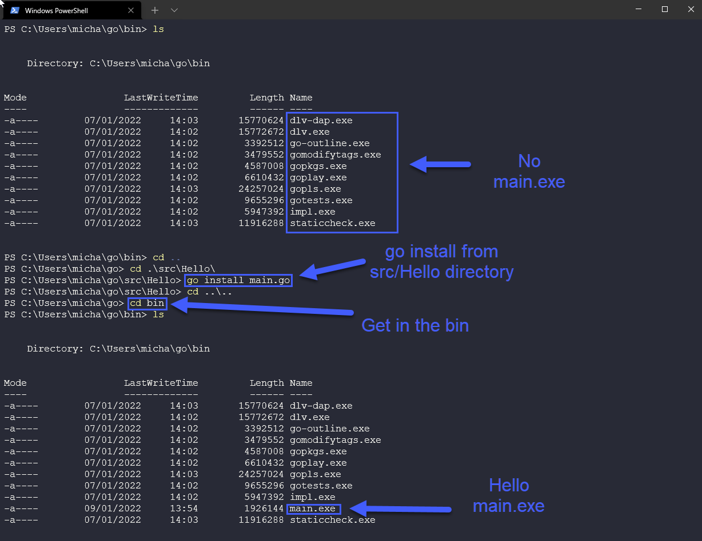

### Go工作区

在[第8天](day08.md)，我们简单介绍了Go工作区并启动和运行了`Hello #90DaysOfDevOps`的演示。但我们应该更多地谈一下Go工作区(workspace)。

还记得我们选用了默认值，然后在已定义好的GOPATH中创建了我们的Go文件夹。实际上，GOPATH可以被更改为任意位置。

如果你运行

```
echo $GOPATH
``` 

输出应该和我的类似(可能用户名会不同)：

```
/home/michael/projects/go
```

然后我们在这个路径下创建了三个文件夹，**src**、**pkg**和**bin**。


**src**是存放所有Go程序和项目的地方。这可以处理帮助你解决所有Go存储库的管理。下图是我工作站上的内容，我们有存放Hello #90DaysOfDevOps这个项目的Hello文件夹


**pkg**是你存放安装或已安装程序包的地方。这有助于根据正使用的包是否被修改来加快编译速度。


**bin**是存放所有已编译二进制文件的地方。


我们的Hello #90DaysOfDevOps不是一个复杂的程序。下面是一个较复杂的Go程序演示，取自另一个值得看的资源[GoChronicles](https://gochronicles.com/)


在[GoChronicles](https://gochronicles.com/project-structure/)中还详细介绍了布局的原因和方式，并在我们未提及的其他文件夹方面做出了更深入的介绍。

### 编译 & 运行代码

在[第9天](day09.md)，我们简单介绍了代码编译，这里我们可以更深入了解一下。

想要运行我们的代码，第一步必须是**编译**它。在Go中有三种方式：

- go build
- go install
- go run 

在我们讲解以上的编译方式之前，我们需要了解Go安装了什么。

我们在第8天安装Go时，它安装了被称为Go工具的东西。其中包括了一些程序，让我们构建和处理我们的Go源文件。其中一个工具是`Go`。

值得注意的是，你可以安装标准Go安装以外的工具。

如果你打开打开命令提示符，然后输入`go`，你会看到一些类似下图的内容。然后那你可以看到下边的“其他帮助主题”，但现在我们不需要去担心这些。


你可能还记得我们已经在第8天中使用了至少其中两个工具。


其中，我们将了解更多构建、安装和运行的内容(build, install and run)。


- `go run` - 编译和运行命令行中指定的.go文件组成的main包。这个命令会被编译到一个临时文件夹里。
- `go build` - 为了编译包和依赖，在当前文件夹中编译这个包。如果是`main`包，则会把可执行文件放在当前目录中；如果不是，则会把可执行文件放在`pkg`文件夹中。`go build`也能为任何Go支持的操作系统平台构建可执行文件。
- `go install` - 与`go build`相同，但它会把可执行文件存放在`bin`文件夹中。


我们已经运行了`go build`和`go run`，如果你想的话，可以在这里多次循行它们。就如前面说到的，`go install`将可执行文件放在我们的bin文件夹中。




如果你正在观看下面的视频，我会收集这些内容并记录在我的笔记中，方便我理解Golang的基础知识。下面的资源能帮助你更好地理解你可能需要的领域，而我想基于我搜集到的资料在记录这7天或7个小时的学习分享。


## 相关资料

- [StackOverflow 2021 Developer Survey](https://insights.stackoverflow.com/survey/2021)
- [Why we are choosing Golang to learn](https://www.youtube.com/watch?v=7pLqIIAqZD4&t=9s)
- [Jake Wright - Learn Go in 12 minutes](https://www.youtube.com/watch?v=C8LgvuEBraI&t=312s) 
- [Techworld with Nana - Golang full course - 3 hours 24 mins](https://www.youtube.com/watch?v=yyUHQIec83I) 
- [**NOT FREE** Nigel Poulton Pluralsight - Go Fundamentals - 3 hours 26 mins](https://www.pluralsight.com/courses/go-fundamentals) 
- [FreeCodeCamp -  Learn Go Programming - Golang Tutorial for Beginners](https://www.youtube.com/watch?v=YS4e4q9oBaU&t=1025s) 
- [Hitesh Choudhary - Complete playlist](https://www.youtube.com/playlist?list=PLRAV69dS1uWSR89FRQGZ6q9BR2b44Tr9N) 

[第十一天](day11.md)见。
