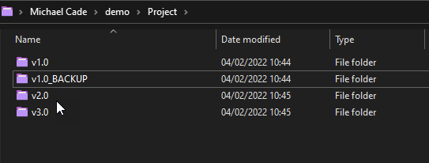
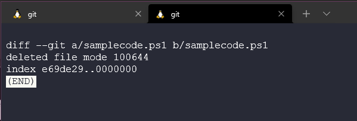

## 概述： Git - 版本控制

在我们开始git之前，我们需要了解什么是版本控制，为什么需要它？在Git部分的开头，我们将介绍版本控制以及git的基础。

### 什么是版本控制？

Git不是唯一的版本控制系统，所以我们会讨论关于版本控制的工具和现成的方法。

版本控制最显著、最大的好处是可以记录一个项目的历史。我们可以通过`git log`回看整个仓库，我们会看到有很多的提交(commits)和评论(comments)，还有项目中发生了什么。不要急，我们会在后边谈到相关的命令(commands)。可以思考一下，如果这是一个实际的软件项目，有着大量的源代码，很多人在不同的时间对我们的软件进行提交，不同的作者、审核人都在这里进行记录。所以我们可以知道什么时候、发生了什么、谁发起的、谁审阅的。

首先，版本控制是很妙的，它就像是在你进行修改之前对现有的版本进行了复制。也类似你为了以防万一，把没用的代码注释掉一样。

我已经在很多地方使用到了版本控制，不单单是源代码方面，也包括一些分享项目(像这个 90DaysOfDevOps)。所以为什么不回滚和记录所有发生的事呢。

然而，一个重要声明：**版本控制不是备份！**

版本控制的另一个好处是可以管理一个项目的多个版本。这里举个例子，我们有一个免费的应用可以在所有系统上运行，还有一个付费的应用也可以在所偶系统上运行。主要的代码在两个应用中共享使用。我们可以复制黏贴我们的代码，每一次对不同应用的提交。但这样会导致混乱，特别是当你与多个人改变开发产品时，同时也可能发生一些错误。

下面我们想对一个高级应用程序(premium app)添加新功能，先称之为高级提交(premium commits)，其中的自由编辑(free edition)包含了常规的提交。

版本控制通过分支(branching)来实现这点。

分支(branching)允许一个应用程序有两个代码流(code streams)，就像我们上面提到的。但我们仍然想让新的功能加入到我们的源代码中。合并(merging)就是用来做这件事的。

这个看起来简单，但合并可以是复杂的，因为你可能在自由编辑(free edition)上与团队一起工作，同时你和另一个团队在付费版本(premium paid for version)上工作。如果同时更改代码，会对所有代码产生影响。可能一个变量被更新导致有些东西出错。然后你会得到一个冲突(conflict)，它会破坏项目中的功能。版本控制不能修复冲突，但版本控制使它们被易于管理。

主要的原因是，如果你还不太了解版本控制，一般的，它有协作的功能。与开发者共享代码的能力，正如我之前提到的，我们为了各种原因去寻找有用的案例、使用源代码。它可能是你与同事制作的演讲，或是一个90DaysOfDevOps的挑战，你拥有一个社区，可以检查内容是否正确，或是跟进整个项目。

如果没有版本控制，软件开发团队还如何处理这些？当我在一步步制作项目时，我发现这将是困难的。我希望它们能够被拆分进不同的功能模块中。在还没发布时，其中一点点的疑问可能导致各部分的问题一起出现。

通过使用版本控制，我们只有一个目标。我们可能在不同模块上进行工作，但这能让大家更好地进行合作。

还有一个需要提到的是，不单是开发者可以从版本控制中获益，团队中的所有成员都可以查看。但对工具应该有了解和利用，项目管理工具可以是类似的，用于追踪工作进程。我们可能会有一个构建平台(build machine)，例如Jenkins 我们将会在另一个章节谈到。一个创建和打包的系统，自动化部署测试和评估。

### 什么是Git？

Git是一个追踪代码或文件改变的工具，或者我们也可以说它是一个开源的分布式版本控制系统。

Git可以有多种方式在我们的系统中使用，对于我来说最常见的是命令行。我们也有图像交互工具，例如Visual Studio Code就有git操作，我们可以使用它。

在开始安装Git之前，我们要看看宏观的概述。

我们之前创建了一个文件夹。

要将版本控制应用在这个文件夹中，我们第一步需要使用`git init`来初始化。可以想象这个命令将我们的目录变成了一个仓库(repository)，并放入了电脑某处的数据库中。

现在我们可以创建一些文件、文件夹和源代码，或者它们已经在这里了。我们使用`git add .`命令来将目录中所有文件和文件夹放入一个快照(snapshot)，到此我们还没有提交(commit)任何东西到数据库中。我们只是将所有的文件使用`.`来进行了添加。

然后我们想进一步并提交文件，使用`git commit -m "My First Commit"`。我们可以描述提交的原因，这是一个好的行为，后续我们才能知道每次提交都发生了什么。

现在我们可以用`git log`来看看项目的历史记录里发生了什么。

如果我们在这里创建一个新的文件`samplecode.ps1`，那么状态提示将发生改变。我们也可以用`git status`来检查我们仓库的状态。它会提示我们没有提交任何的东西，可以添加一个新的文件samplecode.ps1。如果我们后续输入相同的命令`git status`，你会看到将会被提交的文件。

使用`git add samplecode.ps1`来添加新的文件，然后再次输入`git status`。我们看到这个文件已经准备好被提交了。

下面输入`git commit -m "My Second Commit"`。

这次的`git status`再次告诉我们所有东西都是最新的。

后续我们可以使用`git log`来查看最新的和第一个提交。

如果我们想每次提交中的改变内容，比如哪些文件被添加或修改了，我们可以使用`git diff b8f8 709a`。

这样会显示发生了什么改变。在我们的例子中，我们添加了一个新的文件。

我们会在后续进一步学习相关用法，至此我们可以在提交中穿梭了，就像是时间旅行一样！通过利用我们的提交序号(commit number)，`git checkout 709a`可以跳回到之前的版本并保留我们新建的文件。

但同时，我们要继续前进。相同的，我们可以使用提交序号或直接使用`git switch -`来撤销我们的操作。

总结：

- 追踪一个项目的历史记录
- 管理一个项目的多个版本
- 与开发者、更广范围的团队和工具分享源代码
- 协调团队合作
- 和时间旅行的可能！

这似乎是跳跃的，但希望你能有所收获，了解版本控制的命令的功能和宏观思路。

后续，我们会安装git并在你本地的机器上设置，进一步了解有关的使用案例和命令。

## 相关资料

- [What is Version Control?](https://www.youtube.com/watch?v=Yc8sCSeMhi4)
- [Types of Version Control System](https://www.youtube.com/watch?v=kr62e_n6QuQ)
- [Git Tutorial for Beginners](https://www.youtube.com/watch?v=8JJ101D3knE&t=52s) 
- [Git for Professionals Tutorial](https://www.youtube.com/watch?v=Uszj_k0DGsg) 
- [Git and GitHub for Beginners - Crash Course](https://www.youtube.com/watch?v=RGOj5yH7evk&t=8s) 
- [Complete Git and GitHub Tutorial](https://www.youtube.com/watch?v=apGV9Kg7ics)

[第三十六天](day36.md)见！

