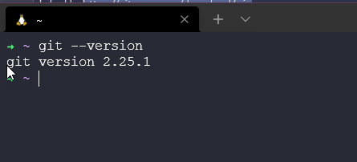
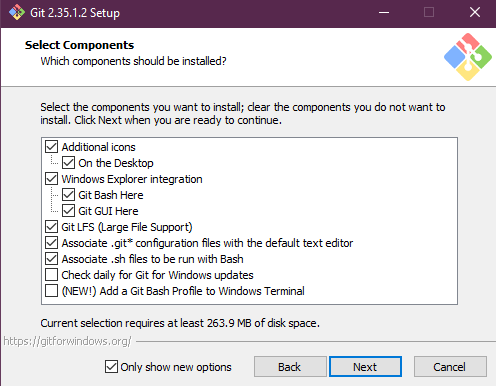
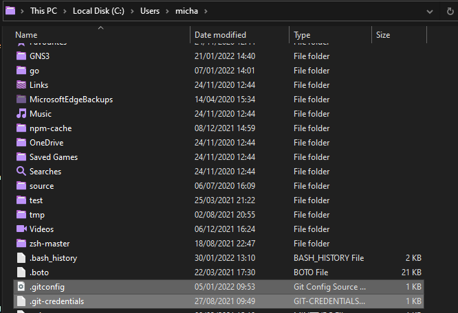
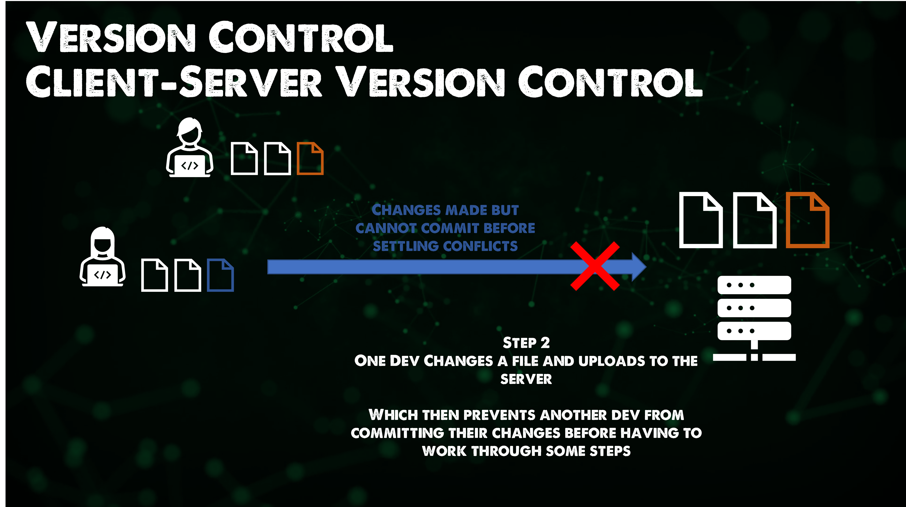

## 安装和配置 Git

Git是一个开源的、跨平台的版本控制工具。如果你也在使用Ubuntu或其他Linux环境，你会发现你已经安装了git，但我们还是会讲一下它的安装和设置。

即使你已经在你的系统上安装了git，最好还是确定我们在用的是最新的。

### 安装Git

就像前面提到的，Git是跨平台的。我们可以在Windows和Linux上运行，并且macOS也在[安装教程](https://git-scm.com/book/zh/v2/%E8%B5%B7%E6%AD%A5-%E5%AE%89%E8%A3%85-Git)中。

对于[Windows版本](https://git-scm.com/download/win)，我们可以从官网上下载安装包。

你也可以在Windows上使用`winget`，类似Windows上的应用程序包管理器。

在开始安装之前，我们可以看看已安装的版本信息。打开PowerShell并运行`git --version`：


也可以在查看WSL Ubuntu上的Git版本。



在编辑这个文档的时候，最新的Windows版本是`2.35.1`，因此我会在后续做更新，在Linux上也类似的。

我下载了最新的安装包，跟着运行向导完成安装。值得注意的是，git会在安装最新版之前将旧版本卸载掉。

这意味着下面的流程也将适用于没有安装过git的情形。

安装的过程很简单。下载完成后双击安装包开始。阅读GNU许可。但记住这是免费的、开源的软件。


在安装的同时，我们可以选择一些额外的与之相关选项。在Windows上，我通常会安装Git Bash，它可以运行bash脚本。



后续我们可以在SSH上执行。相关的内容在Linux部分有提到OpenSSH。


我们按需求勾选实验性的功能，而我并不需要这部分，你也可以随时回到这一步进行添加。


安装完成了，我们可以勾选打开Git Bash和查看更新文档。


最后一步要在PowerShell中检查已安装的git版本信息。


很简单，现在我们已经有了最新版。在Linux机器上，我们相差了一些版本，所以我们可以进行一下更新。

我简单运行`sudo apt-get install git`命令。


你也可以使用下面的命令行，它会把软件安装添加到git仓库中。

```
sudo add-apt-repository ppa:git-core/ppa -y
sudo apt-get update
sudo apt-get install git -y
git --version
``` 

### 配置Git

当我们第一次使用git时，我们已经定义了一些设置，

- Name
- Email 
- Default Editor
- Line Ending

这些可以在三个层次上完成

- System = 全部用户
- Global = 当前用户的全部仓库
- Local = 当前仓库

例如：
`git config --global user.name "Michael Cade"` 
`git config --global user.email Michael.Cade@90DaysOfDevOPs.com"`

你的操作系统会有默认的文本编辑器。在我的Ubuntu机器上，默认使用的是nano。下面的命令会把它更改为visual studio code。

`git config --global core.editor "code --wait"`

现在，如果我们想查看所有的git设置，我们可以使用下面的命令。

`git config --global -e` 


在所有机器上，这个文件被命名为`.gitconfig`。在我的Windows电脑上，它被放在了用户文件夹中。



### Git理论

在昨天的笔记中有提到，版本控制有不同的类型，我们可以把它们分为两类。一种是客户端服务器，另一种是分布式。

### 客户端服务器的版本控制

在git之前，版本控制通常使用的客户端服务器。[Apache Subversion](https://subversion.apache.org/)就是一个例子，他是一个2000年建立的开源版本控制系统。

在这个客户端服务器的版本控制模型中，第一步是从服务器下载源代码。这不会消除冲突(conflicts)，但它消除了冲突的复杂性，并给出解决方案。


举个例子，我们有两个开发者在同一个文件上工作，一个更早地向服务器提交了新的代码。当另一个开发者想要提交时，就存在冲突(conflict)。



因此，开发的过程需要获得第一次的代码的修改，并在冲突被处理后再进行提交。


### 分布式的版本控制

Git不是唯一的分布式版本控制系统。但它是较常见的一个。

Git的主要优势有：

- 快速
- 智能
- 灵活
- 安全

与客户端服务器版本控制不同的，每个开发者下载源仓库的全部内容。提交记录、所有分支...


## 相关资料

- [What is Version Control?](https://www.youtube.com/watch?v=Yc8sCSeMhi4)
- [Types of Version Control System](https://www.youtube.com/watch?v=kr62e_n6QuQ)
- [Git Tutorial for Beginners](https://www.youtube.com/watch?v=8JJ101D3knE&t=52s) 
- [Git for Professionals Tutorial](https://www.youtube.com/watch?v=Uszj_k0DGsg) 
- [Git and GitHub for Beginners - Crash Course](https://www.youtube.com/watch?v=RGOj5yH7evk&t=8s) 
- [Complete Git and GitHub Tutorial](https://www.youtube.com/watch?v=apGV9Kg7ics)

[第三十七天](day37.md)见
