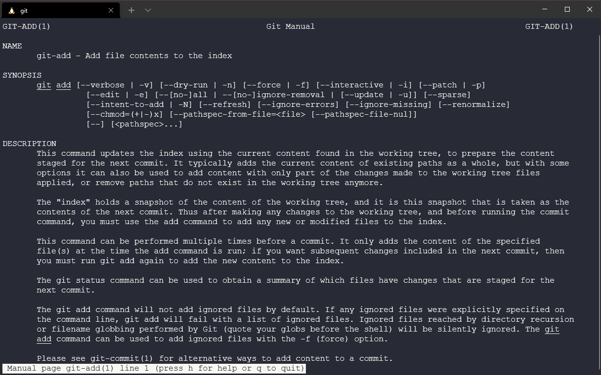
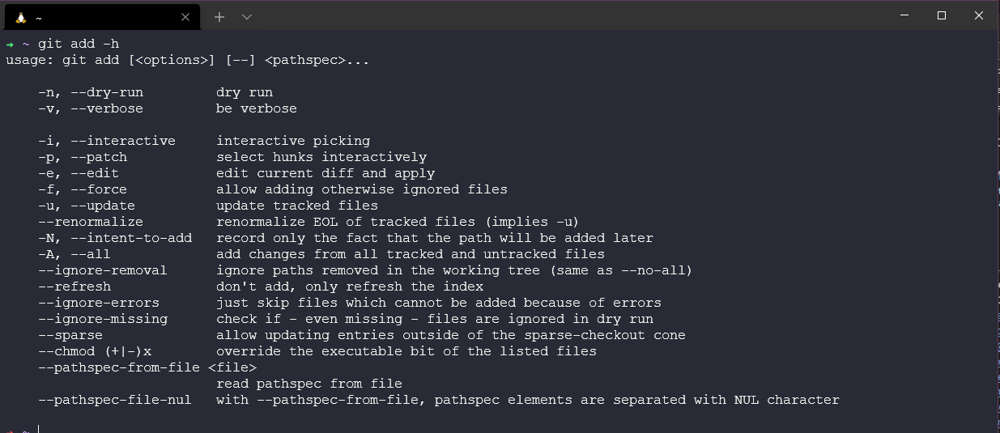

## 了解 Git

很抱歉使用了双关的标题(Gitting to know Git)。但我肯定不是第一个开这个玩笑的人！

在[第三十五天](day35.md)的分享中，我们对版本控制、git的基本工作流有了一定了解。然后[第三十六天](day36.md)，我们在电脑上安装了git，进行了更新和配置。同时也进一步学习了客户端服务器和Git的分布式版本控制。

现在我们要去学习一些常用的git命令及其案例。

### 在哪里查看git的帮助

有时候，你可能不记得或者不知道该使用哪个git命令。这就需要寻找帮助(help)。

在查找帮助的第一时间，你可能会使用搜索引擎，百度一下。

第二步会是查看git上的官方内容和文档。这里([git-scm.com/docs](http://git-scm.com/docs))你不仅可以找到所有命令的可靠资料，还可以找到很多不同的资源。

在离线环境下，我们也可以通过终端(terminal)来查看相同的文档。如果我们想使用`git add`命令，我们可以运行`git add --help`，这里会看到下面的说明内容。

我们也可以在shell中用`git add -h`来查看简短的选项描述。

### Git的错误认知

"Git has no access control" - 你可以授权一个领导者来维护源代码。

"Git is too heavy" - Git可以提供浅层存储库(shallow repositories)，这在项目很大的时候，减少了历史记录的数量。

### 存在的缺点

对于二进制文件的处理并不完美。例如，Git适用于源代码，但不太适合可执行文件或视频文件。

Git对用户不是很友好，我们也花了一些时间来讨论其中的命令和功能，这也是它的一个关键标志。

总的来说，git有学习难度，但它很好用。

### Git的生态

我想简单聊一下围绕git的生态系统，个人觉得有必要从宏观角度去了解这些。

几乎所有现代开发工具支持Git。

- 开发者工具 - 我们之前有提到过visual studio code，你发现git的插件被集成到了如sublime text和其他文本编辑器和IDE中。  
- 团队工具 - 用来做持续集成/持续部署的Jenkins，信息传递框架的Slack和用于项目管理和问题追踪的Jira。
- 云供应商 - 所有大型云供应商都支持Git。 (Microsoft Azure, Amazon AWS, Google Cloud Platform)
- 基于Git的服务 - 有GitHub、GitLab和 BitBucket，后续会进一步讨论。我听说这些服务是代码的社交平台！

### Git备忘录

我们没有列出绝大部分的命令，但查看了网上的一些备忘录后，我想记录一些git的命令及其用途。你不需要把它们全部记下来，只需多使用，你会学到它的基本用法。

我是从[atlassian](https://www.atlassian.com/git/tutorials/atlassian-git-cheatsheet)那里找到的，把它们整理下来也是了解Git命令的一种好方法。

### Git基本操作

| 命令           |           例子                       |           描述                                                                                                       | 
| ---------------   |   ------------------------------------- |   ------------------------------------------------------------------------------------------------------------------------- |
| git init          | `git init <directory>`                  | 在指定的文件夹`<directory>`里创建一个空的Git仓库。                                                                      |
| git clone         | `git clone <repo>`                      | 将`<repo>`中的仓库复制到自己的电脑上。                   |
| git config        | `git config user.name`                  | 定义在当前仓库中所有提交的作者名，`system`、`global`、`local`来进行设定。 |
| git add           | `git add <directory>`                   | 将<directory>中所有变更暂存到下一次提交中。也可以使用`add <files>`和`<.>`来进行操作。         |
| git commit -m     | `git commit -m "<message>"`             | 提交暂存的快照，使用<message>来说明提交了什么。                  |
| git status        | `git status`                            | 列出已暂存、未暂存和未追踪的文件。                   |
| git log           | `git log`                               | 使用默认格式显示所有的提交记录。                        |
| git diff          | `git diff`                              | 显示索引和工作目录中未暂存的更改。                       |

### Git的撤销更改

| 命令           |           例子                       |           描述                                         | 
| ---------------   |   ------------------------------------- |   ------------------------------------------- |
| git revert        | `git revert <commit>`                   | 新建一个提交，撤销<commit>中所有的变更，并应用在当前分支上。         |
| git reset         | `git reset <file>`                      | 将<file>从暂存中移除，但当前文件不会改变。这是将文件改为未暂存并不改变内容的方式。 |
| git clean         | `git clean -n`                          | 显示哪些文件没有被暂存并将被删除。用`-f`可以强制执行删除清理。                        |

### Git重写历史记录

| 命令           |           例子           |           描述             | 
| ---------------|------------------------ |----------------------------|
| git commit        | `git commit --amend`                    | 用暂存的变更替换掉上次的提交，合并上次的提交。当没有暂存时，编辑上次提交的信息。  |
| git rebase        | `git rebase <base>`                     | 从当前分支嫁接到<base>。<base>可以是对应提交ID、分支名称、标签tag 或是对HEAD的相关引用。 |
| git reflog        | `git reflog`                            | 显示本地仓库HEAD的变更记录。添加 --relative-date 来显示日期时间信息，或 --all 来显示所有信息。     |

### Git的分支

| 命令           |           例子               |           描述         | 
| ---------------|-----------------------------|------------------------|
| git branch        | `git branch`                            | 显示仓库中所有的分支。添加<branch>参数来新建一个叫<branch>的分支。               |
| git checkout      | `git checkout -b <branch>`              | 新建并检查一个叫<branch>的新分支。去掉 -b 来检查一个已存在的分支。                |
| git merge         | `git merge <branch>`                    | 将<branch>合并到当前分支中。                                                  |

### Git的远程仓库

| 命令              |           例子                           |           描述                                                         | 
| ------------------|-----------------------------------------|------------------------------------------------------------------------|
| git remote add    | `git remote add <name> <url>`           | 新建连接一个远程仓库。添加后，你可以使用<name>作为<url>的简写。              |
| git fetch         | `git fetch <remote> <branch>`           | 从仓库中抓取特定的<branch>。没有特定<branch>时，抓取所有远程的索引。         |
| git pull          | `git pull <remote>`                     | 抓取当前分支的特定<remote>的更新，并马上将它合并到本地文件夹中。              |
| git push          | `git push <remote> <branch>`            | 将当前分支中的提交推送到<remote>。若远程仓库中不存在<branch>，则新建<branch>。|

### Git的差异比较

| 命令           |           例子               |           描述         | 
| ---------------|-----------------------------|------------------------|
| git diff HEAD     | `git diff HEAD`                         | 显示当前目录与上次提交不同的部分。         |
| git diff --cached | `git diff --cached`                     | 显示暂存的变更与上次提交不同的部分。       |

### Git的配置

| 命令           |           例子               |           描述         | 
| ---------------|-----------------------------|------------------------|
| git config --global user.name <name>                  | `git config --global user.name <name>`                 | 设置当前用户每次提交时使用的作者名称。          |
| git config --global user.email <email>                | `git config --global user.email <email>`               | 设置当前用户每次提交时使用的作者邮箱。          |
| git config --global alias <alias-name> <git-command>  | `git config --global alias <alias-name> <git-command>` | 新建git命令的缩写。                           |
| git config --system core.editor <editor>              | `git config --system core.editor <editor>`             | 设置每个用户预设的文本编辑器。<editor>是打开对应编辑器的命令。 |
| git config --global --edit                            | `git config --global --edit `                          | 用文本编辑器打开全局配置文件，并进行编辑。                   |

### Git的嫁接(rebase)

| 命令           |           例子               |           描述         | 
| ---------------|-----------------------------|------------------------|
| git rebase -i <base>                  | `git rebase -i <base>`                 | 将当前分支嫁接到<base>。打开编辑器来输入命令，每个提交将如何转移到新的分支上。   |

### Git Pull

| 命令           |           例子               |           描述         | 
| ---------------|-----------------------------|------------------------|
| git pull --rebase <remote>            | `git pull --rebase <remote>`           | 将远程仓库的内容抓取到文件夹中。使用`--rebase`来避免合并分支。     |

### Git的重置

| 命令           |           例子               |           描述         | 
| ---------------|-----------------------------|------------------------|
| git reset                 | `git reset `                | 重置暂存的内容，但不改变当前文件夹。                   |
| git reset --hard          | `git reset --hard`          | 重置暂存的内容和文件夹，匹配最近的提交，并改写所有变更。                        |
| git reset <commit>        | `git reset <commit>`        | 重置当前分支到<commit>，重置暂存的内容，但不改变当前文件夹。                        |
| git reset --hard <commit> | `git reset --hard <commit>` | 与上一条类似，但重置暂存内容和文件夹。删除未提交的变更和所有在<commit>之后的内容。   |

### Git Push

| 命令           |           例子               |           描述         | 
| ---------------|-----------------------------|------------------------|
| git push <remote> --force                 | `git push <remote> --force`   | 强制进行推送。不要使用`--force`，除非你明确清楚自己在做什么。 |
| git push <remote> --all          | `git push <remote> --all`          | 推送当前分支的所有内容到特定远程仓库。                        |
| git push <remote> --tags        | `git push <remote> --tags`        | 当你推送一个分支或使用`--flag`时，Tags不会被自动推送。添加`--tags`后才推送所有tags到远程仓库。 |

## 相关资料

- [What is Version Control?](https://www.youtube.com/watch?v=Yc8sCSeMhi4)
- [Types of Version Control System](https://www.youtube.com/watch?v=kr62e_n6QuQ)
- [Git Tutorial for Beginners](https://www.youtube.com/watch?v=8JJ101D3knE&t=52s) 
- [Git for Professionals Tutorial](https://www.youtube.com/watch?v=Uszj_k0DGsg) 
- [Git and GitHub for Beginners - Crash Course](https://www.youtube.com/watch?v=RGOj5yH7evk&t=8s) 
- [Complete Git and GitHub Tutorial](https://www.youtube.com/watch?v=apGV9Kg7ics)
- [Git cheatsheet](https://www.atlassian.com/git/tutorials/atlassian-git-cheatsheet)

[第三十八天](day38.md)见
