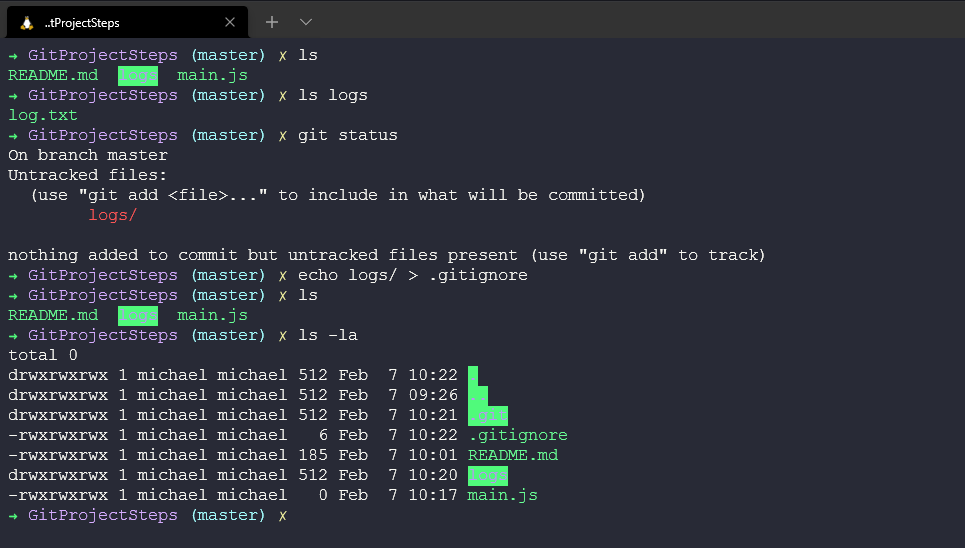
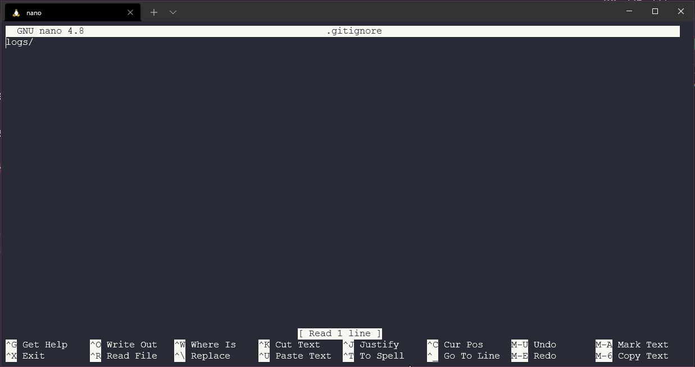

## 暂存与变更

我们已经了解了一些基础的内容，接下来的实操可以帮助我们更好地学习和理解。在我们开始使用基于git的服务(比如GitHub)之前，git可以在本地的工作站中使用相关的功能。

我们会先创建项目文件夹，然后用git来做些简单的操作。我们已经在本地电脑上新建了一个文件夹，使用`git init`来初始化它。

现在我们会看到在已初始化的文件夹中有一个隐藏文件夹。

git仓库的内容将会被保存在里面，例如分支和提交的信息。

### 暂存文件

然后我们会在这个空白文件夹中做点什么，可能是添加第一天工作的源代码。创建我们的`readme.md`文件，然后我们可以看到它出现在这个目录中。接着检查`git status`，它知道`readme.md`是新的文件，并且我们还未对其进行提交。

我们可以对`readme.md`进行暂存，使用`git add README.md`，然后可以看到出现了提交后的不同提示(之前是没有绿色字体部分的)。

下一步，我们将要进行第一次提交或是快照。我们会用到`git commit -m "Meaningful message"`，这样就可以清晰地看到每次提交中做了什么更改。同时，关注之前黄色的交叉符号变成了现在了绿色勾。这是一些在Linux中的操作，以及在我的终端中出现的东西。

### 提交更改

我们很可能会想在目录中加入更多的文件或是进行更改。在上边，我们已经完成了第一次的提交。但还可以加入更多的细节内容和文件。

我们可以是重复上述的步骤，新建或编辑文件。使用`git add .`来暂存所有的文件，然后`git commit -m "meaningful message"`来完成相关流程。但你一定不希望所谓有用的信息(meaningful message)是长篇大论的，例如`git commit -m "Well, I changed some code because it did not work and when I fixed that I also added something new to the readme.mdto ensure everyone knew about the user experience and then I made a tea."`。这样做确实可行，但更好的方式是在文本编辑器中进行添加。

如果我们在运行了`git add`之后，运行`git commit`，它会打开默认的文本编辑器(这里默认的是nano)。我对文件进行了一些修改，运行`git status`来显示已暂存和未暂存的内容。然后用`git add`添加这个文件到暂存的区域，运行`git commit`就会打开nano。

打开nano后，你可以输入或长或短的描述，最后保存。

### 提交的最佳实践

这里需要注意什么时候要提交和提交的频率。我们不应等到整个项目都完成了才去提交，并且每次的提交应该是有意义的，相互之间是有所关联的。如果你修复了一个bug，同时编辑了语法错误，更好的做法是确保他们分别处于两个提交。

让提交信息有意义。

在措辞方面，你和你的团队应在每次提交中保持相同的用词方式。

### 跳过暂存

在提交之前，你可以不对更改进行暂存吗？

是的，但不要把这个操作视作捷径。你应有百分百的把握不需要快照或回滚，这是一个有风险的做法。

### 移除文件

如果我们在目录中有另一个已提交的文件，但现在这个项目不再用到它了，那么我们应该移除掉它。

但只是在文件夹中移除文件，git还是会存储着它，我们还需要在仓库中进行移除。你可以参考下图的操作步骤：

在一个大型项目中处理文件和文件夹是个痛点。我们可以使用`git rm oldcode.ps1`来达到效果。

### 重命名和移动文件

在操作系统中，我们可以重命名和移动文件。类似的，移除是一个两步的过程，我们在操作系统上修改了文件，然后需要确保在暂存中也进行了修改并被正确地添加了。步骤如下：

像从操作系统和git仓库中移除文件的过程，同样可以用git命令来实现。

### 忽略文件

我们可能想要忽略掉一些项目中的文件或文件夹，像是logs，我们只想在本地使用，将它们上传会浪费很多的空间。或是考虑到文件的私密性，你不行将它放在公开的地方。

我们可以将文件或文件夹添加进`.gitignore`中，从而忽略掉它们。

然后你可以打开`.gitignore`，里边有我们添加的`logs/`文件夹。我们也可以在这里加入其他的文件或文件夹。

然后查看`git status`，会发生什么。

这也会存在回滚文件的情况，可能你想分享logs文件夹，但后来意识到这不是你想要的。如果你在之前已经将这样的文件夹进行暂存，可以使用`git rm --cached `从暂存空间中移除文件和文件夹。

### 状态简述

我们已经对`git status`的使用有了一定的了解，知道什么应该在暂存中，哪些不应放入其中。这是一个帮助我们更好理解细节的命令。大多数时候，你只想知道什么被修改了，什么被添加了？我们可以使用`git status -s`来获取简短的描述。我通常会在系统上设置一个别名来使用`git status -s`，与详细的描述进行区分。

在下一天，我们将继续通过一些例子来学习常用的git命令。

## 相关资料

- [What is Version Control?](https://www.youtube.com/watch?v=Yc8sCSeMhi4)
- [Types of Version Control System](https://www.youtube.com/watch?v=kr62e_n6QuQ)
- [Git Tutorial for Beginners](https://www.youtube.com/watch?v=8JJ101D3knE&t=52s)
- [Git for Professionals Tutorial](https://www.youtube.com/watch?v=Uszj_k0DGsg)
- [Git and GitHub for Beginners - Crash Course](https://www.youtube.com/watch?v=RGOj5yH7evk&t=8s)
- [Complete Git and GitHub Tutorial](https://www.youtube.com/watch?v=apGV9Kg7ics)
- [Git cheatsheet](https://www.atlassian.com/git/tutorials/atlassian-git-cheatsheet)

[第三十九天](day39.md)见
