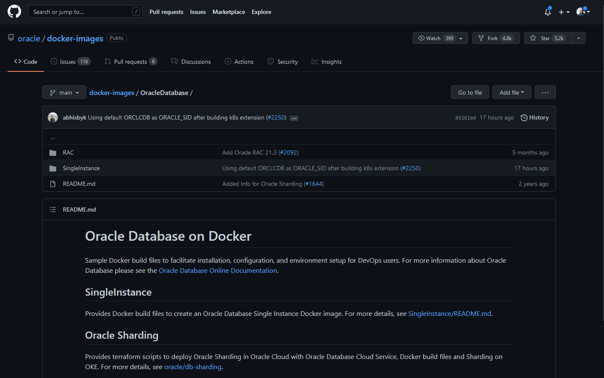

## 概览： 容器

我们现在进入下一个章节，在这里会关注于容器(containers)。我们会学习Docker，了解关键的功能，进而学习容器。

我也会制作一些实操案例，在这里会创建后续将用到的容器。

下面我们会介绍如何操作以及它的意义。

#History of platforms and application development
#do we want to talk about Virtualisation & Containerisation 

### 为什么采用另一种方式运行应用？

首先，我们要知道为什么需要用另一种方式运行软件或应用？这个做法是好的，我们可以通过许多方式来运行程序，例如在物理机上部署应用。或是在虚拟机、云端IaaS上运行应用，然后再次将数据库集成进虚拟机或公共云端的PaaS里。又或者是在容器中运行。

以上说的方法没有对错之分，它们有各自存在的道理，我相信没有一个是多余的。有很多文章在讨论容器与虚拟机的好坏，这不应是一个讨论点(它们都是运行应用的方式)，就像苹果和梨都是水果，只不过它们之间存在差异罢了。

如果你正要开始开发一个应用，你可以留意一下容器，因为我们将在后续聊到相关内容(关于效率、速度和大小)。但这也涉及到学习成本，如果你不了解容器，可以作为一个学习曲线来激励你，理解原因以及观念想法。如果你已经在开发你的应用，并且已经配置了相关环境，那么在考虑使用容器前，你可能需要解决许多痛点。

在下载软件时会有许多针对不同操作系统的选项，我们可以按需选择，并按照安装应用所需操作来执行。

在最近，我发现在配置过程中可能需要一次性完成服务器操作系统(server OS)、虚拟机(VM)、物理或云端设备(physical or cloud instance)，这些可以找到相关公开的基于容器技术的版本。这些容器是对所有人公开的，不光是程序开发者。

正如我之前提到的，我不会说容器技术是最好的，重要的是解决问题！但我会对这种部署应用的选择进行讨论。

容器技术已经出现很长时间了，但为什么最近10年(特别是近5年)才变得普及起来。几十年前我们就可以使用容器了。但它沉寂是因为容器(containers)或是镜像(images)如何分发应用程序的问题，因为我们只是单纯有容器技术，那么软件管理中的问题并没有被优化解决。

你可以把docker看作一个工具，因为镜像(images)的生态很容易查询和使用，并且应用、运行在你的系统上。很重要的一点是，整个空间的一致性，这与我们在软件方面所面临的问题挑战有所不同。无论MongoDB或是nodeJS，在docker上获取并运行的流程都是一样的。终止这些软件的操作也是一样的。一些问题会始终存在，但当我们将容器(container)和镜像(image)技术融合在一起，我们就拥有了一系列工具来帮我们解决不同的问题。部分的问题如下：

- 我们第一次在互联网上查找软件。
- 我们需要下载这个软件。
- 这个软件来源是否可信任？
- 我们是否需要许可证(License)？需要哪个许可？
- 它是否兼容不同的平台？
- 需要什么包？二进制文件？是否可执行？包管理工具？
- 我们如何配置这个软件？
- 存在依赖？我们是否已经下载了全部内容或它们是否是需要的？
- 是否存在依赖的依赖？
- 如何启动应用程序？
- 如何终止应用程序？
- 它会自动重启吗？
- 它会伴随系统一起启动吗？
- 存在资源冲突？
- 存在库的冲突？
- 存在端口冲突？
- 软件是否安全？
- 软件如何更新？
- 如何移除软件？

我们可以将它们分成软件复杂度的三种情形，容器和镜像能相应的进行协助解决。

| 分布 | 安装 | 运维          |
| ------------ | ------------ | -----------------  |
| 查找         | 安装      | 开始运行      |
| 下载         | 配置      | 安全          |
| 许可         | 卸载      | 端口          |
| 包           | 依赖      | 资源冲突      |
| 信任         | 平台      | 自动重启      |
| 查找         | 库        | 更新         |

容器和镜像会帮助我们解决存在的部分问题。

宏观来看，我们可以把安装和运维视作一类。镜像会帮助我们处理分布的问题，容器则处理安装和运维。

这看起来很不错，但我们还是需要理解什么是容器，现在我们提到了镜像(images)，后续会进行讨论。

你会注意到软件开发中的容器就像是船上的集装箱，用大型集装箱来进行跨海域的货物运输。

这和我们的容器主题有什么联系？想象一下，软件开发者写的代码该如何从一台机器转移到另一台机器上？

回忆一下之前提到的软件分发、安装和运维，现在我们要开始将这个过程进行可视化。我们有硬件和操作系统，我们可以在上边运行不同的应用程序。例如，nodejs有对应的依赖和库。如果你后续想安装MySQL，那么它需要它的库和依赖。每一个应用程序都会有它们的库和依赖。我们可能很幸运，应用程序之间没有出现任何冲突，特定的库和依赖会导致冲突问题，那么应用程序越多，存在冲突的风险就越高。然而，当所有问题都被解决后，软件的更新也可能带来新的问题。

容器可以帮助我们解决这个问题。容器可以对你的应用程序进行构建(**build**)、运输(**ship**)、部署(**deploy**)和扩展(**scale**)，并很容易独立起来。让我们看看结构，你有硬件和操作系统，然后在此基础上有一个容器引擎(container engine)比如docker。容器引擎软件协助新建容器，将库和依赖包装在一起，所以你可以随时将这个容器从一台机器转移到另一台机器上。不需要担心库和依赖是否会出问题，它们已经变成了容器中包的一部分。因此你可以有不同的容器，然后在系统中移动，这不会影响到基础依赖关系。因为软件运行所需要的库都被打包进了一个容器中。

### 容器的优势

- 容器可以将所有的依赖都打包到了容器中，并且将它们各自分离开。
- 管理容器是简单的。
- 可以从一个系统转移到另一个系统。
- 容器将软件打包起来，你可以方便地转移它，并且不需要重复的配置
- 容器是容易扩展的。

### 什么是容器？

当我们在电脑上运行应用程序的时候，可以是你正在用的浏览器或VScode。这个应用程序以进程的形式运行着。而进程就是在电脑或系统上，我们想要运行的多个程序。我们打开一个新的应用程序或者点击它的图标，有时候它就是一个后台运行的服务。我们的操作系统的后台中运行着很多的服务，它们给我们带来用户体验。

应用程序的图标表示一个链接表示文件系统中的某个可执行的地方，然后操作系统将可执行程序加载进内存中。另外，聊到进程时，可执行文件有时会被称为镜像(image)。

容器是进程。一个容器是一个软件的标准单元，它包含了代码和所有依赖，所以程序可以快速、可靠地在不同计算机环境中运行。

无论设备是怎样的，容器化的软件通常运行起来是一样的。容器将软件从环境中分离开，同时确保它在不同的开发平台上的工作是一致的。

我们之前有聊到为何将容器和镜像融合在一起的形式让容器技术在生态中变得流行。

### 什么是镜像？

一个容器的镜像是轻量、独立、可执行的软件包，它包括运行应用所需的所有东西：代码、内存管理、系统工具、系统库和设置。容器镜像运行时就变成了容器。

## 相关资料

- [TechWorld with Nana - Docker Tutorial for Beginners](https://www.youtube.com/watch?v=3c-iBn73dDE)
- [Programming with Mosh - Docker Tutorial for Beginners](https://www.youtube.com/watch?v=pTFZFxd4hOI)
- [Docker Tutorial for Beginners - What is Docker? Introduction to Containers](https://www.youtube.com/watch?v=17Bl31rlnRM&list=WL&index=128&t=61s)

[第四十三天](day43.md)见
