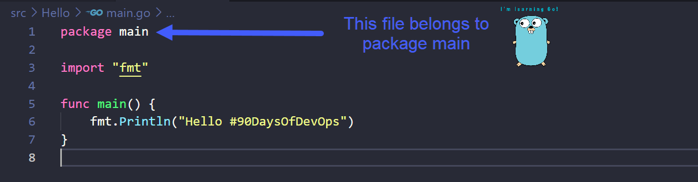
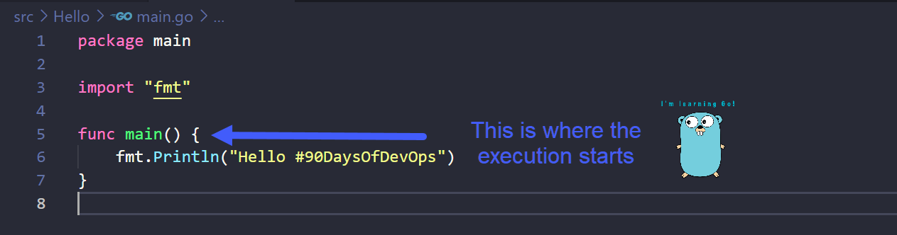
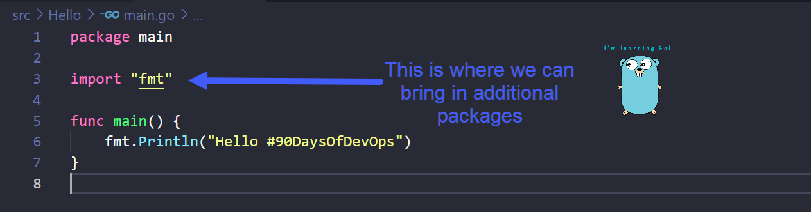

## Let's explain the Hello World code

### How Go works 

On [Day 8](day08.md) we walked through getting Go installed on your workstation and we then created our first Go application. 
 
In this section, we are going to take a deeper look into the code and understand a few more things about the Go language. 

### What is Compiling?
Before we get into the [6 lines of the Hello World code](Go/hello.go) we need to have a bit of an understanding about compiling.

Programming languages that we commonly use such as Python, Java, Go and C++ are high-level languages. Meaning they are human-readable but when a machine is trying to execute a program it needs to be in a form that a machine can understand. We have to translate our human-readable code to machine code which is called compiling. 

From the above you can see what we did on [Day 8](day08.md) here, we created a simple Hello World main.go and we then used the command `go build main.go` to compile our executable. 

### What are packages?
A package is a collection of source files in the same directory that are compiled together. We can simplify this further, a package is a bunch of .go files in the same directory. Remember our Hello folder from Day 8? If and when you get into more complex Go programs you might find that you have folder1 folder2 and folder3 containing different .go files that make up your program with multiple packages. 

We use packages so we can reuse other peoples code, we don't have to write everything from scratch. Maybe we are wanting a calculator as part of our program, you could probably find an existing Go Package that contains the mathematical functions that you could import into your code saving you a lot of time and effort in the long run.  

Go encourages you to organise your code in packages so that it is easy to reuse and maintain source code. 

### Hello #90DaysOfDevOps Line by Line 
Now let's take a look at our Hello #90DaysOfDevOps main.go file and walk through the lines. 

In the first line, you have `package main` which means that this file belongs to a package called main. All .go files need to belong to a package, they should also have `package something` in the opening line. 

A package can be named whatever you wish. We have to call this `main` as this is the starting point of the program that is going to be in this package, this is a rule. (I need to understand more about this rule?)    

Whenever we want to compile and execute our code we have to tell the machine where the execution needs to start. We do this by writing a function called main. The machine will look for a function called main to find the entry point of the program. 

A function is a block of code that can do some specific task for and can be used across the program. 

You can declare a function with any name using `func` but in this case we need to name it `main` as this is where the code starts. 

Next we are going to look at line 3 of our code, the import, this basically means you want to bring in another package to your main program. fmt is a standard package being used here provided by Go, this package contains the `Println()`function and because we have imported this we can use this in line 6. There are a number of standard packages you can include in your program and leverage or reuse them in your code saving you the hassle of having to write from scratch. [Go Standard Library](https://pkg.go.dev/std)

the `Println()` that we have here is a way in which to write to a standard output to the terminal where ever the executuable has been executed succesfully. Feel free to change the message in between the (). 

### TLDR

- **Line 1** = This file will be in the package called `main` and this needs to be called `main` because includes the entry point of the program. 
- **Line 3** = For us to use the `Println()` we have to import the fmt package to use this on line 6. 
- **Line 5** = The actual starting point, its the `main` function. 
- **Line 6** = This will let us print "Hello #90DaysOfDevOps" on our system. 

## Resources

- [StackOverflow 2021 Developer Survey](https://insights.stackoverflow.com/survey/2021)
- [Why we are choosing Golang to learn](https://www.youtube.com/watch?v=7pLqIIAqZD4&t=9s)
- [Jake Wright - Learn Go in 12 minutes](https://www.youtube.com/watch?v=C8LgvuEBraI&t=312s) 
- [Techworld with Nana - Golang full course - 3 hours 24 mins](https://www.youtube.com/watch?v=yyUHQIec83I) 
- [**NOT FREE** Nigel Poulton Pluralsight - Go Fundamentals - 3 hours 26 mins](https://www.pluralsight.com/courses/go-fundamentals) 
- [FreeCodeCamp -  Learn Go Programming - Golang Tutorial for Beginners](https://www.youtube.com/watch?v=YS4e4q9oBaU&t=1025s) 
- [Hitesh Choudhary - Complete playlist](https://www.youtube.com/playlist?list=PLRAV69dS1uWSR89FRQGZ6q9BR2b44Tr9N) 

See you on [Day 10](day10.md).
