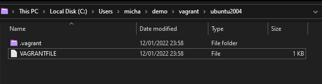

## The Big Picture: DevOps and Linux
Linux and DevOps share very similar cultures and perspectives; both are focused on customization and scalability. Both of these aspects of Linux are of particular importance for DevOps.

A lot of technologies start on Linux, especially if they are related to software development or managing infrastructure.

As well lots of open source projects, especially DevOps tools, were designed to run on Linux from the start.

From a DevOps perspective or in fact any operations role perspective you are going to come across Linux I would say mostly. There is a place for WinOps but the majority of the time you are going to be administering and deploying Linux servers. 

I have been using Linux on a daily basis for a number of years but my go to desktop machine has always been either macOS or Windows. However, when I moved into the Cloud Native role I am in now I took the plunge to make sure that my laptop was fully Linux based and my daily driver, whilst I still needed Windows for work-based applications and a lot of my audio and video gear does not run on Linux I was forcing myself to run a Linux desktop full time to get a better grasp of a lot of the things we are going to touch on over the next 7 days. 

## Getting Started 
I am not suggesting you do the same as me by any stretch as there are easier options and less destructive but I will say taking that full-time step forces you to learn faster on how to make things work on Linux. 

For the majority of these 7 days, I am actually going to deploy a Virtual Machine in Virtual Box on my Windows machine. I am also going to deploy a desktop version of a Linux distribution, whereas a lot of the Linux servers you will be administering will likely be servers that come with no GUI and everything is shell-based. However, as I said at the start a lot of the tools that we covered throughout this whole 90 days started out on Linux I would also strongly encourage you to take the dive into running that Linux Desktop for that learning experience as well. 


For the rest of this post, we are going to concentrate on getting a Ubuntu Desktop virtual machine up and running in our Virtual Box environment. Now we could just download [Virtual Box](https://www.virtualbox.org/) and grab the latest [Ubuntu ISO](https://ubuntu.com/download) from the sites linked and go ahead and build out our desktop environment but that wouldn't be very DevOps of us, would it? 


Another good reason to use most Linux distributions is that they are free and open-source. We are also choosing Ubuntu as it is probably the most widely used distribution deployed not thinking about mobile devices and enterprise RedHat Enterprise servers. I might be wrong there but with CentOS and the history there I bet Ubuntu is high on the list and it's super simple. 


## Introducing HashiCorp Vagrant 


Vagrant is a CLI utility that manages the lifecycle of your virtual machines. We can use vagrant to spin up and down virtual machines across many different platforms including vSphere, Hyper-v, Virtual Box and also Docker. It does have other providers but we will stick with that we are using Virtual Box here so we are good to go. 


The first thing we need to do is get Vagrant installed on our machine, when you go to the downloads page you will see all the operating systems listed for your choice. [HashiCorp Vagrant](https://www.vagrantup.com/downloads) I am using Windows so I grabbed the binary for my system and went ahead and installed this to my system. 


Next up we also need to get [Virtual Box](https://www.virtualbox.org/wiki/Downloads) installed. Again this can also be installed on many different operating systems again a good reason to choose this and vagrant is that if you are running Windows, macOS, or Linux then we have you covered here. 


Both installations are pretty straightforward. If you have issues both have great communities around them also feel free to reach out and I can try to assist also. 


## Our first VAGRANTFILE


The VAGRANTFILE describes the type of machine we want to deploy. It also defines how we want the configuration and provisioning of this machine need to look. 


When it comes to saving these and organizing your VAGRANTFILEs I tend to put them in their own folders in my workspace. You can see below how this looks on my system. Hopefully following this you will play around with Vagrant and see the ease of spinning up different systems, it is also great for that rabbit hole is known as distro hopping for Linux Desktops. 





Let's take a look at that VAGRANTFILE then and see what we are building. 


``` 

Vagrant.configure("2") do |config|

  config.vm.box = "chenhan/ubuntu-desktop-20.04"

  config.vm.provider :virtualbox do |v|

   v.memory  = 8096

   v.cpus    = 4

   v.customize ["modifyvm", :id, "--vram", "128mb"]

end

end

```

This is a very simple VAGRANTFILE overall we are saying we want a specific "box" a box being possibly either a public image or private build of the system you are looking for. You can find a long list of "boxes" publicly available here in the [public catalog of Vagrant boxes](https://app.vagrantup.com/boxes/search) 


Next line we are saying we want to use a specific provider in this case it is `VirtualBox` and then we want to define our machine's memory to `8GB and our number of CPUs to `4`. My experience also tells me that you may want to also add the following line if you experience display issues. This will set the video memory to what you want, I would ramp this right up to `128MB but depends on your system. 


```

v.customize ["modifyvm", :id, "--vram", ""]

```

I have also placed a copy of this specific vagrant file in the [Linux Folder](Linux/VAGRANTFILE) 


## Provisioning our Linux Desktop


We are now ready to get our first machine up and running, in your workstations terminal. In my case I am using PowerShell on my Windows machine, navigate to your projects folder and where you will find your VAGRANTFILE. Once there you can type the command `vagrant up` and if everything is correct then you will see something like the below.  


Another thing to add here is that the network will be set to `NAT` on your virtual machine, at this stage we don't really need to know about NAT and I plan to have a whole session talking about in the next section about Networking. But know that it is the easy button when it comes to getting a machine on your home network, it is also the default networking mode on Virtual Box. You can find out more in the [Virtual Box documentation](https://www.virtualbox.org/manual/ch06.html#network_nat)


Once `vagrant up` is complete we can now use `vagrant ssh` to jump straight into the terminal of our new VM. 


This is where we will do most of our exploring over the next few days but I also want to dive into some customizations for your developer workstation that I have done and it makes your life much simpler when running this as your daily driver, and of course, are you really in DevOps unless you have a cool nonstandard terminal? 


But just to confirm in Virtual Box you should see the login prompt when you select your VM. 


Oh and if you made it this far and you have been asking "WHAT IS THE USERNAME & PASSWORD?" 


- Username = vagrant 

- Password = vagrant 


Tomorrow we are going to get into some of the commands and what they do, The terminal is going to be the place to make everything happen.  

## Resources 

- [Learn the Linux Fundamentals - Part 1](https://www.youtube.com/watch?v=kPylihJRG70)
- [Linux for hackers (don't worry you don't need be a hacker!)](https://www.youtube.com/watch?v=VbEx7B_PTOE)

There are going to be lots of resources I find as we go through and much like the Go resources I am generally going to be keeping them to FREE content so we can all partake and learn here. 

As I mentioned next up we will take a look at the commands we might be using on a daily whilst in our Linux environments. 

See you on [Day15](day15.md)

