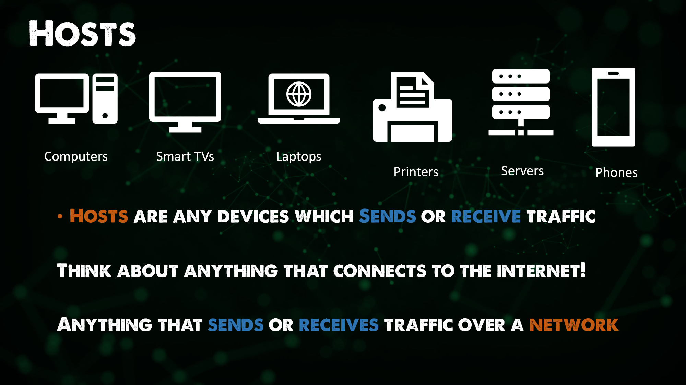
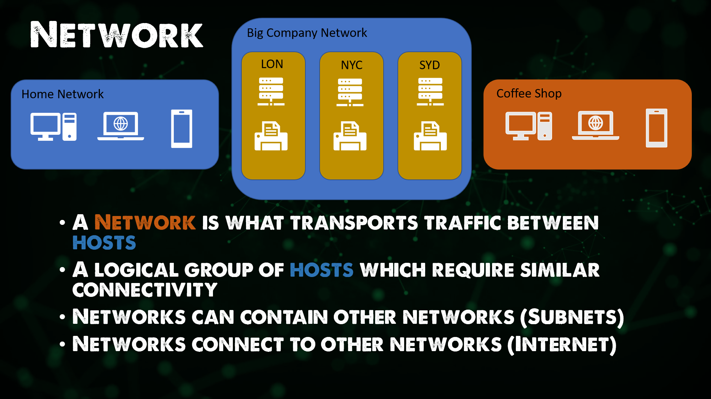
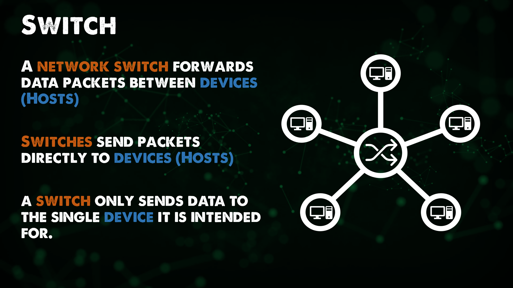

## The Big Picture: DevOps and Networking

Welcome to Day 21! We are going to be getting into Networking over the next 7 days, Networking and DevOps is the overarching theme but we will need to get into some of the networking fundamentals as well. 

Ultimately as we have said previously DevOps is about a culture and process change within your organisations this as we have discussed can be Virtual Machines, Containers, Kubernetes but it can also be the network, If we are using those DevOps principles for our infrastructure that has to include the network more to the point from a DevOps point of view you also need to know about the network as in the different topologies and networking tools and stacks that we have available. 

I would argue that we should have our networking devices configured using infrastructure as code and have everything automated like we would our virtual machines, but in order to do that we have to have a good understanding of what we are automating. 

### What is NetDevOps | Network DevOps?

You may also hear the terms Network DevOps or NetDevOps. Maybe you are already a Network engineer and have a great grasp on the network components within the infrastructure you understand the elements used around networking such as DHCP, DNS, NAT etc etc. You will also have a good understanding around the hardware or software defined networking options, switches, routers etc etc. 

But if you are not a network engineer then we probably need to get a foundational knowledge across the board on some of those areas so that we can understand the end goal of Network DevOps. 

But in regards to those terms we can think of NetDevOps or Network DevOps as applying the DevOps Principles and Practices to the network, applying version control and automation tools to the network creation, testing, monitoring, and deployments. 

If we think of Network DevOps of having to require automation, we mentioned before about DevOps breaking down the siloes between teams. If the networking teams do not change to a similar model and process then they become the bottleneck or even the failure overall. 

Using the automation principles around provisioning, configuration, testing, version control and deployment is a great start. Automation is overall going to enable speed of deployment, stability of the networking infrastructure and consistent improvement as well as the process being shared across multiple environments once they have been tested. Such as a fully tested Network Policy that has been fully tested on one environment can be used quickly in another location because of the nature of this being in code vs a manually authored process which it might have been before. 
A really good view point and outline of this thinking can be found here. [Network DevOps](https://www.thousandeyes.com/learning/techtorials/network-devops)

## Networking The Basics 

Let's forget the DevOps side of things to begin with here and we now need to look very briefly into some of the Networking fundamentals. 

### Network Devices 

**Host** are any devices which sends or recieve traffic. 

**IP Address** the identity of each host. 

**Network** is what transports traffic between hosts. If we did not have networks there would be a lot of manual movement of data! 

A logical group of hosts which require similar connectivity. 

**Switches** facilitate communication ***within*** a network. A switch forwards data packets between hosts. A switch sends packets directly to hosts. 

- Network: A Grouping of hosts which require similar connectivity. 
- Hosts on a Network share the same IP address space. 

**Router** facilitate communication between networks. If we said before that a switch looks after communication within a network a router allows us to join these networks together or at least give them access to each other if permitted. 

A router can provide a traffic contol point (security, filtering, redirting) More and more switches also provide some of these functions now. 

Routers learn which networks they are attached to. This is known as routes, a routing table is all the networks a router knows about. 

A router has an IP address in the networks they are attached to. This IP is also going to be each hosts way out of their local network also known as a gateway. 

Routers also create the hierarchy in networks I mentioned earlier. 

## Switches vs Routers 

**Routing** is the process of moving data between networks. 
    
- A router is a device whose primary purpose is Routing.

**Switching** is the process of moving data within networks. 

- A Switch is a device who's primary purpose is switching. 

This is very much a foundational overview of devices as we know there are many different Network Devices such as: 

- Access Points 
- Firewalls 
- Load Balancers 
- Layer 3 Switches
- IDS / IPS 
- Proxies 
- Virtual Switches 
- Virtual Routers 

Although all of these devices are going to perform Routing and/or Switching. 

Over the next few days we are going to get to know a little more about this list. 

- OSI Model 
- Network Protocols 
- DNS (Domain Name System)
- NAT 
- DHCP
- Subnets 

## Resources 

[Computer Networking full course](https://www.youtube.com/watch?v=IPvYjXCsTg8)

See you on [Day22](day22.md)
