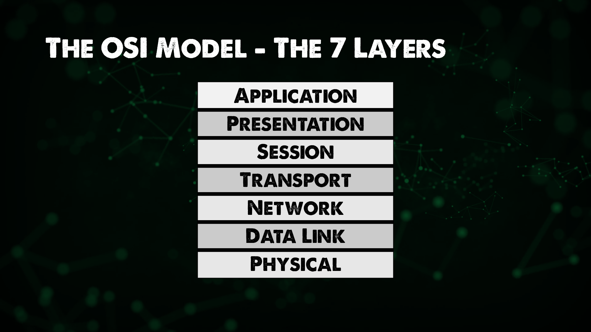

## The OSI Model - The 7 Layers

The overall purpose of networking as an industry is to allow two hosts to share data before networking if I want to get data from this host to this host I'd have to plug something into this host walk it over to the other host plug it into the other host.

Networking allows us to automate this by allowing the host to share data automatically across the wire for these hosts to do this they must follow a set of rules.

This is no different than any language English has a set of rules that two English speakers must follow Spanish has its own set of rules French has its own set of rules while networking also has its own set of rules

The rules for networking are divided into seven different layers and those layers are known as the OSI model. 

### Introduction to the OSI Model 

The OSI Model (Open Systems Interconnection Model) is a framework used to describe the functions of a networking system. The OSI model characterises computing functions into a universal set of rules and requirements in order to support interoperability between different products and software. In the OSI reference model, the communications between a computing system are split into seven different abstraction layers: **Physical, Data Link, Network, Transport, Session, Presentation, and Application**.

### Physical
Layer 1 in the OSI model and this is known as physical, the premise of being able to get data from one host to another through a means be it physical cable or we could also consider Wi-Fi in this layer as well. We might also see some more legacy hardware seen here around hubs and repeaters in order to transport the data from one host to another. 

### Data Link 
Layer 2, the data link enables node to node transfer where data is packaged into frames. There is also a level of error correcting that might have occurred at the physical layer. This is also where we introduce or first see MAC addresses. 

This is where we see the first mention of switches that we covered in our first day of networking on [Day 21](day21.md)

### Network 
You have likely heard the term layer 3 switches or layer 2 switches. In our OSI model Layer 3, the Network has a goal of end to end delivery, this is where we see our IP addresses also mentioned in the first day overview. 

Routers and hosts exist at layer 3, remember the router is the ability to route between multiple networks. Anything with an IP could be considered Layer 3. 

So why do we need addressing schemes on both Layer 2 and 3? (MAC Addresses vs IP Addresses) 

If we think about getting data from one host to another, each host has an IP address but there are several switches and routers in between. Each of the devices has that layer 2 MAC address. 

The layer 2 MAC address will go from host to switch/router only, it is focused on hops where as the layer 3 IP addresses will stay with that packet of data until it reaches its end host. (End to End)

IP Addresses - Layer 3 = End to End Delivery 

MAC Addresses - Layer 2 = Hop to Hop Delivery 

Now there is a network protocol that we will get into but not today called ARP(Address Resolution Protocol) which links our Layer3 and Layer2 addresses. 

### Transport 
Service to Service delivery, Layer 4 is there to distinguish data streams. In the same way that Layer 3 and Layer 2 both had their addressing schemes in Layer 4 we have ports. 

### Session, Presentation, Application 
Distinction between Layers 5,6,7 is or had become somewhat vague. 

It is worth looking at the [TCP IP Model](https://www.geeksforgeeks.org/tcp-ip-model/) to get a more recent understanding. 

Let's now try and explain what's actually happening when hosts are communicating to each other using this networking stack. This host has an application that's going to generate data that is meant to be sent to another host.

The source host is going to go through is what's known as the encapsulation process. That data will be first sent to layer 4.

Layer 4 is going to add a header to that data which can facilitate the goal of layer 4 which is service to service delivery. This is going to be a port using either TCP or UDP. It is also going to include the source port and destination port. 

This may also be known as a segment (Data and Port)

This segment is going to be passed down the osi stack to layer 3, the network layer, the network layer is going to add another header to this data.
This header is going to facilitate the goal of layer 3 which is end to end delivery meaning in this header you will have a source ip address and a destination ip, the header plus data may also be referred to as a packet. 

Layer 3 will then take that packet and hand it off to layer 2, layer 2 will once again add another header to that data to accomplish layer 2's goal of hop to hop delivery meaning this header will include a source and destination mac address. 
This is known as a frame when you have the layer 2 header and data.

That frame then gets converted into ones and zeros and sent over the Layer 1 Physical cable or wifi. 

I did mention above the naming for each layer of header plus data but decided to draw this out as well. 

Obviously the Application sending the data is being sent somewhere so the receiving in some what in reverse to get that back up the stack and into the receiving host. 

## Resources 

- [Computer Networking full course](https://www.youtube.com/watch?v=IPvYjXCsTg8)
- [Practical Networking](http://www.practicalnetworking.net/)

See you on [Day23](day23.md)
