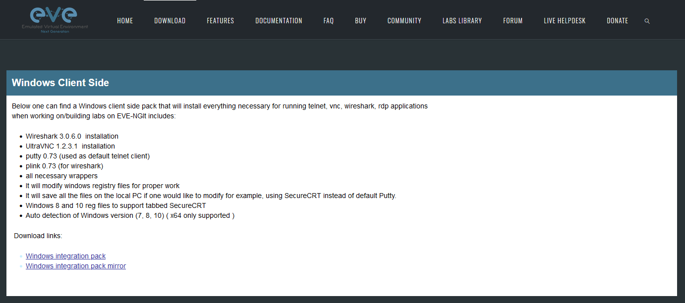
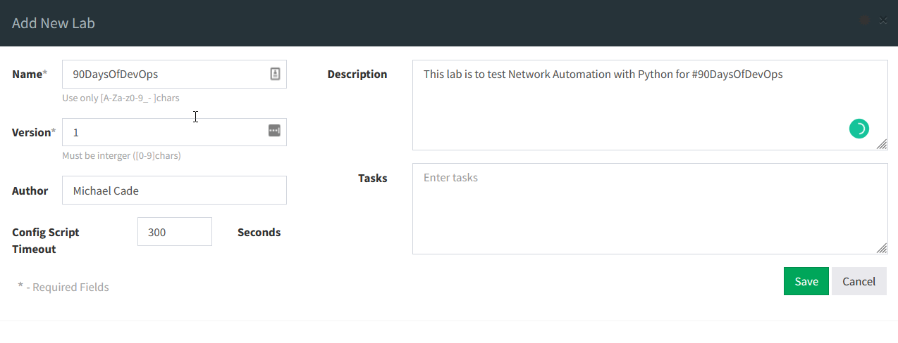
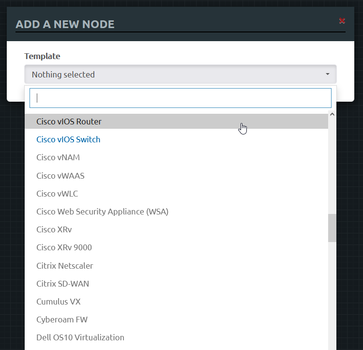
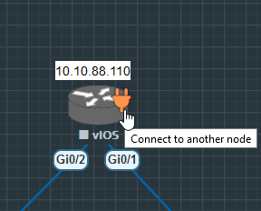
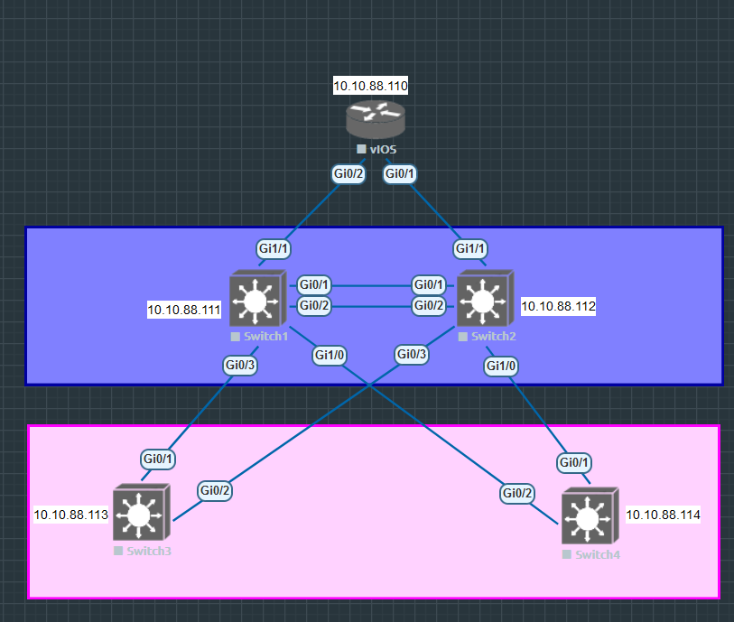

## Building our Lab

We are going to continue our setup of our emulated network using EVE-NG and then hopefully get some devices deployed and start thinking about how we can automate the configuration of these devices. On [Day 25](day25.md) we covered the installation of EVE-NG onto our machine using VMware Workstation. 

### Installing EVE-NG Client

There is also a client pack that allows us to choose which application is used when we SSH to the devices. It will also set up Wireshark for packet captures between links. You can grab the client pack for your OS (Windows, macOS, Linux). 

[EVE-NG Client Download](https://www.eve-ng.net/index.php/download/)

Quick Tip: If you are using Linux as your client then there is this [client pack](https://github.com/SmartFinn/eve-ng-integration).

The install is a straightforward next,next and I would suggest leaving the defaults. 

### Obtaining network images

This step has been a challenge, I have followed some videos that I will link at the end that links to some resources and downloads for our router and switch images whilst telling us how and where to upload them. 

It is important to note that I using everything for education purposes. I would suggest downloading official images from network vendors. 

[Blog & Links to YouTube videos](https://loopedback.com/2019/11/15/setting-up-eve-ng-for-ccna-ccnp-ccie-level-studies-includes-multiple-vendor-node-support-an-absolutely-amazing-study-tool-to-check-out-asap/) 

[How To Add Cisco VIRL vIOS image to Eve-ng](https://networkhunt.com/how-to-add-cisco-virl-vios-image-to-eve-ng/)

Overall the steps here are a little complicated and could be much easier but the above blogs and videos walk through the process of adding the images to your EVE-NG box. 

I used FileZilla to transfer the qcow2 to the VM over SFTP. 

For our lab, we need Cisco vIOS L2 (switches) and Cisco vIOS (router) 

### Create a Lab

Inside the EVE-NG web interface, we are going to create our new network topology. We will have four switches and one router that will act as our gateway to outside networks. 

| Node        | IP Address  |
| ----------- | ----------- |
| Router      | 10.10.88.110|
| Switch1     | 10.10.88.111|
| Switch2     | 10.10.88.112|
| Switch3     | 10.10.88.113|
| Switch4     | 10.10.88.114|

#### Adding our Nodes to EVE-NG

When you first log in to EVE-NG you will see a screen like below, we want to start by creating our first lab. 

Give your lab a name and the other fields are optional. 

You will be then greeted with a blank canvas to start creating your network. Right-click on your canvas and choose add node. 

From here you will have a long list of node options, If you have followed along above you will have the two in blue shown below and the others are going to be grey and unselectable. 

We want to add the following to our lab: 

- 1 x Cisco vIOS Router 
- 4 x Cisco vIOS Switch

Run through the simple wizard to add them to your lab and it should look something like this. 

#### Connecting our nodes 

We now need to add our connectivity between our routers and switches. We can do this quite easily by hovering over the device and seeing the connection icon as per below and then connecting that to the device we wish to connect to. 

When you have finished connecting your environment you may also want to add some way to define physical boundaries or locations using boxes or circles which can also be found in the right-click menu. You can also add text which is useful when we want to define our naming or IP addresses in our labs. 

I went ahead and made my lab look like the below. 

You will also notice that the lab above is all powered off, we can start our lab by selecting everything and right-clicking and selecting start selected. 

Once we have our lab up and running you will be able to console into each device and you will notice at this stage they are pretty dumb with no configuration. We can add some configuration to each node by copying or creating your own in each terminal. 

I will leave my configuration in the Networking folder of the repository for reference. 

| Node        | Configuration         |
| ----------- | -----------           |
| Router      | [R1](Networking/R1)   |
| Switch1     | [SW1](Networking/SW1) |
| Switch2     | [SW2](Networking/SW2) |
| Switch3     | [SW3](Networking/SW3) |
| Switch4     | [SW4](Networking/SW4) |

## Resources 

- [Free Course: Introduction to EVE-NG](https://www.youtube.com/watch?v=g6B0f_E0NMg)
- [EVE-NG - Creating your first lab](https://www.youtube.com/watch?v=9dPWARirtK8)
- [3 Necessary Skills for Network Automation](https://www.youtube.com/watch?v=KhiJ7Fu9kKA&list=WL&index=122&t=89s)
- [Computer Networking full course](https://www.youtube.com/watch?v=IPvYjXCsTg8)
- [Practical Networking](http://www.practicalnetworking.net/)
- [Python Network Automation](https://www.youtube.com/watch?v=xKPzLplPECU&list=WL&index=126)

Most of the examples I am using here as I am not a Network Engineer have come from this extensive book which is not free but I am using some of the scenarios to help understand Network Automation. 

- [Hands-On Enterprise Automation with Python (Book)](https://www.packtpub.com/product/hands-on-enterprise-automation-with-python/9781788998512)

See you on [Day 27](day27.md)
