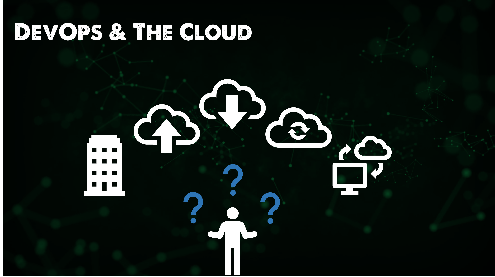
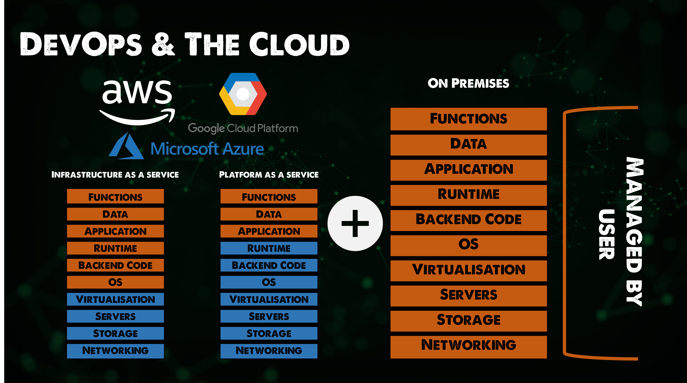
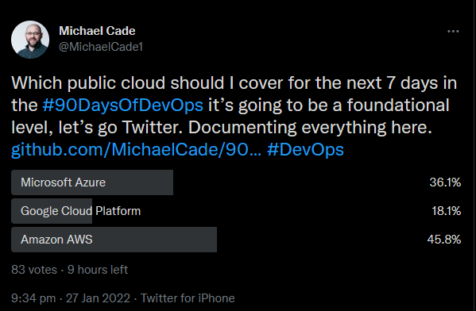

## The Big Picture: DevOps & The Cloud

When it comes to cloud computing and what is offered, it goes very nicely with the DevOps ethos and processes. We can think of Cloud Computing bringing the technology and services whilst DevOps as we have mentioned many times before is about the process and process improvement. 

But to start with that cloud learning journey is a steep one and making sure you know and understand all elements or the best service to choose for the right price point is confusing. 

Does the public cloud require a DevOps mindset? My answer here is not, but to really take advantage of cloud computing and possibly avoid those large cloud bills that so many people have been hit with then it is important to think of Cloud Computing and DevOps together. 

If we look at what we mean by the Public Cloud at a 40,000ft view, it is about removing some responsibility to a managed service to enable you and your team to focus on more important aspects which name should be the application and the end-users. After all the Public Cloud is just someone else's computer. 

In this first section, I want to get into and describe a little more of what Public Cloud is and some of the building blocks that get referred to as the Public Cloud overall. 

### SaaS 

The first area to cover is Software as a service, this service is removing almost all of the management overhead of a service that you may have once run on-premises. Let's think about Microsoft Exchange for our email, this used to be a physical box that lived in your data centre or maybe in the cupboard under the stairs. You would need to feed and water that server. By that I mean you would need to keep it updated and you would be responsible for buying the server hardware, most likely installing the operating system, installing the applications required and then keeping that patched, if anything went wrong you would have to troubleshoot and get things back up and running. 

Oh, and you would also have to make sure you were backing up your data, although this doesn't change with SaaS for the most part either. 

What SaaS does and in particular Microsoft 365, because I mentioned Exchange is removing that administration overhead and they provide a service that delivers your exchange functionality by way of mail but also much other productivity (Office 365) and storage options (OneDrive) that overall gives a great experience to the end-user. 

Other SaaS applications are widely adopted, such as Salesforce, SAP, Oracle, Google, Apple. All removing that burden of having to manage more of the stack. 

I am sure there is a story with DevOps and SaaS-based applications but I am struggling to find out what they may be. I know Azure DevOps has some great integrations with Microsoft 365 that I might have a look into and report back. 

### Public Cloud

Next up we have the public cloud, most people would think of this in a few different ways, some would see this as the hyper scalers only such as Microsoft Azure, Google Cloud Platform and AWS. 

Some will also see the public cloud as a much wider offering that includes those hyper scalers but also the thousands of MSPs all over the world as well. For this post, we are going to consider Public Cloud including hyper scalers and MSPs, although later on, we will specifically dive into one or more of the hyper scalers to get that foundational knowledge. 

*thousands more companies could land on this, I am merely picking from local, regional, telco and global brands I have worked with and am aware of.* 

We mentioned in the SaaS section that Cloud removed the responsibility or the burden of having to administer parts of a system. If SaaS we see a lot of the abstraction layers removed i.e the physical systems, network, storage, operating system, even application to some degree. When it comes to the cloud there are various levels of abstraction we can remove or keep depending on your requirements. 

We have already mentioned SaaS but there are at least two more to mention regarding the public cloud. 

Infrastructure as a service - You can think of this layer as a virtual machine but whereas on-premises you will be having to look after the physical layer in the cloud this is not the case, the physical is the cloud providers responsibility and you will manage and administer the Operating System, the data and the applications you wish to run. 

Platform as a service - This continues to remove the responsibility of layers and this is really about you taking control of the data and the application but not having to worry about the underpinning hardware or operating system. 

There are many other aaS offerings out there but these are the two fundamentals. You might see offerings around StaaS (Storage as a service) which provides you with your storage layer but without having to worry about the hardware underneath. Or you might have heard CaaS for Containers as a service which we will get onto, later on, another aaS we will look to cover over the next 7 days is FaaS (Functions as a Service) where maybe you do not need a running system up all the time and you just want a function to be executed as and when.

There are many ways in which the public cloud can provide abstraction layers of control that you wish to pass up and pay for. 

### Private Cloud

Having your own data centre is not a thing of the past I would think that this has become a resurgence among a lot of companies that have found the OPEX model difficult to manage as well as skill sets in just using the public cloud. 

The important thing to note here is the public cloud is likely now going to be your responsibility and it is going to be on your premises. 

We have some interesting things happening in this space not only with VMware that dominated the virtualisation era and on-premises infrastructure environments. We also have the hyper scalers offering an on-premises version of their public clouds.

### Hybrid Cloud

To follow on from the Public and Private cloud mentions we also can span across both of these environments to provide flexibility between the two, maybe take advantage of services available in the public cloud but then also take advantage of features and functionality of being on-premises or it might be a regulation that dictates you having to store data locally. 

Putting this all together we have a lot of choices for where we store and run our workloads. 

Before we get into a specific hyper-scale, I have asked the power of Twitter where we should go? 

[Link to Twitter Poll](https://twitter.com/MichaelCade1/status/1486814904510259208?s=20&t=x2n6QhyOXSUs7Pq0itdIIQ)

Whichever one gets the highest percentage we will take a deeper dive into the offerings, I think the important to mention though is that services from all of these are quite similar which is why I say to start with one because I have found that in knowing the foundation of one and how to create virtual machines, set up networking etc. I have been able to go to the others and quickly ramp up in those areas. 

Either way, I am going to share some great **FREE** resources that cover all three of the hyper scalers. 

I am also going to build out a scenario as I have done in the other sections where we can build something as we move through the days. 

## Resources 

- [Hybrid Cloud and MultiCloud](https://www.youtube.com/watch?v=qkj5W98Xdvw)
- [Microsoft Azure Fundamentals](https://www.youtube.com/watch?v=NKEFWyqJ5XA&list=WL&index=130&t=12s)
- [Google Cloud Digital Leader Certification Course](https://www.youtube.com/watch?v=UGRDM86MBIQ&list=WL&index=131&t=10s)
- [AWS Basics for Beginners - Full Course](https://www.youtube.com/watch?v=ulprqHHWlng&t=5352s)

See you on [Day 29](day29.md)
