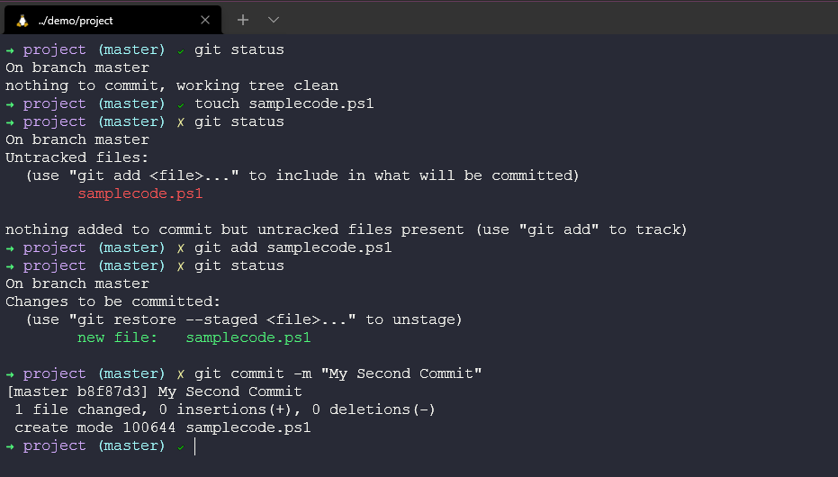

## 概述: Git - 版本控制

在開始 Git 工具之前, 我們需要瞭解什麼是版本控制,還有為什麼要使用它. 作為 Git 教學的開端, 我們會稍微帶過何謂版本控制以及 Git 基礎概念.  

### 甚麼是版本控制? 

由於 Git 並不是唯一的版本控制工具，所以這一節將會涵蓋版本控制有哪些選項和使用方法. 

版本控制最明顯且重要的功能是可以追蹤專案的歷史. 我們可以利用`git log` 指令回顧儲存庫(repository)內,過去專案提交的紀錄和註解. 讓我們想想, 如果這是實際的軟體專案, 有滿滿的原始碼, 而且許多開發者在不同的時間點提交軟體, 不同的作者和審稿人在這裡做紀錄, 有了歷史追蹤, 我們得以知道發生了什麼事, 何時發生, 又是誰在審稿. 

版本控制很酷, 就像你在異動程式碼前, 手動複製一份. 你可能會為了以防萬一, 註解掉無用的舊程式碼, 而你隨時可以還原. 

我不僅僅對原始碼做版本控制, 我甚至幾乎對所有的東西做版本控制, 就像談到這個 90DaysOfDevOps 這個專案, 當你不小心刪到你想要的文字, 然到不會想要擁有歷史紀錄和做資料回朔? 

然而, 在此聲明 **版本控制不是備份!**

版本控制的另外一個好處是它可以對一個專案管理很多版本, 舉一個例子, 我們分別有一個免費版(FREE)和付費版(PAID)的程式, 兩者都能在所有的作業系統上面執行, 而且共享大部分的程式碼, 每次提交程式碼的時候, 都會複製並貼上到所有程式. 這樣做將會非常混亂, 尤其是當程式開發不只一個人的時候, 將會更容易發生錯誤. 

白金方案(Premium)的軟體擁有額外的功能, 在這裡我們稱為 premium commits, 免費版只包含 normal commits. 

在版本控制中, 想要處理上述的問題就是透過分支(Branching). 

如上所述, 分支(Branching) 允許同一支程式擁有兩個程式碼流. 當我們想要把免費版本的額外功能變成白金付費方案的時候, 我們可以透過合併(merging). 

現在, 合併(merging) 既可以簡單但也可以複雜, 如果你有一個團隊在免費版工作, 另一個團隊在白金付費版工作, 兩個團隊同時更改會影響整個程式碼的行為. 說不定只是更新了某個變數導致破壞某樣功能. 版本控制無法解決上述的衝突, 但是讓你更容易更輕鬆的管理. 

目前為止, 我看到沒有使用版本控制的主要理由就是開發者間的協調能力夠好. 但是有越來越多的案例, 開發者之間正在用版本控制來分享程式碼, 也許是你和你的同事加入一個簡報, 或是你在加入一個社群, 對一個項目共向修正和更新, 就像這個儲存庫 90DaysOfDevOps. 

我無法想像軟體開發團隊在沒有版本控制的情況下要怎麼處理問題? 當在我追蹤我自己的項目時, 我就發現他已經夠難了. 我希望團隊們能先把程式碼拆分一小部分的函數, 解決每一小部分的函數的問題之後再予與發佈, 事情將簡單的多. 

也就是說, 有了版本控制, 我們才有辦法做統整. 也許團隊們正在對不同的模組上進行開發, 但是就能夠協同合作的更好. 

Another thing to mention here is that it's not just developers that can benefit from Version Control, it's all members of the team to have visibility but also tools all having awareness or leverage, Project Management tools can be linked here, tracking the work. We might also have a build machine for example Jenkins which we will talk about in another module. A tool that Builds and Packages the system, automating the deployment tests and metrics. 

### What is Git? 

Git is a tool that tracks changes to source code or any file, or we could also say Git is an open-source distributed version control system. 

There are many ways in which git can be used on our systems, most commonly or at least for me I have seen it in at the command line, but we also have graphical user interfaces and tools like Visual Studio Code that have git aware operations we can take advantage of. 

Now we are going to run through a high-level overview before we even get Git installed on our local machine. 

Let's take the folder we created earlier. 

To use this folder with version control we first need to initiate this directory using the `git init command. For now, just think that this command puts our directory as a repository in a database somewhere on our computer. 

Now we can create some files and folders and our source code can begin or maybe it already has and we have something in here already. We can use the `git add .` command which puts all files and folders in our directory into a snapshot but we have not yet committed anything to that database. We are just saying all files with the `.` are ready to be added.   

Then we want to go ahead and commit our files, we do this with the `git commit -m "My First Commit"` command. We can give a reason for our commit and this is suggested so we know what has happened for each commit. 

現在我們可以透過 `git log` 指令, 知道專案的歷史和發生何事.

我們還能透過 `git status` 指令來檢查倉儲的狀態, 如下圖的前三行, 這表示我們還沒有提交檔案. 如果我們添加一個新檔 samplecode.ps1 , 再次輸入 `git status` 的時候, 會看到我們準備要提交的文件. 

Add our new file using the `git add samplecode.ps1` command and then we can run `git status` again and see our file is ready to be committed. 

然後下 `git commit -m "My Second Commit"` 指令.

Another `git status` now shows everything is clean again.

We can then use the `git log` command which shows the latest changes and first commit. 

If we wanted to see the changes between our commits i.e what files have been added or modified we can use the `git diff b8f8 709a`

Which then displays what has changed in our case we added a new file. 

We can also and we will go deeper into this later on but we can jump around our commits i.e we can go time travelling! By using our commit number we can use the `git checkout 709a` command to jump back in time without losing our new file. 

But then equally we will want to move forward as well and we can do this the same way with the commit number or you can see here we are using the `git switch -` command to undo our operation. 

摘要 (TLDR) 

- 追蹤專案的歷史
- 管理一個專案內不同版本的程式碼
- 在開發人員在開發人員和更廣泛的團隊和工具之間共享程式碼
- 協調團隊合作
- 哦，還有一些做時間旅行! 

這個章節的內容似乎跳的有些快, 希望在尚未解說 Git 指令的強大之前, 你能對版本控制的功能有大致上的了解. 

下一章,我們將會在你的電腦安裝和設置 Git ,並且更深入的解說 Git 的命令和使用案例, 以及 Git 能做到什麼.

## Resources 

- [What is Version Control?](https://www.youtube.com/watch?v=Yc8sCSeMhi4)
- [Types of Version Control System](https://www.youtube.com/watch?v=kr62e_n6QuQ)
- [Git Tutorial for Beginners](https://www.youtube.com/watch?v=8JJ101D3knE&t=52s) 
- [Git for Professionals Tutorial](https://www.youtube.com/watch?v=Uszj_k0DGsg) 
- [Git and GitHub for Beginners - Crash Course](https://www.youtube.com/watch?v=RGOj5yH7evk&t=8s) 
- [Complete Git and GitHub Tutorial](https://www.youtube.com/watch?v=apGV9Kg7ics)

See you on [第 36 天](day36.md) 

