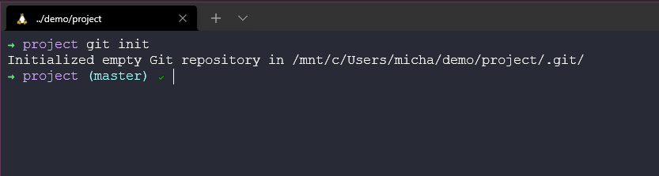
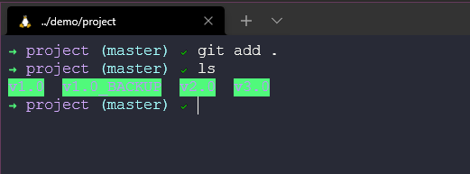
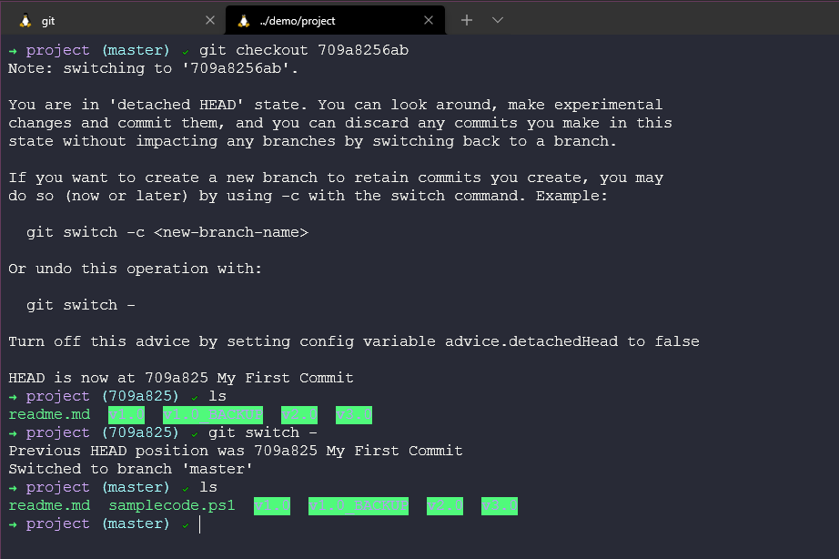

## 概述: Git - 版本控制

在開始 Git 工具之前，我們需要瞭解什麼是版本控制,還有為什麼要使用它。作為 Git 教學的開端，我們會稍微帶過何謂版本控制以及 Git 基礎概念。

### 甚麼是版本控制? 

由於 Git 並不是唯一的版本控制工具，所以這一節將會涵蓋版本控制有哪些選項和使用方法。

版本控制最明顯且重要的功能是可以追蹤專案的歷史。我們可以利用`git log` 指令回顧儲存庫(repository)內,過去專案提交的紀錄和註解。 讓我們想想，如果這是實際的軟體專案，有滿滿的原始碼，而且許多開發者在不同的時間點提交軟體，不同的作者和審稿人在這裡做紀錄，有了歷史追蹤，我們得以知道發生了什麼事，何時發生，又是誰在審稿。

版本控制很酷，就像你在異動程式碼前，手動複製一份。 你可能會為了以防萬一，註解掉無用的舊程式碼，而你隨時可以還原。

我不僅對原始碼做版本控制，甚至是幾乎對所有的東西做版本控制，就像談到 90DaysOfDevOps 這個專案，當你不小心刪到你想要的文字，難道不會想要擁有歷史紀錄和做資料回朔的機制？

然而，在此聲明 **版本控制不是備份!**

版本控制的另外一個好處是它可以對一個專案同時管理很多個版本，舉一個例子，我們分別有一個免費版(FREE)和付費版(PAID)的程式，兩者都能在所有的作業系統上面執行，而且共享大部分的程式碼，每次提交程式碼的時候，都會複製並貼上到其他程式。 這樣做是不是會非常混亂，尤其是當程式開發不只一個人的時候，更容易發生錯誤。

白金方案(Premium)的軟體擁有額外的功能，在這裡我們稱為 premium commits，免費版只包含 normal commits。

在版本控制中，想要處理上述的問題需要透過分支(Branching)。

如上所述，分支(Branching) 允許同一支程式擁有兩個程式碼分流。當我們想要把免費版本的額外功能變成白金付費方案的時候，我們會透過合併(merging)。

現在，合併(merging) 既可以簡單但也可以複雜，譬如說你有一個團隊在開發免費版，另一個團隊在開發白金付費版，兩個團隊同時改動會影響整個程式碼的代碼，又或只是更新了某個變數導致破壞某樣功能。版本控制無法解決上述的衝突，但是讓你更容易更輕鬆的管理。

目前為止，我看到沒有使用版本控制的主要理由就是開發者間的協調能力夠好。但是有越來越多的案例，開發者之間正在用版本控制來分享程式碼，可能是你和你的同事加入一個簡報，或是你加入一個社群，對一個項目共向修正和更新，就像這個儲存庫 90DaysOfDevOps。

我無法想像軟體開發團隊在沒有版本控制的情況下要怎麼處理問題？當在我追蹤我自己的項目時，我就發現他已經夠難了。 我希望團隊們能先把程式碼拆分一小部分的函數，解決每一小部分函數的問題之後再予與發佈，事情將簡單的多。

也就是說，有了版本控制，才有辦法做統整。 像是團隊們正在對不同的模組上進行開發，這時就能夠協同合作的更好。

另外值得一提的事情是版本控制不只僅受益於開發者，團隊中的所有成員和其他工具也都有了能見度，一些專案管理工具可以跟 git 建立鏈結，跟蹤工作的狀況。最知名的例子就是  Jenkinus。 一個可以建置、打包、自動測試和佈署軟體的系統。 

### 什麼是 Git? 

Git 是一個用來追蹤原始碼或任何檔案每次異動的工具，或者我們可以說 Git 是一個開源的分布式版本控制系統。

我們的系統有很多種 Git 使用方法，對我來說最常看到的用法是輸入指令，但它也有圖形使用者介面，如微軟開發的 Visual Studio Code 只要透過界面按鈕就可輕鬆管理。

在教學如何安裝 Git 之前，我們先瀏覽了一下 Git 怎麼使用。

我們先用之前建立的資料夾來當範例。

首先，如果想要對資料夾做版本控管，就要輸入指令`git init`。現在只要知道這個指令會把目錄建構成儲存庫(repository)。

現在我們可以創建一些檔案或資料夾，也或許你已經有放一些檔案了!? 我們可以輸入指令 `git add .` 將尚未提交的檔案做快照。圖片中的句點代表的是把所有新增的檔案都添加進去。

然後我們想要進一步提交檔案，這個時候就可以輸入 `git commit -m "My First Commit"`。建議提交時寫一些註解，這將幫助我們了解發生了什麼事。

現在我們可以透過 `git log` 指令，回顧專案的歷史和註解。

我們還能透過 `git status` 指令來檢查倉儲的狀態，如下圖的前三行，這表示我們還沒有提交檔案。 如果我們添加一個新檔 samplecode。ps1 ，再次輸入 `git status` 的時候，會看到我們準備要提交的文件。

輸入指令 `git add samplecode。ps1` 可以添加新檔案 samplecode。ps1。然後可以再次輸入 `git status` 確認檔案準備被提交。

然後下 `git commit -m "My Second Commit"` 指令。

再輸入一次 `git status` 可以看見檔案都已提交。

我們可以輸入指令 `git log` 顯示最後的異動和第一次提交。

如果你想要審查兩個提交的版本之間的差異，就可以輸入 `git diff b8f87d394 709a8256ab` 來看出有何檔案被新增或修改。

於是以我們的案例來看，很清楚的顯示我們添加了一個文件。

我們還可以透過指令 `git checkout 709a8256ab` 跳回之前提交的版本，是不是很像時間旅行，而且不會丟失我們的新檔案。 之後我們將會深入研究這個議題。

同理的我們可以用相同方法跳回 b8f87d394 版本，或者你可以看到我用 `git switch -` 取消我的操作。 

摘要 (TLDR) 

- 追蹤專案的歷史
- 管理一個專案內不同版本的程式碼
- 在開發人員在開發人員和更廣泛的團隊和工具之間共享程式碼
- 協調團隊合作
- 哦，還有一些做時間旅行! 

這個章節的內容似乎跳的有些快，希望在尚未解說 Git 指令的強大之前，你能對版本控制的功能有大致上的了解。

下一章,我們將會在你的電腦安裝和設置 Git，並且更深入的解說 Git 的命令和使用案例，以及 Git 能做到什麼。

## 資源

- [What is Version Control?](https://www。youtube。com/watch?v=Yc8sCSeMhi4)
- [Types of Version Control System](https://www。youtube。com/watch?v=kr62e_n6QuQ)
- [Git Tutorial for Beginners](https://www。youtube。com/watch?v=8JJ101D3knE&t=52s) 
- [Git for Professionals Tutorial](https://www。youtube。com/watch?v=Uszj_k0DGsg) 
- [Git and GitHub for Beginners - Crash Course](https://www。youtube。com/watch?v=RGOj5yH7evk&t=8s) 
- [Complete Git and GitHub Tutorial](https://www。youtube。com/watch?v=apGV9Kg7ics)

See you on [第 36 天](day36.md) 