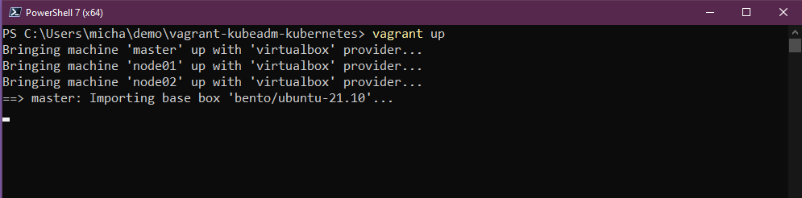
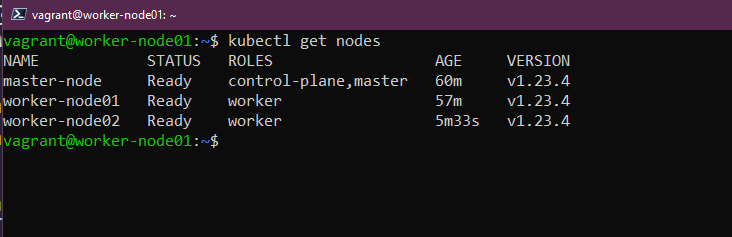
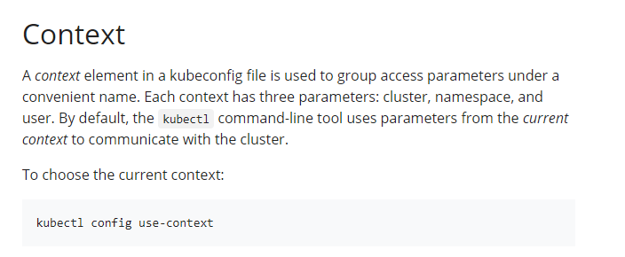

## Setting up a multinode Kubernetes Cluster 

I wanted this title to be "Setting up a multinode Kubernetes cluster with Vagrant" but thought it might be a little too long! 

In the session yesterday we used a cool project to deploy our first Kubernetes cluster and get a little hands on with the most important CLI tool you will come across when using Kubernetes (kubectl). 

Here we are going to use VirtualBox as our base but as mentioned the last time we spoke about Vagrant back in the Linux section we can really use any hypervisor or virtualisation tool supported. It was [Day 14](day14.md) when we went through and deployed an Ubuntu machine for the Linux section. 

### A quick recap on Vagrant 

Vagrant is a CLI utility that manages the lifecyle of your virtual machines. We can use vagrant to spin up and down virtual machines across many different platforms including vSphere, Hyper-v, Virtual Box and also Docker. It does have other providers but we will stick with that we are using Virtual Box here so we are good to go. 

I am going to be using a baseline this [blog and repository](https://devopscube.com/kubernetes-cluster-vagrant/) to walk through the configuration. I would however advise that if this is your first time deploying a Kubernetes cluster then maybe also look into how you would do this manually and then at least you know what this looks like. Although I will say that this Day 0 operations and effort is being made more efficient with every release of Kubernetes. I liken this very much to the days of VMware and ESX and how you would need at least a day to deploy 3 ESX servers now we can have that up and running in an hour. We are heading in that direction when it comes to Kubernetes. 

### Kubernetes Lab environment 

I have uploaded in [Kubernetes folder](days/kubernetes) the vagrantfile that we will be using to build out our environment. Grab this and navigate to this directory in your terminal. I am again using Windows so I will be using PowerShell to perform my workstation commands with vagrant. If you do not have vagrant then you can use arkade, we covered this yesterday when installing minikube and other tools. A simple command `arkade get vagrant` should see you download and install the latest version of vagrant. 

When you are in your directory then you can simply run `vagrant up` and if all is configured correctly then you should see the following kick off in your terminal. 



 In the terminal you are going to see a number of steps taking place, but in the meantime let's take a look at what we are actually building here. 


From the above you can see that we are going to build out 3 virtual machines, we will have a control plane node and then two worker nodes. If you head back to [Day 49](Days/day49.md) You will see some more description on these areas we see in the image. 

Also in the image we indicate that our kubectl access will come from outside of the cluster and hit that kube apiserver when in fact as part of the vagrant provisioning we are deploying kubectl on each of these nodes so that we can access the cluster from within each of our nodes. 

The process of building out this lab could take anything from 5 minutes to 30 minutes depending on your setup. 

I am going to cover the scripts shortly as well but you will notice if you look into the vagrant file that we are calling on 3 scripts as part of the deployment and this is really where the cluster is created. We have seen how easy it is to use vagrant to deploy our virtual machines and OS installations using vagrant boxes but having the ability to run a shell script as part of the deployment process is where it gets quite interesting around automating these lab build outs. 

Once complete we can then ssh to one of our nodes `vagrant ssh master` from the terminal should get you access, default username and password is `vagrant/vagrant` 

You can also use `vagrant ssh node01` and `vagrant ssh node02` to gain access to the worker nodes should you wish. 


Now we are in one of the above nodes in our new cluster we can issue `kubectl get nodes` to show our 3 node cluster and the status of this. 



At this point we have a running 3 node cluster, with 1 control plane node and 2 worker nodes. 

### Vagrantfile and Shell Script walkthrough 

If we take a look at our vagrantfile, you will see that we are defining a number of worker nodes, networking IP addresses for the bridged network within VirtualBox and then some naming. Another you will notice is that we are also calling upon some scripts that we want to run on specific hosts. 

``` 
NUM_WORKER_NODES=2
IP_NW="10.0.0."
IP_START=10

Vagrant.configure("2") do |config|
    config.vm.provision "shell", inline: <<-SHELL
        apt-get update -y
        echo "$IP_NW$((IP_START))  master-node" >> /etc/hosts
        echo "$IP_NW$((IP_START+1))  worker-node01" >> /etc/hosts
        echo "$IP_NW$((IP_START+2))  worker-node02" >> /etc/hosts
    SHELL
    config.vm.box = "bento/ubuntu-21.10"
    config.vm.box_check_update = true

    config.vm.define "master" do |master|
      master.vm.hostname = "master-node"
      master.vm.network "private_network", ip: IP_NW + "#{IP_START}"
      master.vm.provider "virtualbox" do |vb|
          vb.memory = 4048
          vb.cpus = 2
          vb.customize ["modifyvm", :id, "--natdnshostresolver1", "on"]
      end
      master.vm.provision "shell", path: "scripts/common.sh"
      master.vm.provision "shell", path: "scripts/master.sh"
    end

    (1..NUM_WORKER_NODES).each do |i|
      config.vm.define "node0#{i}" do |node|
        node.vm.hostname = "worker-node0#{i}"
        node.vm.network "private_network", ip: IP_NW + "#{IP_START + i}"
        node.vm.provider "virtualbox" do |vb|
            vb.memory = 2048
            vb.cpus = 1
            vb.customize ["modifyvm", :id, "--natdnshostresolver1", "on"]
        end
        node.vm.provision "shell", path: "scripts/common.sh"
        node.vm.provision "shell", path: "scripts/node.sh"
      end
    end
  end
  ```
Lets break down those scripts that are being ran. We have three scripts listed in the above VAGRANTFILE to run on specific nodes. 

`master.vm.provision "shell", path: "scripts/common.sh"`

This script above is going to focus on getting the nodes ready, it is going to be ran on all 3 of our nodes and it will remove any existing Docker components and reinstall Docker and ContainerD as well as kubeadm, kubelet and kubectl. This script will also update existing software packages on the system. 

`master.vm.provision "shell", path: "scripts/master.sh"`

The master.sh script will only run on the control plane node, this script is going to create the Kubernetes cluster using kubeadm commands. It will also prepare the config context for access to this cluster which we will cover next. 

`node.vm.provision "shell", path: "scripts/node.sh"`

This is simply going to take the config created by the master and join our nodes to the Kubernetes cluster, this join process again uses kubeadm and another script which can be found in the config folder. 

### Access to the Kubernetes cluster 

 Now we have two clusters deployed we have our minikube cluster that we deployed in the previous section and we have the new 3 node cluster we just deployed to VirtualBox.

 Also in that config file that you will also have access to on the machine you ran vagrant from consists of how we can gain access to our cluster from our workstation. 

 Before we show that let me touch on the context. 



Context is important, the ability to access your Kubernetes cluster from your desktop or laptop is required. Lots of different options out there and people use obviously different operating systems as their daily drivers.

By default, the Kubernetes CLI client (kubectl) uses the C:\Users\username\.kube\config to store the Kubernetes cluster details such as endpoint and credentials. If you have deployed a cluster you will be able to see this file in that location. But if you have been using maybe the master node to run all of your kubectl commands so far via SSH or other methods then this post will hopefully help you get to grips with being able to connect with your workstation.

We then need to grab the kubeconfig file from the cluster or we can also get this from our config file once deployed, grab the contents of this file either via SCP or just open a console session to your master node and copy to the local windows machine. 


We then want to take a copy of that config file and move to our `$HOME/.kube/config` location. 


Now from your local workstation you will be able to run `kubectl cluster-info` and `kubectl get nodes` to validate that you have access to your cluster. 


This not only allows for connectivity and control from your windows machine but this then also allows us to do some port forwarding to access certain services from our windows machine

If you are interested in how you would manage multiple clusters on your workstation then I have a more detailed walkthrough [here](https://vzilla.co.uk/vzilla-blog/building-the-home-lab-kubernetes-playground-part-6). 

I have added this list which are walkthrough blogs I have done around different Kubernetes clusters being deployed. 

- [Kubernetes playground – How to choose your platform](https://vzilla.co.uk/vzilla-blog/building-the-home-lab-kubernetes-playground-part-1)
- [Kubernetes playground – Setting up your cluster](https://vzilla.co.uk/vzilla-blog/building-the-home-lab-kubernetes-playground-part-2)
- [Getting started with Amazon Elastic Kubernetes Service (Amazon EKS)](https://vzilla.co.uk/vzilla-blog/getting-started-with-amazon-elastic-kubernetes-service-amazon-eks)
- [Getting started with Microsoft Azure Kubernetes Service (AKS)](https://vzilla.co.uk/vzilla-blog/getting-started-with-microsoft-azure-kubernetes-service-aks)
- [Getting Started with Microsoft AKS – Azure PowerShell Edition](https://vzilla.co.uk/vzilla-blog/getting-started-with-microsoft-aks-azure-powershell-edition)
- [Getting started with Google Kubernetes Service (GKE)](https://vzilla.co.uk/vzilla-blog/getting-started-with-google-kubernetes-service-gke)
- [Kubernetes, How to – AWS Bottlerocket + Amazon EKS](https://vzilla.co.uk/vzilla-blog/kubernetes-how-to-aws-bottlerocket-amazon-eks)
- [Getting started with CIVO Cloud](https://vzilla.co.uk/vzilla-blog/getting-started-with-civo-cloud)
- [Minikube - Kubernetes Demo Environment For Everyone](https://vzilla.co.uk/vzilla-blog/project_pace-kasten-k10-demo-environment-for-everyone)

### What we will cover in the series on Kubernetes 

We have started covering some of these mentioned below but we are going to get more hands on tomorrow with our second cluster deployment then we can start deploying applications into our clusters. 

- Kubernetes Architecture 
- Kubectl Commands 
- Kubernetes YAML 
- Kubernetes Ingress 
- Kubernetes Services
- Helm Package Manager 
- Persistant Storage 
- Stateful Apps 

## Resources 

If you have FREE resources that you have used then please feel free to add them in here via a PR to the repository and I will be happy to include them. 

- [Kubernetes Documentation](https://kubernetes.io/docs/home/)
- [TechWorld with Nana - Kubernetes Tutorial for Beginners [FULL COURSE in 4 Hours]](https://www.youtube.com/watch?v=X48VuDVv0do)
- [TechWorld with Nana - Kubernetes Crash Course for Absolute Beginners](https://www.youtube.com/watch?v=s_o8dwzRlu4)
- [Kunal Kushwaha - Kubernetes Tutorial for Beginners | What is Kubernetes? Architecture Simplified!](https://www.youtube.com/watch?v=KVBON1lA9N8)

See you on [Day 53](day53.md) 
