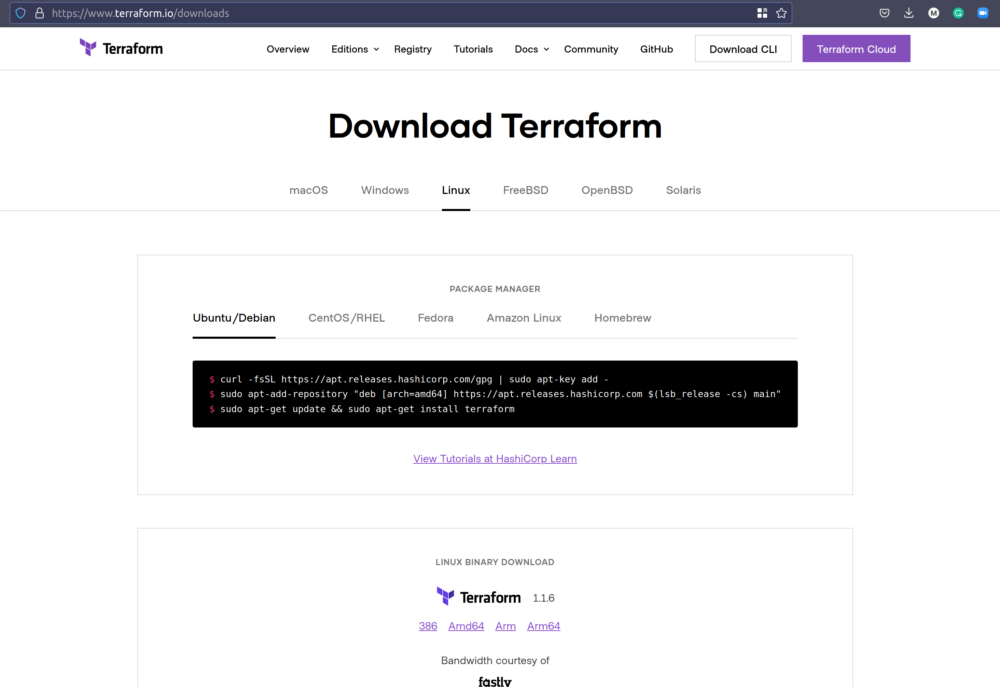

## An intro to Terraform 

"Terraform is a tool for building, changing, and versioning infrastructure safely and efficiently" 

The above quote is from HashiCorp, HashiCorp is the company behind Terraform. 

"Terraform is an open-source infrastructure as code software tool that provides a consistent CLI workflow to manage hundreds of cloud services. Terraform codifies cloud APIs into declarative configuration files."

HashiCorp have a great resource in [HashiCorp Learn](https://learn.hashicorp.com/terraform?utm_source=terraform_io&utm_content=terraform_io_hero) which covers all of their products and gives some great walkthrough demos when you are trying to achieve something with Infrastructure as Code. 

All cloud providers and on prem platforms generally give us access to management consoles which enables us to create our resources via a UI, generally these platforms also provide a CLI or API access to also create the same resources but with an API we have the ability to provision fast. 

Infrastructure as Code allows us to hook into those APIs to deploy our resources in a desired state. 

Other tools but not exclusive or exhaustive below. If you have other tools then please share via a PR.  

| Cloud Specific                  | Cloud Agnostic | 
| ------------------------------- | -------------- |
| AWS CloudFormation              | Terraform      | 
| Azure Resource Manager          | Pulumi         | 
| Google Cloud Deployment Manager |                | 

This is another reason why we are using Terraform, we want to be agnostic to the clouds and platforms that we wish to use for our demos but also in general. 

## Terraform Overview 

Terraform is a provisioning focused tool, Terraform is a CLI that gives the capabilities of being able to provision complex infrastructure environments. With Terraform we can define complex infrastructure requirements that exist locally or remote (cloud) Terraform not only enables us to build things initially but also to maintain and update those resources for their lifetime.  

We are going to cover the high level here but for more details and loads of resources you can head to [terraform.io](https://www.terraform.io/)

### Write

Terraform allows us to create declaritive configuration files that will build our environments. The files are written using the HashiCorp Configuration Language (HCL) which allows for concise descriptions of resources using blocks, arguments, and expressions. We will of course be looking into these in detail in deploying VMs, Containers and within Kubernetes. 

### Plan

The ability to check that the above configuration files are going to deploy what we want to see using specific functions of the terraform cli to be able to test that plan before deploying anything or changing anything. Remember Terraform is a continued tool for your infrastructure if you would like to change aspect of your infrastructure you should do that via terraform so that it is captured all in code. 

### Apply

Obviously once you are happy you can go ahead and apply this configuration to the many providers that are available within Terraform. You can see the large amount of providers available [here](https://registry.terraform.io/browse/providers)

Another thing to mention is that there are also modules available, and this is similar to container images in that these modules have been created and shared in public so you do not have to create it again and again just re use the best practice of deploying a specific infrastructure resource the same way everywhere. You can find the modules available [here](https://registry.terraform.io/browse/modules)

The Terraform workflow looks like this: (*taken from the terraform site*)

### Terraform vs Vagrant

During this challenge we have used Vagrant which happens to be another Hashicorp open source tool which concentrates on the development environments. 

- Vagrant is a tool focused for managing development environments

- Terraform is a tool for building infrastructure. 

A great comparison of the two tools can be found here on the official [Hashicorp site](https://www.vagrantup.com/intro/vs/terraform)

## Terraform Installation 

There is really not much to the installation of Terraform. 

Terraform is cross platform and you can see below on my Linux machine we have several options to download and install the CLI 

Using `arkade` to install Terraform, arkade is a handy little tool for getting your required tools, apps and clis onto your system. A simple `arkade get terraform` will allow for an update of terraform if available or this same command will also install the Terraform CLI

We are going to get into more around HCL and then also start using Terraform to create some infrastructure resources in various different platforms. 

## Resources 
I have listed a lot of resources down below and I think this topic has been covered so many times out there, If you have additional resources be sure to raise a PR with your resources and I will be happy to review and add them to the list. 

- [What is Infrastructure as Code? Difference of Infrastructure as Code Tools](https://www.youtube.com/watch?v=POPP2WTJ8es)
- [Terraform Tutorial | Terraform Course Overview 2021](https://www.youtube.com/watch?v=m3cKkYXl-8o)
- [Terraform explained in 15 mins | Terraform Tutorial for Beginners](https://www.youtube.com/watch?v=l5k1ai_GBDE)
- [Terraform Course - From BEGINNER to PRO!](https://www.youtube.com/watch?v=7xngnjfIlK4&list=WL&index=141&t=16s)
- [HashiCorp Terraform Associate Certification Course](https://www.youtube.com/watch?v=V4waklkBC38&list=WL&index=55&t=111s)
- [Terraform Full Course for Beginners](https://www.youtube.com/watch?v=EJ3N-hhiWv0&list=WL&index=39&t=27s)
- [KodeKloud -  Terraform for DevOps Beginners + Labs: Complete Step by Step Guide!](https://www.youtube.com/watch?v=YcJ9IeukJL8&list=WL&index=16&t=11s)
- [Terraform Simple Projects](https://terraform.joshuajebaraj.com/)
- [Terraform Tutorial - The Best Project Ideas](https://www.youtube.com/watch?v=oA-pPa0vfks)
- [Awesome Terraform](https://github.com/shuaibiyy/awesome-terraform)

See you on [Day 58](day58.md)
