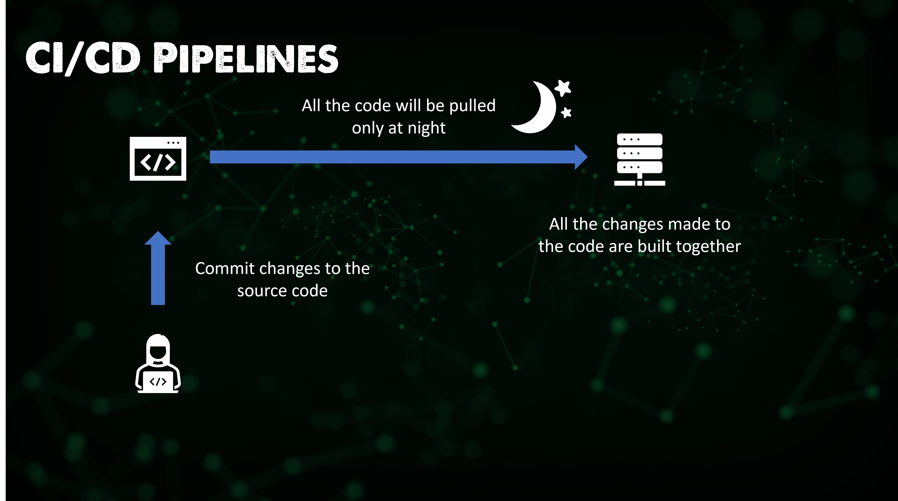
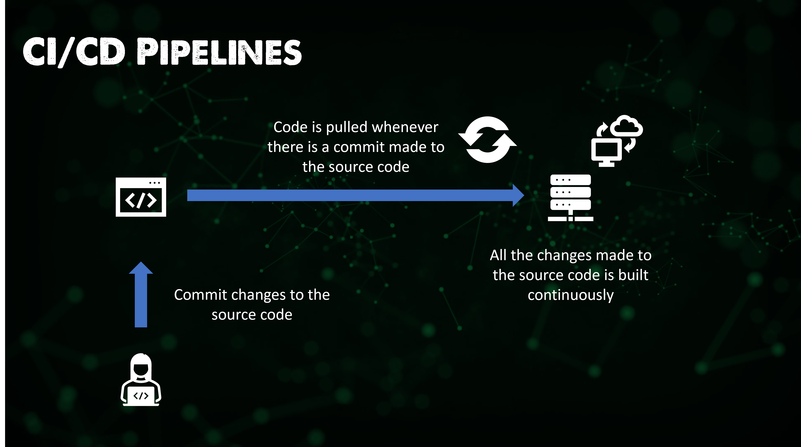
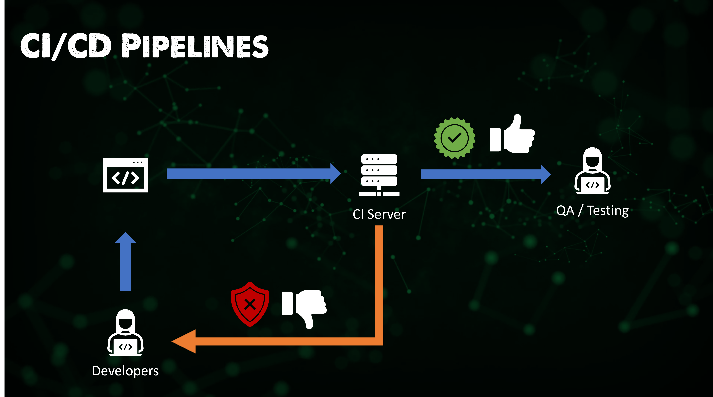
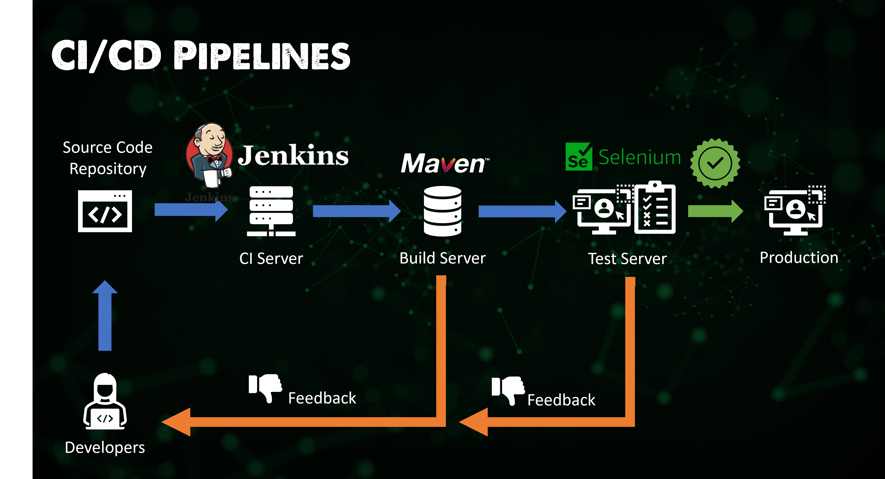

## What is Jenkins?

Jenkins is a continous integration tool that allows continous development, test and deployment of newly created code. 

There are two ways we can achieve this with either nightly builds or continous development. The first option is that our developers are developing throughout the day on their tasks and come the end of the set day they push their changes to the source code repository. Then during the night we run our unit tests and build of the software. This could be deemed as the old way to integrate all code. 

The other option and the preferred way is that our developers are still committing their changes to source code, then when that code commit has been made there is a build process kicked off continously. 

The above methods means that with distributed developers across the world we don't have a set time each day where we have to stop committing our code changes. This is where Jenkins comes in to act as that CI server to control those tests and build processes. 

I know we are talking about Jenkins here but I also want to add a few more to maybe look into later on down the line to get an understanding why I am seeing Jenkins as the overall most popular, why is that and what can the others do over Jenkins. 

- TravisCI - A hosted, distributed continous integration service used to build and test software projects hosted on GitHub. 
  
- Bamboo - Can run multiple builds in parallel for faster compilation, built in functionality to connect with repositories and has build tasks for Ant, Maven. 
  
- Buildbot - is an open-source framework for automating software build, test and release processes. It is written in Python and supports distributed, parallel execution of jobs across multiple platforms. 
  
- Apache Gump - Specific to Java projects, designed with the aim to build and test those Java projects every night. ensures that all projects are compatible at both API and functionality level. 

Because we are now going to focus on Jenkins - Jenkins is again open source like all of the above tools and is an automation server written in Java. It is used to automate the software development process via continous integration adn faciliates continous delivery. 

### Features of Jenkins

As you can probably expect Jenkins has a lot of features spanning a lot of areas. 

**Easy Installation** - Jenkins is a self contained java based program ready to run with packages for Windows, macOS and Linux operating systems. 

**Easy Configuration** - Easy setup and configured via a web interface which includes error checks and built in help. 

**Plug-ins** - Lots of plugins available in the Update Centre and integrates with many tools in the CI / CD toolchain. 

**Extensible** - In addition to the Plug-Ins available, Jenkins can be extended by that plugin architecture which provides nearly infinite options for what it can be used for. 

**Distributed** - Jenkins easily distributes work across multiple machines, helping to speed up builds, tests and deployments across multiple platforms. 

### Jenkins Pipeline 

You will have seen this pipeline but used in a much broader and we have not spoken about specific tools. 

You are going to be committing code to Jenkins, which then will build out your application, with all automated tests, it will then release and deploy that code when each step is completed. Jenkins is what allows for the automation of this process. 

### Jenkins Architecture 

First up and not wanting to reinvent the wheel, the [Jenkins Documentation](https://www.jenkins.io/doc/developer/architecture/) is always the place to start but I am going to put down my notes and learnings here as well. 

Jenkins can be installed on many different operating systems, Windows, Linux and macOS but then also the ability to deploy as a Docker container and within Kubernetes. [Installing Jenkins](https://www.jenkins.io/doc/book/installing/)

As we get into this we will likely take a look at installing Jenkins within a minikube cluster simulating the deployment to Kubernetes. But this will depend on the scenarios we put together throughout the rest of the section. 

Let's now break down the image below. 

Step 1 - Developers commit changes to the source code repository.

Step 2 - Jenkins checks the repository at regular intervals and pulls any new code.

Step 3 - A build server then builds the code into an executable, in this example we are using maven as a well known build server. Another area to cover. 

Step 4 - If the build fails then feedback is sent back to the developers. 

Step 5 - Jenkins then deploys the build app to the test server, in this example we are using selenium as a well known test server. Another area to cover. 

Step 6 - If the test fails then feedback is passed to the developers.

Step 7 - If the tests are successful then we can release to production. 

This cycle is continous, this is what allows applications to be updated in minutes vs hours, days, months, years! 

There is a lot more to the architecture of Jenkins if you require it, they have a master-slave capability, which enables a master to distribute the tasks to slave jenkins environment. 

For reference with Jenkins being open source, there are going to be lots of enterprises that require support, CloudBees is that enterprise version of Jenkins that brings support and possibly other functionality for the paying enterprise customer. 

An example of this in a customer is Bosch, you can find the Bosch case study [here](https://assets.ctfassets.net/vtn4rfaw6n2j/case-study-boschpdf/40a0b23c61992ed3ee414ae0a55b6777/case-study-bosch.pdf)

I am going to be looking for a step by step example of an application that we can use to walkthrough using Jenkins and then also use this with some other tools.

## Resources

- [Jenkins is the way to build, test, deploy](https://youtu.be/_MXtbjwsz3A)
- [Jenkins.io](https://www.jenkins.io/)
- [ArgoCD](https://argo-cd.readthedocs.io/en/stable/)
- [ArgoCD Tutorial for Beginners](https://www.youtube.com/watch?v=MeU5_k9ssrs)
- [What is Jenkins?](https://www.youtube.com/watch?v=LFDrDnKPOTg)
- [Complete Jenkins Tutorial](https://www.youtube.com/watch?v=nCKxl7Q_20I&t=3s)
- [GitHub Actions](https://www.youtube.com/watch?v=R8_veQiYBjI)
- [GitHub Actions CI/CD](https://www.youtube.com/watch?v=mFFXuXjVgkU)

See you on [Day 72](day72.md)
